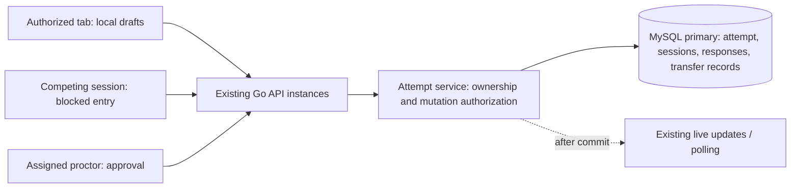

# SAT Session Ownership and Device Transfer — Final Plan

> For future execution: implement the tasks in dependency order with the repository's applicable planning and verification workflows. This document authorizes no application changes, deployments, or load runs. Implementation requires a separate user instruction.

**Goal:** Prevent concurrent browsers or devices using the same student identity from causing rejected saves, conflicting answers, or duplicate submissions, while allowing controlled recovery on another device.

**Architecture:** Reuse the Go attempt service, MySQL, attempt credentials, and the existing browser durability engine. The database owns one writer session per attempt. Transfer changes ownership atomically; the browser preserves unconfirmed drafts and obtains authoritative state before enabling input.

**Tech stack:** Existing React/TypeScript frontend, Go backend, MySQL/InnoDB, IndexedDB/local draft storage, Vitest, Playwright, Go tests, and k6. Use Bun for frontend scripts and one-off tools; Node 20+ remains required.

**Date:** 2026-10-06, Asia/Bangkok.

**Status:** Consolidated design and implementation plan. No fix has been implemented or validated as part of this document. The reported incident has not been reproduced. Production capacity is not established by code inspection.

---

## 1. Evidence, assumptions, and unresolved requirements

Labels throughout this document:

- **VERIFIED:** Observed in the current workspace, or directly reported by the user. Workspace evidence does not establish deployed production behavior.
- **ASSUMED:** A proposed policy, target, or design decision adopted for this plan.
- **UNKNOWN:** Requires evidence before the related release gate can pass.

### Current findings

| ID | Status | Finding | Source, relative to the repository root |
|---|---|---|---|
| F1 | VERIFIED: user report | Entering SAT from different browsers/devices with the same WCODE/student ID is associated with saving problems. The precise error is unknown. | Conversation |
| F2 | VERIFIED: workspace | Attempt creation replays the attempt associated with a registration; migrations define registration and attempt uniqueness. | `backend/go/internal/schedules/service.go`, `backend/go/migrations/0006_delivery.sql`, `backend/go/migrations/0012_registration_fields.sql` |
| F3 | VERIFIED: workspace | Check-in can reuse an attempt but issues its token with lease epoch `1`. An existing transferred attempt can have a higher epoch. | `backend/go/cmd/api/handlers_v2.go`, student entry handler |
| F4 | VERIFIED: workspace | Writer identity reads session storage with a local-storage fallback, allowing tabs to reuse the same identity. A browser-specific resolver avoids copying the active writer identity from server projections. | `src/services/studentAttemptRepository.ts` |
| F5 | VERIFIED: workspace | V2 response saving checks the active session and lease; takeover updates the owner/epoch and revokes other sessions. | `backend/go/internal/attempts/service.go`, `backend/go/internal/attempts/submit.go` |
| F6 | VERIFIED: workspace | SAT already uses the durability engine, preserves drafts, and surfaces superseded-session failures and takeover actions. | `src/features/student-delivery/hooks/useSatResponsePersistence.ts`, `src/features/student-delivery/ui/feedback/SatSaveStatus.tsx` |
| F7 | VERIFIED: workspace | The default V2 runtime gate takes shared runtime/section locks. An alternative committed-read gate also exists. Deployed configuration is unknown. | `backend/go/cmd/api/handlers_v2.go`, `backend/go/cmd/api/v2locker_snapshot.go`, `backend/go/cmd/api/main.go` |
| F8 | VERIFIED: workspace | New attempt creation takes an exclusive schedule lock, which may contend during admission waves. Its measured impact is unknown. | `backend/go/internal/schedules/service.go` |
| F9 | VERIFIED: workspace | Existing SAT k6 exam-day harness uses delivery response PATCH paths; it alone does not establish the behavior or throughput of the V2 durability path. | `k6/sat-exam-day.js` |

F3 and F4 are investigation candidates, not proven causes of F1. Do not repair only those two findings and declare the incident fixed without reproducing the failing user path.

### Release-gating unknowns

| Unknown | How to resolve | Consequence while unresolved |
|---|---|---|
| Exact failure and whether answers reached the server | Reproduce with two browser contexts; correlate HTTP error, token binding, lease, write ID, acknowledgment, and stored response | Root cause remains unconfirmed |
| Deployed build, schema, auth modes, runtime gate, and topology | Record build SHA, applied migrations, relevant configuration, DB version, and primary/replica routing | Local findings cannot be asserted as production facts |
| Verified student authentication | Establish whether the system verifies identity beyond typed WCODE/name/email | Self-service transfer remains disabled unless the existing authorized session approves |
| Peak concurrency and burst shape | Obtain deployment target; use the proposed 10,000-student scenario meanwhile | Capacity claim remains provisional |
| Proctor staffing and approval wait target | Measure transfer frequency and handling time | Human recovery throughput remains unproven |
| Disaster durability, retention, and browser support | Establish DB durability/backup policy, draft retention, and supported browser matrix | No disaster RPO or universal browser-support promise |

## 2. Requirements and boundaries

### Required behavior

1. Resolve normalized student identity within a schedule to one registration and one attempt. Preserve current code normalization; do not create a new competing normalization rule.
2. Authorize exactly one writing session per attempt; a device fingerprint, IP, WCODE, or display name is not ownership authority.
3. Block competing entry before answer input or protected exam content is enabled.
4. Resume refresh, network reconnect, and credential renewal for the current authorized session without resetting answers, timing, or module progress.
5. Support explicit pre-start transfer and supervised post-start recovery according to Section 3.
6. Preserve unconfirmed drafts; prohibit automatic replay across an ownership change.
7. Enforce ownership on answers, module entry/start, transitions, submission, and other student mutations that affect delivery state. Presence must never replace the writer.
8. Return success only after durable server commit. A local draft and a server-confirmed answer must remain distinct states.
9. Make admission, write retry, transfer retry, and submission retry idempotent.
10. Preserve shared student-service behavior for IELTS/ACT; apply SAT policy only to SAT attempts unless another product explicitly adopts it.

### Non-goals

- Concurrent collaborative answering or last-device-wins answer merging.
- Automatic transfer after a heartbeat timeout.
- Recovering device-only answers from a permanently unavailable or destroyed device.
- Physical-device attestation, stolen-bearer prevention through fingerprinting, or proof that a human is the rightful student from a typed identifier alone.
- A new distributed lock service, broker, independent microservice, or unmeasured database sharding project.
- Unrelated refactoring of SAT timing, scoring, adaptive routing, or authoring.

## 3. Final recommended transfer policy

**ASSUMED policy adopted for this plan:** Student-controlled transfer before the first timed module starts; proctor-approved transfer after it starts. Once any timed module has started, the attempt remains in the post-start policy during breaks, pauses, and later modules.

| Situation | Decision | Required proof/action |
|---|---|---|
| Same authorized session refreshes or reconnects | Resume automatically | Validate identity, credential/session binding, current ownership, and attempt state |
| Another tab/browser/device enters | Block editing and protected exam access | Offer a transfer request; do not issue writer authority |
| Pre-start transfer | Explicit self-service permitted | Verified student authentication OR confirmation from the currently authorized session, bound to the target session |
| Pre-start without either proof | Proctor approval | WCODE/name/email alone never suffice |
| Post-start transfer, including breaks | Assigned proctor approval | Verify student and target; enforce organization/schedule authorization |
| Old device unreachable | Supervised recovery permitted | Show possible loss of device-only unconfirmed answers; record recovery reason |
| Old browser misses heartbeats | Mark disconnected only | Retain ownership; no automatic surrender or transfer |
| Submitted, terminated, locked, or cancelled attempt | Refuse transfer | Terminal state is authoritative |

The transfer service must re-check the pre-start condition in the ownership transaction. A transfer authorized under pre-start rules cannot commit using those rules if a module start wins the race.

**Proposed configurable defaults, not existing behavior:** transfer request expires after 10 minutes; approval must be redeemed within 2 minutes. Bind both to the attempt, target session, operation ID, and expected lease. Expiry never affects existing ownership. Repeated status reads do not extend expiry.

Allow one outstanding request per attempt. Identical retries return that request; a different target cannot silently replace it. A student can cancel their uncommitted request. Denial, cancellation, or expiry leaves the original writer unchanged.

For a reachable old device, use a bounded flush attempt outside the DB transaction. If it fails, pre-start self-service does not silently force transfer; require proctor recovery. Proctor approval must acknowledge unconfirmed-answer risk before committing a forced transfer.

The exam deadline continues through transfer. Pause or additional time is a separate, permission-checked, audited action. No transfer path resets or automatically extends it.

## 4. Options and decision record

| Option | Complexity/cost | Consistency and failure behavior | Scale/operations | Reversibility and delivery |
|---|---|---|---|---|
| Reject all competing sessions | Lowest incremental work | Strong ownership but difficult recovery from device failure | Simple backend; support must resolve failures manually | Easy to revise; smallest delivery scope |
| Single writer with controlled transfer | Moderate work using existing services | Explicit owner, stale-write rejection, recoverable device change | Independent attempts coordinate separately; approval queue needs staffing | Recommended; policy is reversible, ownership history must be preserved |
| Simultaneous writers | Highest cost | Conflicting answers require a product-level merge policy | More contention and support ambiguity | Harder to reverse after contradictory histories accumulate |

Choose controlled transfer. Revisit proctor approval only when verified identity and operational evidence justify a different policy. Revisit architecture only after measured capacity or topology requirements exceed the existing database design.

Two-way decisions: transfer UI, expiry settings, rate limits, canary scope, pre-start self-service availability, notification transport.

Hard-to-reverse decisions: deleting drafts, rewriting historical answer records, removing ownership enforcement, and destructive schema migration. This plan does none of those; preserve additive schema and historical evidence.

## 5. Architecture, ownership, and contracts



### Responsibilities

| Component | Responsibility |
|---|---|
| Registration service and database constraints | Canonical schedule/student registration and attempt uniqueness |
| Attempt service | Claim/resume/transfer decisions, ownership version, terminal checks, shared mutation authorization |
| Credential issuance/refresh | Issue only the permitted capability; bind current writer credentials to attempt, authenticated identity, session, and authoritative lease |
| Browser session repository | Own client identity and same-browser tab coordination; never adopt a remote writer identity |
| Durability engine | Store local intent, retry valid writes, match acknowledgments, preserve superseded drafts |
| Student UI | Block competing sessions, communicate storage/confirmation state, expose allowed recovery action |
| Proctor UI/service | Scoped verification and approval; no permission bypass through the student takeover endpoint |
| Notifications | Improve discovery after commit; never determine ownership correctness |

### Data model

Reuse `student_attempts.active_client_session_id`, `lease_epoch`, delivery state, response revisions, and existing session/response tables. Do not duplicate answers or create a second attempt on transfer.

Add a narrowly scoped `attempt_device_transfers` record only for the new request/approval workflow. Proposed fields: operation ID, attempt ID, requesting authenticated principal, target session ID, expected lease epoch, state, requested/expiry timestamps, approver ID, approval/approval-expiry timestamps, reason code, resulting lease epoch, committed timestamp. Preserve audit history. Store no bearer token or answer content in the audit record.

Transfer state: `pending -> approved -> committed`; `pending -> denied/cancelled/expired`; `approved -> cancelled/expired/conflicted`. Terminal records cannot be edited into new approvals.

All changes to a transfer request serialize through its attempt row. A nullable unique active-attempt marker in the transfer table enforces at most one active request; transitions and lazy expiry clear it inside the transaction. Do not depend on a periodic cleanup worker for correctness. The migration must be additive, and its exact schema must be checked against the deployed MySQL version.

### Conceptual API contracts

Routes below are proposed contracts to map into existing API/authz conventions during implementation; they are not available endpoints today.

| Operation | Input | Output and enforcement |
|---|---|---|
| Admit/resume | Schedule/registration identity, browser-owned session, entry proof | `authorized`, `blocked`, or `closed`; writer credential only for `authorized` |
| Request transfer | Unique operation ID, attempt ID, target session, expected lease, reason | Existing or new request; verify identity/eligibility without granting answer access |
| Approve/deny | Request ID, authenticated scoped proctor, decision/reason | Approval bound to target/expected owner; no owner change yet |
| Pre-start approve | Request ID and verified student proof or old-writer confirmation | Same target/epoch binding; enforce pre-start condition again at commit |
| Commit transfer | Request ID and target-session proof | Atomically change owner, revoke old credentials, increment lease, mark committed, return current credential/state |
| Transfer status/recover receipt | Operation ID and target-session proof | Committed result or pending/denied/expired/conflicted state; never silently repeat a completed ownership change |
| Save/submit | Existing V2 command contract and current writer credential | Committed acknowledgments/receipt, or explicit ownership/control/terminal refusal |

A blocked browser can receive a narrowly scoped recovery capability for its transfer request. It must not receive write or protected-content authority. Apply the capability check to every affected handler, not just the UI.

Proposed errors: `SESSION_ALREADY_ACTIVE`, `TRANSFER_APPROVAL_REQUIRED`, `TRANSFER_EXPIRED`, `TRANSFER_CONFLICT`. Preserve existing `LEASE_FENCED` for stale writes and existing terminal/control errors. Auth expiry, ownership loss, module closure, and transient network failure must remain distinct.

Credential renewal for a committed transfer may issue a fresh credential only while the target still owns the resulting lease. A previously committed request cannot reclaim ownership after a later transfer. Reusing an operation ID with different input is a conflict.

## 6. Main and alternate flows

### First entry and resume

1. Validate entry eligibility; normalize identity through the existing boundary.
2. Resolve/create registration and attempt using current uniqueness guarantees.
3. In a short transaction, claim an unowned writable attempt or recognize the same authenticated owner.
4. Read the authoritative lease; never hardcode epoch `1` for a resumed attempt.
5. Issue the permitted credential and hydrate server answers, module state, and clock.
6. If ownership changed between claim and issuance, re-check and refuse stale authority. Prefer transactional issuance tied to the ownership decision.
7. For a competitor, return blocked state with minimal safe metadata and transfer capability; input remains disabled.

### Duplicate tabs and browser reload

Use a browser-owned session plus an exclusive per-attempt Web Lock to prevent cooperative tabs from simultaneously creating engines, refreshing writer credentials, or modifying the same local outbox. Acquire the lock before bootstrapping the writer and release it when the owning page exits. A duplicate tab that cannot acquire it shows blocked entry; it does not wait and silently begin writing later.

Web Locks coordinate contexts of one origin in a browser and require a secure context. They do not coordinate different browsers/devices; database ownership remains authoritative. [Web Locks documentation](https://developer.mozilla.org/en-US/docs/Web/API/Web_Locks_API)

Define and test the supported browser matrix before rollout. If the lock API is unavailable, fail exam preflight with a clear supported-browser action; do not silently reuse shared storage as proof of exclusivity. During reload, reacquire the local lock and validate server ownership before replaying drafts. Exercise duplicated session-storage identities and suspended/restored tabs in browser tests.

### Transfer

1. Target requests transfer; existing writer can continue until commitment.
2. Obtain the required approval and, if reachable, a bounded old-writer flush.
3. The transaction locks the attempt first, then the transfer and related sessions in a consistent order. Validate proof, expiry, expected epoch, policy stage, terminal state, and target binding.
4. Increment the epoch, set the target writer, revoke superseded writer credentials, persist the successful operation and audit event, and commit together.
5. Notify after commit. A lost notification never permits stale writes.
6. Target obtains its credential and authoritative bootstrap. If delivery of either fails, remain non-editable and recover the committed receipt.
7. Preserve old-device drafts with their origin lease. Never relabel or resend them under the new lease automatically. Any later evidence review uses existing late-evidence rules without changing submitted scores or adaptive routes implicitly.

### Transfer/save/submit races

- A save committed before transfer is part of the server snapshot. A new mutation evaluated after transfer from the old owner is refused. Stored acknowledgments do not grant renewed writer authority.
- A submit committed first closes the attempt and prevents transfer. A transfer committed first fences a subsequent old-writer submit.
- Two target sessions racing for transfer cannot both succeed at the same expected epoch.
- A policy decision based on pre-start state is revalidated under the same attempt lock as module start.

### Offline and storage failure

Keep unconfirmed answers locally while the same session owns the attempt. Show persistent offline/pending status once confirmation is delayed; show an immediate actionable storage fault if local persistence fails. A reconnection never trusts local ownership alone. If superseded, stop mutation retry and preserve evidence.

Browser lifecycle: `blocked -> authorizing -> active -> offline/pending -> active`, or `active/offline -> superseded`; `active -> finalizing -> closed`. Local lock release or heartbeat expiry does not change server ownership.

## 7. Invariants and enforcement

| ID | Invariant | Owner |
|---|---|---|
| I1 | One attempt per registration and canonical identity per schedule | Database constraints + registration boundary |
| I2 | At most one current writer for an attempt | Attempt service + attempt row |
| I3 | Every new student mutation requires the current session/credential/lease and writable state | Shared mutation authorization inside the committing transaction |
| I4 | Transfer changes owner, epoch, revocation, and committed record atomically | Transfer transaction |
| I5 | Lease version increases on ownership change and never decreases | Attempt service |
| I6 | Retry of identical writes/transfers/submissions does not apply again | Existing write ledger + transfer operation ID + submission receipt |
| I7 | Expired/revoked credentials cannot regain ownership through refresh or bootstrap | Credential service and all issuance callers |
| I8 | Transfer preserves deadlines, section/module progress, adaptive route, and accepted answers | Attempt/delivery services |
| I9 | Server-confirmed state requires a matching committed acknowledgment | Durability engine |
| I10 | Superseded local drafts cannot overwrite the current writer | Lease-aware persistence and evidence handling |
| I11 | One student's ownership change does not require exclusive ownership of room-wide rows | Transaction/query design + real-MySQL contention tests |
| I12 | Post-start transfer approval is organization/schedule scoped and auditable | Authz + proctor workflow |
| I13 | Inactive tabs cannot rotate credentials or write the shared local outbox | Browser lock owner + server session checks |

Use existing transaction, credential, and durability abstractions. HTTP handlers decode and dispatch; they do not own independent transfer rules. Keep business authorization out of React components. Never substitute stale caches, asynchronous events, or in-memory locks for authoritative ownership checks.

## 8. High-scale design and proposed capacity gates

**ASSUMED initial certification target:** 10,000 simultaneous students. This is a test target, not a claim that the current deployment supports it.

| Concurrent students | Average V2 save batches/s at one batch every 5 seconds |
|---:|---:|
| 1,000 | 200 |
| 10,000 | 2,000 |
| 50,000 | 10,000 |

These figures exclude credential requests, polling, presence, module transitions, and submission; a save batch can execute multiple database statements. Include representative payload sizes and answer activity. Do not equate HTTP RPS with SQL statement throughput.

Scale rules:

- Coordinate ownership by attempt ID on the authoritative primary. API nodes share database truth and require no sticky routing for transfer correctness.
- Keep transfer transactions bounded; never wait for a browser, proctor interaction, network callback, or notification inside them.
- Preserve room-wide stop/pause semantics. Shared runtime locks permit parallel readers but can delay control writers; the alternative gate requires its own correctness tests. Do not switch gates solely for throughput.
- Measure F8 during check-in. Reuse existing pre-provisioning where possible. Change schedule-lock behavior only if measured contention requires it, retaining atomic eligibility/cancellation and duplicate-attempt protection.
- Bound DB connection pools across all API replicas. Adding replicas must not multiply connections beyond DB capacity.
- Batch/coalesce response traffic using the existing engine, keeping local intent durable and preserving boundary flushes. Do not trade answer safety for a longer debounce.
- Use bounded retries with jitter and honor backpressure. Rate-limit entry/transfer by authenticated actor and attempt; preserve abuse protection without treating an entire school behind one public IP as one student.
- Keep presence reporting lightweight and staggered; presence must not rotate writer credentials or grant ownership.
- Read ownership and write authorization from the primary; lagging replicas and caches may serve non-authoritative displays only where permitted.

### Required staging scenarios

1. 10,000 concurrent students, representative V2 saves, realistic polling/presence, and at least a 60-minute soak.
2. Check-in of 10,000 students over 60 seconds, followed by a separate 1,000-entry/second burst and shared-IP scenario.
3. 100 transfer requests concurrently while ordinary saves continue; race two targets on selected attempts.
4. Reconnect 20% of clients over 10 seconds while pending writes retry and tokens renew.
5. Synchronized module boundaries and final submissions using actual configured timing/handoff modes.
6. Inject slow transactions, DB deadlocks, API restart, lost acknowledgments, and lost transfer responses.
7. Compare one large schedule against several smaller schedules to identify shared-row contention.

All runs use isolated staging schedules and disposable test identities. Existing k6 guards remain intact. Extend the harness to use the actual V2 batch/submit endpoints and inspect stored outcomes; the legacy PATCH path is additional coverage, not a substitute.

### Proposed acceptance targets

| Gate | Target |
|---|---|
| Correctness | Zero stale-owner mutations accepted; zero duplicate terminalizations; no loss of acknowledged answers in tested failures |
| Healthy-load saving | Server acknowledgment latency p95 < 1 s; p99 < 3 s |
| Transfer commitment | Backend p95 < 1 s, excluding human approval, old-device flush, and content download |
| Client transfer recovery | Input remains disabled until authoritative hydration completes; record its latency separately |
| Cross-student contention | Unrelated attempt's open transaction does not block transfer/save through an exclusive room lock |
| Pending detection | Surface unconfirmed-save attention by 30 s; storage faults immediately |
| Backpressure | Bounded pending/retry growth; no retry amplification after injection stops |
| Recovery | Outstanding healthy-session writes drain after faults clear; measure drain time and remaining pending records |

Human capacity is separate from DB capacity. Required proctors for a burst is approximately `requests × average handling seconds / allowed wait seconds`. Illustratively, 100 requests at 20 seconds each with a 120-second wait target require about 17 continuously available proctors. Real staffing must use measured frequency and handling time. Routine refresh/reconnect never enters this queue.

## 9. Failure analysis and pre-mortem

| Failure | Impact | Detection | Mitigation | Residual risk |
|---|---|---|---|---|
| Simultaneous admission | Multiple clients seek writer authority | Admission conflict/lease audit | Atomic per-attempt claim and credential binding | Clear blocked-entry UX required |
| Commit succeeds, HTTP response lost | Client uncertain about save/transfer | Operation lookup and pending age | Stable IDs and recorded result recovery | Connectivity delays confirmation |
| Old writer reconnects | Stale answers/submission arrive | Revocation/lease mismatch | Refuse new mutations; preserve evidence | Device-only answers need review |
| Approval races with module start | Self-service could bypass post-start policy | Transactional started-state check | Serialize on attempt; refuse stale approval | Proctor recovery may be needed |
| Target hydration fails after transfer | Neither device currently usable | Committed request with client still authorizing | Recover receipt/current credential and bootstrap | Temporary interruption; no silent clock reset |
| DB error mid-transfer | Partial ownership state would be unsafe | Transaction failure | Roll back all ownership/revocation/request changes | DB outage blocks progress |
| Slow DB/retry storm | Saves age; clients overload service | Latency, queue depth, pool waits | Bounded jittered retries, backpressure, durable drafts | Long outage can cross exam deadline |
| Credential refresh resurrects revoked session | Ownership bypass | Credential reason/lease audit | Central issuance checks; block every bypass path | Mixed old binaries are a release risk |
| Shared storage/duplicated tab | Credentials and drafts collide | Browser-lock and duplicate-tab tests | One cooperative writer per browser, authoritative cross-device owner | Malicious bearer cloning is outside device-attestation scope |
| Storage unavailable/cleared | Unconfirmed answers may be lost | Local persistence failure | Visible fault and server confirmation where possible | Permanently missing device-only data cannot be recovered |
| Transfer races with submit/expiry | Wrong final state or reopen | Terminal/lease/revision refusal | Shared lock order and authoritative deadline/state checks | Late-answer policy remains bounded |
| Wrong-person approval | Legitimate owner loses access | Scoped audit and target confirmation | Verify student/target, least privilege, specific reason | Human error remains possible |
| Mixed deployment/schema | Some nodes bypass new policy | Build/version telemetry, canary tests | Additive schema, deploy capable backend before enabling client policy | Legacy clients may require reload |
| Database disaster | Confirmed answers lost/unavailable | Restore tests and replication monitoring | Approved DB durability/backup configuration | Disaster RPO remains unknown until established |

Most likely causes of a major failure after 12 months:

1. A forgotten entry/bootstrap/refresh path issues writer authority: addressed by shared ownership checks and bypass tests.
2. A browser lifecycle edge case defeats local coordination: addressed by duplicate-tab, reload, suspend, crash, and supported-browser tests; hostile token copying remains outside scope.
3. Shared schedule contention dominates admission or control latency: measured by same-schedule bursts and held-row tests; deployment capacity remains uncertified until results pass.
4. UI silently treats local intent as server-confirmed: addressed by acknowledgment matching and delayed-save/storage-fault scenarios.
5. A network incident creates more transfers than proctors can handle: workflow avoids routine approval, but staffing must still be measured and provisioned.

## 10. Implementation sequence and ownership

This is a design-level execution roadmap: contracts and behavior are specified; implementation code is deliberately omitted. All unchecked steps are future work. File paths are repository-relative. Proposed new filenames below do not imply existing implementations.

### Task 1 — Reproduce and freeze the failure contract

**Responsibility:** Diagnostic evidence and regression specification.

**Files:** existing `backend/go/cmd/api/entry_handler_test.go`, `backend/go/internal/attempts/concurrency_test.go`, `backend/go/internal/attempts/durability_contract_test.go`; create `e2e/sat-device-transfer.spec.ts` for the real user flow.

- [ ] Record deployed/build/schema/auth/runtime configuration and baseline workspace changes; preserve unrelated in-progress edits.
- [ ] Enter the same schedule/student from two isolated browser contexts; record expected versus actual admission/save behavior without logging bearer secrets or answers.
- [ ] Repeat after an explicit existing takeover, after token expiry, and in duplicated tabs.
- [ ] Distinguish save rejection, delayed confirmation, wrong snapshot hydration, and genuinely missing stored answers.
- [ ] Create failing regression scenarios for the observed incident and I1–I3/I7; preserve test fixtures and correlation IDs.

**Exit:** Reproduction identifies the failing boundary, or documented diagnostic evidence explicitly leaves the cause unconfirmed. Proceed with protection work without claiming an incident fix until reproduced behavior passes.

### Task 2 — Centralize ownership and admission

**Responsibility:** One authoritative claim/resume/mutation boundary.

**Files:** `backend/go/internal/attempts/service.go`, `types.go`, proposed `ownership.go`/`ownership_test.go` in that directory; `backend/go/cmd/api/handlers_v2.go`, `student_context.go`; `backend/go/internal/auth/auth.go`; `backend/go/internal/schedules/service.go`; `backend/go/internal/delivery/service.go`.

- [ ] Define authorized/blocked/closed admission outcomes and capability checks using existing error/transaction types.
- [ ] Route SAT entry, bootstrap, credential refresh, and existing takeover callers through the shared ownership decision.
- [ ] Stop hardcoded resume leases; validate current ownership before credential issuance and preserve terminal checks.
- [ ] Make initial claim and credential issuance race-safe; retries must not invalidate a still-active tab unexpectedly.
- [ ] Ensure presence/telemetry cannot set a competing writer or revive revoked credentials.
- [ ] Exercise simultaneous claim, post-transfer entry, refresh-vs-transfer, start-vs-admission, and closed attempts.

**Exit:** I1–I3/I5/I7 hold on real transactional boundaries; competing entry cannot obtain write or protected-content authority.

### Task 3 — Add transfer request, approval, and idempotent commit

**Responsibility:** Policy and transactional transfer lifecycle.

**Files:** `backend/go/internal/attempts/submit.go`; proposed `device_transfer.go`/`device_transfer_test.go` in the attempts package; next unused migration in `backend/go/migrations/`; `backend/go/internal/proctor/service.go`; `backend/go/internal/authz/table_staff.go`; `backend/go/cmd/api/main.go`; proposed `handlers_device_transfer.go`/`handlers_device_transfer_test.go` in the API package.

- [ ] Add the additive request/approval schema and uniqueness rules; verify migration version against current repository state.
- [ ] Implement one outstanding request, lazy expiry, cancellation, target binding, input-hash/idempotency checks, and scoped status lookup.
- [ ] Implement pre-start proof and assigned-proctor approval. If verified student identity is unavailable, retain proctor/current-writer confirmation only.
- [ ] Tighten the existing takeover endpoint so it cannot bypass approval; old SAT callers must receive an explicit approval-required outcome.
- [ ] Commit approval consumption, epoch increment, target ownership, session revocation, receipt, and audit together.
- [ ] Exercise lost commit response, duplicate operation, stale expected lease, different payload reuse, target swapping, expiry, unauthorized proctor, and submission races.

**Exit:** I4/I6/I8/I12 hold; status recovery never reclaims ownership after a later transfer.

### Task 4 — Isolate browser writers and preserve drafts

**Responsibility:** Browser identity, local singleton writer, and durability recovery.

**Files:** `src/services/studentAttemptRepository.ts`, `src/services/attemptCredentialAdapter.ts`; `src/features/student/infrastructure/responseDurabilityTransport.ts`; `src/features/student-delivery/hooks/useSatResponsePersistence.ts`; `src/shared/durability/DurableResponseEngine.ts`; `src/utils/durableDraftStore.ts`; existing corresponding test directories.

- [ ] Acquire a per-attempt browser lock before engine creation/credential rotation and block duplicate tabs.
- [ ] Ensure refresh/reload preserves legitimate identity, including duplicate session-storage copies; never adopt a remote active writer.
- [ ] Update transfer requests and receipt recovery to use the new permitted capabilities.
- [ ] Preserve origin lease on pending/checkpoint/quarantined records; version any additive local record changes and read old formats safely.
- [ ] Hydrate the committed owner snapshot before accepting input or replay; keep superseded drafts as evidence.
- [ ] Test storage denial, outbox collision, delayed storage completion, reload during transfer, old-device reconnection, expired credentials, and unavailable Web Locks.

**Exit:** I9/I10/I13 hold; no local-storage or credential-refresh fallback becomes an ownership bypass.

### Task 5 — Complete student and proctor UX

**Responsibility:** Clear blocked entry and supervised recovery.

**Files:** `src/features/student-delivery/routes/StudentRegistrationRoute.tsx`, `StudentAccessLinkEntryRoute.tsx`, `SatStudentSessionRoute.tsx`; `ui/feedback/SatControlFeedback.tsx`, `SatSaveStatus.tsx`; `domain/satCopy.ts`; `src/products/sat/routes/SatSessionRoomRoute.tsx`, `src/products/sat/ui/SatSessionRoomInspector.tsx`, `SatSessionRoomConfirmDialog.tsx`.

- [ ] Show blocked entry before protected answering content; explain active elsewhere without exposing other-device credentials or answers.
- [ ] Replace unrestricted post-start Take over with Request device change; show pending/denied/expired status and cancellation.
- [ ] Add scoped proctor request review with student/schedule/target/last server save and clear unconfirmed-answer warning for forced recovery.
- [ ] Preserve timing and disable input until authoritative recovery completes; distinguish a committed transfer awaiting hydration from a failed transfer.
- [ ] Expose persistent delayed-confirmation/offline status and immediate storage failure; announce significant changes accessibly without keystroke-level noise.
- [ ] Test keyboard access, focus restoration, screen-reader feedback, and usable actions outside inert exam content.

**Exit:** Student and proctor workflows complete without hidden actions, contradictory save claims, or inaccessible recovery controls.

### Task 6 — Verify concurrency and high-scale behavior

**Responsibility:** Artifact-backed correctness and capacity certification.

**Files:** proposed `backend/go/integration/sat_device_transfer_test.go`; existing `sat_shared_row_contention_test.go`, `backend/go/cmd/api/v2locker_mysql_test.go`; proposed browser spec from Task 1; `k6/sat-exam-day.js` and proposed `k6/sat-device-transfer.js`.

- [ ] Add real-MySQL save/transfer/submit/approval-start races with forced overlap; verify outcomes in stored rows, not HTTP status alone.
- [ ] Hold another student's transaction open and prove this student's save/transfer progresses without an exclusive room dependency.
- [ ] Exercise multiple API instances, credential expiry/revocation, lost notifications, and all actual runtime gate configurations planned for deployment.
- [ ] Extend V2 load traffic and inject transfer/reconnect bursts; record SQL statement rates, lock/pool waits, acknowledgment latency, and stored correctness.
- [ ] Run Section 8 scenarios on staging only and produce a capacity report including failed/skipped tests and generator saturation.
- [ ] Adjust the measured certified concurrency or transaction design if targets fail; do not claim a successful 10,000-student run from extrapolation.

**Exit:** Section 8 gates pass at the declared deployment size, and approval staffing is documented separately.

### Task 7 — Roll out and operate

**Responsibility:** Compatibility, observability, and reversible enablement.

**Files:** existing platform config and telemetry packages, proposed `docs/runbooks/sat-device-transfer.md`; deployment configuration and relevant authz tests.

- [ ] Add server-owned schedule-scoped policy enablement; snapshot the policy for active attempts so it cannot weaken mid-exam.
- [ ] Deploy additive schema, capable backend/authz, and compatible frontend before enabling the new policy. Verify every API replica's build.
- [ ] Canary practice schedules at low concurrency, then larger rehearsals; require gate evidence before live exams.
- [ ] Publish operator steps for verification, forced recovery, delayed hydration, local-evidence review, and DB outage.
- [ ] Monitor and rehearse rollback; disable new transfer requests while retaining current owner checks and recovering already-committed transfers.

**Exit:** Canary passes, operators can diagnose silent saving failure, rollback preserves answers/ownership, and live scale is explicitly certified.

## 11. Verification commands and evidence expectations

Run during future implementation, not as part of writing this plan. Frontend commands run from the repository root; Go commands run from `backend/go`. Existing tests are baseline checks and do not replace new scenarios above.

```bash
bun run typecheck
bunx vitest run src/shared/durability src/features/student-delivery/hooks/__tests__ src/features/student-delivery/application/__tests__ src/services/__tests__
bunx vitest run src/features/student-delivery/ui/feedback/SatSaveStatus.test.tsx
bun run lint
bun run build
bun run e2e:sat-a11y
```

Expected: no introduced failures; record pre-existing baseline failures separately. Run the new transfer browser spec through a verified project configuration pointed at an isolated test environment.

```bash
go test ./internal/attempts ./internal/auth ./internal/authz ./internal/student ./internal/schedules ./internal/delivery ./internal/proctor ./cmd/api
go test -race ./internal/attempts ./internal/student ./internal/delivery ./internal/proctor
go test ./cmd/api -run TestV2LockerDoesNotSerializeCandidatesInOneSchedule -count=1 -v
go test ./integration -run 'TestSAT.*(Transfer|Candidates|ConcurrentLateAnswers)' -count=1 -v
```

Real-MySQL tests require `TEST_MYSQL_DSN` configured securely for a disposable database. A skipped suite is not a passed concurrency gate. Confirm newly added transfer test names match the selected pattern. Preserve each meaningful test's failure-before/pass-after evidence, stored-row assertions, browser traces, and load-test results.

Do not run production load scripts automatically. Staging operators configure the existing SAT k6 safety guard, base URL, disposable schedule/fixtures, and generator capacity before running the confirmed V2 scenarios.

## 12. Observability, rollout, and rollback details

Metrics: admission outcomes; lease/revocation refusals; credential renewal outcomes; transfer requests/approvals/commits/conflicts/expiries; commit and hydration latency; oldest unconfirmed draft; storage failures; save acknowledgment p95/p99; DB lock/pool waits; retry amplification; unresolved finalization; proctor queue age.

Use low-cardinality labels for metrics. Keep attempt/request/session correlation IDs in access-controlled logs/traces, not metric labels. Never log tokens, answer contents, raw personal details, or device fingerprints as part of this feature.

Proposed alerts: pending confirmation older than 30 seconds; unexpected rise in same-owner fencing or credential-refresh loops; transfer committed but hydration repeatedly fails; approval queue exceeds the agreed wait budget; save latency breaches Section 8; terminalization or acknowledgment correctness violations. Compare saved response revision/count with client acknowledgments to detect silent loss.

Rollout phases: observe/reproduce -> additive schema and server capability -> frontend compatibility -> practice canary -> certified staging load -> live schedules. Each phase retains the current database as source of truth.

Rollback disables initiating new transfers and self-service entry changes. Continue current-owner saves, already-committed receipt recovery, and supervised resolution of active requests. Never roll back to a binary that ignores ownership/capability restrictions on enabled attempts; use a compatible release or disable affected entry. Retain new columns/tables until all dependent attempts are terminal and retention permits removal.

## 13. Definition of done

- [ ] Reported incident is reproduced and the same scenario passes, or the incident remains explicitly unconfirmed rather than described as fixed.
- [ ] Every invariant I1–I13 is covered by a meaningful assertion at its enforcement boundary.
- [ ] Duplicate tabs, separate browsers/devices, refresh, reconnect, and credential renewal behave according to Section 3.
- [ ] Proctor-only post-start transfer cannot be bypassed through legacy takeover, bootstrap, refresh, or alternate delivery mutations.
- [ ] Confirmed answers, adaptive route, progress, and deadlines survive approved transfer unchanged.
- [ ] Unconfirmed answers are preserved without implicit cross-lease replay; lost-device limitation is visible.
- [ ] Lost responses and simultaneous transfer/submit/start/save requests recover without duplicate effects.
- [ ] Real-MySQL and real-browser gates pass; skipped integration coverage is clearly reported.
- [ ] Deployment-specific load results establish the declared concurrency, latency, and recovery behavior.
- [ ] Proctor staffing, supported browser matrix, retention, and disaster durability requirements are documented.
- [ ] Additive rollout and compatible rollback are rehearsed; no existing unrelated work is reverted.

## 14. References and remaining limitations

- [MySQL locking reads](https://dev.mysql.com/doc/refman/8.4/en/innodb-locking-reads.html): transaction-held locking and shared/exclusive behavior.
- [MySQL deadlock handling](https://dev.mysql.com/doc/refman/8.4/en/innodb-deadlocks-handling.html): short transactions, consistent ordering, indexing, and retry handling.
- [IndexedDB](https://developer.mozilla.org/en-US/docs/Web/API/IndexedDB_API): browser-local structured storage; this is not cross-device replication.
- [Web Locks](https://developer.mozilla.org/en-US/docs/Web/API/Web_Locks_API): same-origin browser coordination, separate from server ownership.
- Existing repository SAT handoff plan and runbook: preserve their timing, adaptive routing, late-evidence, and content-fencing contracts during this work.

This design coordinates one authorized software session; it is not hardware attestation. Browser-local unconfirmed answers can be permanently lost with their device. Exact production root cause, verified student identity, deployed topology, capacity, disaster durability, and proctor staffing remain release-gating unknowns described in Section 1. No implementation, application test run, migration, or capacity certification has been performed by creating this plan.
