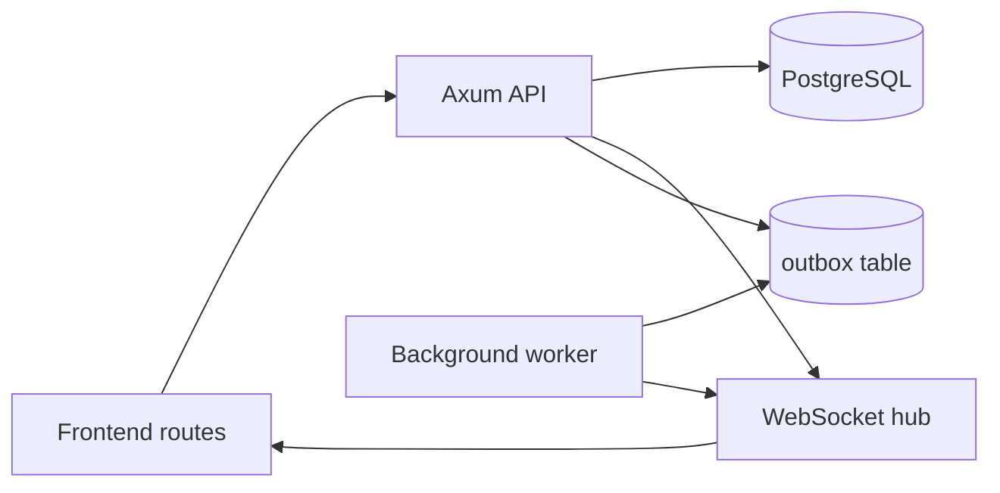

# Rust Backend Design Spec

Status: Draft

This spec defines a lean Rust backend target for the current IELTS proctoring frontend. It keeps the core domain model already present in the repo, replaces local persistence with a modular monolith built around PostgreSQL, and adds optional realtime push. Where the backend design intentionally goes beyond the current frontend contract, those deltas are called out explicitly.

## Scope

The backend covers the active frontend surfaces in [route-manifest.ts](/Users/rd-cream/Downloads/remix_-ielts-proctoring-system/src/app/router/route-manifest.ts):

- `/admin/*`
- `/builder/:examId`
- `/proctor`
- `/student/:scheduleId/:studentId?`

The backend must preserve the domain concepts already present in [src/types/domain.ts](/Users/rd-cream/Downloads/remix_-ielts-proctoring-system/src/types/domain.ts), [src/types/studentAttempt.ts](/Users/rd-cream/Downloads/remix_-ielts-proctoring-system/src/types/studentAttempt.ts), and [src/types/grading.ts](/Users/rd-cream/Downloads/remix_-ielts-proctoring-system/src/types/grading.ts).

## Current Code Alignment Notes

- The active student route is `/student/:scheduleId/:studentId?`, not `/student/:scheduleId`. The current hook in [useStudentSessionRouteData.ts](/Users/rd-cream/Downloads/remix_-ielts-proctoring-system/src/features/student/hooks/useStudentSessionRouteData.ts) accepts an optional route `studentId` and otherwise generates a session-scoped anonymous candidate id in `sessionStorage`.
- The current live student and proctor surfaces are polling-based via [useStudentSessionRouteData.ts](/Users/rd-cream/Downloads/remix_-ielts-proctoring-system/src/features/student/hooks/useStudentSessionRouteData.ts) and [useProctorRouteController.ts](/Users/rd-cream/Downloads/remix_-ielts-proctoring-system/src/features/proctor/hooks/useProctorRouteController.ts). WebSocket push is therefore an optimization path, not an existing client dependency.
- The current builder draft implementation in [examLifecycleService.ts](/Users/rd-cream/Downloads/remix_-ielts-proctoring-system/src/services/examLifecycleService.ts) creates a new `ExamVersion` on each `saveDraft()` call and moves `currentDraftVersionId` to the new snapshot. Any future stable mutable-draft design would be an intentional behavior change.
- The current scheduling UI in [AdminScheduling.tsx](/Users/rd-cream/Downloads/remix_-ielts-proctoring-system/src/components/admin/AdminScheduling.tsx) prefers a published version but can fall back to the current draft version when no published version exists yet. A published-only scheduling rule would therefore tighten current behavior.
- The current auth and permission model is lightweight client-side state plus exam-level booleans such as `canEdit`, `canPublish`, and `canDelete`. Database-backed memberships, staff assignments, schedule registrations, and released-result actor bindings described later in this spec are backend extensions, not frontend concepts that already exist today.
- The grading domain types and services already include `StudentResult` and release workflow state, but `/admin/results` is still placeholder UI and there is no active student-facing results route in the current route tree.
- Admin defaults are currently a single global config persisted by [adminPreferencesRepository.ts](/Users/rd-cream/Downloads/remix_-ielts-proctoring-system/src/services/adminPreferencesRepository.ts). Organization-scoped defaults and reset flows are future extensions.

## Goals

- Replace localStorage-backed repositories with backend APIs.
- Keep published exam versions immutable.
- Support 200-300 concurrent active users overall, including 10-50 proctors during live sessions.
- Support real-time proctoring and student session updates through polling-compatible HTTP reads, with WebSocket push added as an optimization path.
- Keep builder, delivery, proctoring, grading, and scheduling logic in one deployable backend.
- Use transactional writes and optimistic concurrency for state changes.
- Make student answers, final submissions, published exam versions, and released results durable enough that ordinary retries, reconnects, and single-process restarts do not lose committed business data.
- Prefer graceful degradation over hard failure for live presence, heartbeats, and alert fan-out when the system is under pressure.

## Durability Classes

The backend must not treat every write path equally. Product UX and exam integrity require different guarantees for different data classes.

### Strictly Durable Business State

These flows must commit to PostgreSQL before the API acknowledges success, and retries must be safe:

- student answer mutations
- final submission and section submission snapshots
- published exam version creation and schedule pinning
- grading drafts once the save endpoint returns success
- released result versions and release history
- speaking recordings after final media completion and attachment

Rules:

- A successful response means the state is durable in PostgreSQL and recoverable after API or worker restart.
- WebSocket delivery, cache refresh, and derived projection refresh must happen after commit and may lag without changing the meaning of the committed business action.
- If downstream fan-out fails, the durable row remains the source of truth and clients recover through rehydrate or polling flows.

### Durable but Delay-Tolerant Operational State

These flows must be persisted when they represent a meaningful transition, but brief lag is acceptable:

- violation events
- cohort control events
- proctor session notes and audit entries
- upload-intent metadata

Rules:

- The event row itself must not be lost after a success response.
- Derived alerts, badges, and live roster indicators may be retried asynchronously.

### Ephemeral or Loss-Tolerant Coordination State

These flows optimize latency and operator awareness, not authoritative exam recordkeeping:

- heartbeat pulses
- proctor presence refreshes
- WebSocket acks and transient roster decorations
- cache invalidation wake-up signals

Rules:

- The system may coalesce, drop, or recompute these signals.
- UI should tolerate stale data for a short window and fall back to polling or hydration.
- These paths must never block durable answer save or final submission traffic.

## Capacity Constraints

- Primary PostgreSQL storage budget: 1 GB for operational data.
- The 1 GB budget excludes backups and local development data, but includes the live application tables.
- The data model should favor compact snapshots, summary counters, and bounded retention over unbounded raw history.
- Heartbeat events, mutation logs, and outbox rows should be pruned, compacted, or partitioned according to retention policy after they are no longer operationally needed.
- Large binary artifacts should not be stored in the operational database.

### Retention and Partitioning Schedule

- Retention is measured from the table's operational timestamp column, not from wall-clock creation of the cleanup job.
- `app_worker` owns cleanup. Each cleanup task deletes or archives in batches of `1000-5000` oldest rows, commits per batch, and stops after `30` seconds so it does not monopolize locks.
- Cleanup jobs must skip rows tied to schedules that are still `live`, submissions with unreleased grading work, or outbox rows that are not yet published.
- Append-only operational tables should be created as range-partitioned tables when first implemented if the table is expected to exceed `1 million` rows per month. For v1 that applies to `student_attempt_mutations`, `student_heartbeat_events`, and `outbox_events`.

| Table | Operational need | Retention rule | Partition cadence | Cleanup cadence |
| --- | --- | --- | --- | --- |
| `shared_cache_entries` | Rebuildable L2 cache | Hard delete rows where `invalidated_at is not null` or `expires_at < now()` after a `24 hour` grace period | none | hourly |
| `idempotency_keys` | Request replay safety | Default `expires_at = created_at + interval '72 hours'`; hard delete `24 hours` after expiry | none | hourly |
| `outbox_events` | Durable fan-out until delivery | Keep rows with `published_at is null` until published; hard delete rows `72 hours` after `published_at`; do not auto-delete failed unpublished rows | monthly by `created_at` | every `15 minutes` for publish, daily for prune |
| `media_assets` | Upload metadata and temporary exports | Hard delete rows `7 days` after `delete_after_at`; unfinalized uploads older than `24 hours` become `orphaned` and are eligible for cleanup | none | hourly |
| `student_heartbeat_events` | Short-lived operational history | Hard delete `7 days` after `server_received_at` and never keep rows for `live` schedules longer than needed for current runtime views | monthly by `server_received_at` | every `6 hours` |
| `student_attempt_mutations` | Offline sync diagnostics and recovery | Hard delete `30 days` after `coalesce(applied_at, server_received_at)` once the attempt is submitted or the schedule has ended | monthly by `server_received_at` | daily |
| `session_audit_logs` | Operational audit trail | Hard delete `180 days` after `timestamp` unless compliance requirements extend it explicitly | none in v1 | daily |
| `proctor_presence` | Current coordination state only | Keep only the latest state row per `(schedule_id, proctor_id)`; no separate history retention in this table | none | not applicable |
| `review_events`, `release_events`, `student_results`, `student_submissions` | Business record and grading traceability | Keep indefinitely in v1 | none | not applicable |

### Storage Budget Guardrails

- Warning threshold: `750 MB` total PostgreSQL size. Emit an operational alert and log a size breakdown by largest tables and indexes.
- High-water threshold: `850 MB`. Run cache and idempotency pruning immediately, then run event-log pruning out of schedule.
- Critical threshold: `950 MB`. Refuse new `shared_cache_entries` inserts except for routes explicitly marked critical to exam delivery, and page operators.
- The worker should record the result of every pruning run, including rows deleted and bytes reclaimed estimate, in tracing logs.

## Non-Goals

- No microservices in v1.
- No Kafka or RabbitMQ in v1.
- No QUIC in v1.
- No gRPC in v1.
- No CRDT or operational transform system in v1.
- No read replicas in v1 unless load testing proves they are needed.

## Architecture



### Runtime Shape

- `axum` handles HTTP and WebSocket upgrade paths.
- `tower` and `tower-http` provide middleware, tracing, compression, CORS, and request IDs.
- `sqlx` is the only database client in the first version.
- `tokio` is the async runtime.
- `moka` is the per-instance L1 cache for immutable version snapshots and short-lived read models.
- PostgreSQL is both the source of truth and the shared L2 cache layer for idempotency replays, invalidatable read projections, presence, and outbox coordination.
- No Redis is required in v1; any shared cache state must survive process restarts and remain transactionally aligned with PostgreSQL writes.
- A background worker drains the outbox table and publishes events to the WebSocket hub.
- The current frontend must still be able to rehydrate through ordinary HTTP reads and polling because no active client WebSocket implementation exists today.

### Realtime Coordination Across Instances

- API instances own only their local in-memory WebSocket connections.
- The source of truth for cross-instance live updates is PostgreSQL plus the outbox flow, not in-memory broadcast between processes.
- Worker instances claim durable `outbox_events`, mark delivery progress, and publish a lightweight wake-up signal that every API instance can observe.
- After receiving a wake-up, each API instance reloads the latest runtime or aggregate state for the affected schedule or attempt and broadcasts to its own connected sockets.
- The system must not assume that the worker delivering an outbox row runs on the same node that holds the relevant WebSocket connections.
- If wake-up signaling is unavailable, API instances must fall back to short-interval polling for affected live views instead of dropping durable state changes.

#### Wake-Up Signaling Contract

- V1 uses PostgreSQL `LISTEN/NOTIFY` as the cross-instance wake-up mechanism. The outbox row remains the durable post-commit record; `NOTIFY` is only a freshness hint.
- Wake-up delivery is `at-least-once` and may be duplicated, coalesced, or dropped. API instances must treat the signal as "something changed, re-read current state" rather than as an authoritative event payload.
- Wake-up payloads must stay small and contain only routing metadata:
  - aggregate kind
  - aggregate id
  - latest revision or sequence
  - event family
- Recommended payload shape:

```json
{
  "kind": "schedule_runtime",
  "id": "schedule-123",
  "revision": 48,
  "event": "runtime_changed"
}
```

- API instances must coalesce wake-ups by aggregate key for a short window before rereading PostgreSQL to avoid fan-out storms during high mutation periods.
- API instances must reread the latest runtime, attempt, roster, or result projection before broadcasting to sockets. They must never trust the wake-up payload as the business payload.
- A missed wake-up must be repairable by revision-based reload. API instances should keep short-lived in-memory last-seen revisions for hot aggregates so they can detect gaps and force refresh.
- On process startup, reconnect, or suspected notify loss, API instances must rebuild live views by rehydrating from PostgreSQL instead of waiting for the next wake-up.

#### Degraded Live Mode

- The product priority order is:
  1. durable answer and submission writes
  2. durable runtime control commands
  3. proctor live awareness
  4. UI immediacy and decoration
- The system must preserve this order under pressure. It may shed or delay decorative live updates before it delays or drops durable business writes.
- If `LISTEN/NOTIFY` is unavailable, worker publish lag exceeds threshold, or API instances detect repeated revision gaps, the backend must enter degraded live mode for the affected scope.
- In degraded live mode:
  - student runtime and sync acknowledgement views poll every `3-5` seconds
  - proctor roster and alert views poll every `2-3` seconds
  - presence refreshes and roster decorations may be coalesced aggressively
  - durable answer-save, submit, and control-command traffic must continue on the normal HTTP path
- The backend should expose a degraded-live-state flag so the frontend can switch UX modes intentionally instead of inferring failure from socket silence.
- The backend must prefer false positives over false negatives for wake-up behavior. Extra rereads are acceptable; a success response that implies durable state when no durable state exists is not.

### Connection Strategy

- Production deployments must place PgBouncer between the Rust services and PostgreSQL.
- PgBouncer must use transaction pooling in production. Session pooling may be used only for local development or short-lived debugging, not as the production baseline.
- The backend should launch on one API instance if needed, but the data-access model must scale to at least 500 concurrent connected users without redesign by adding API or worker instances behind PgBouncer.
- WebSocket connections must not reserve PostgreSQL connections. Socket state lives in application memory, durable coordination tables, and the outbox flow; database connections are borrowed only for short-lived request, message-handling, or worker transactions.
- All runtime queries that depend on actor-scoped policy context, including reads protected by row-level security, must run inside an explicit short transaction.
- At the start of each policy-sensitive transaction, the runtime must set transaction-local session variables with `SET LOCAL` before the first protected statement:
  - `app.actor_id`
  - `app.role`
  - `app.organization_id`
  - `app.scope_schedule_id` when the operation is schedule-scoped
  - `app.scope_student_key` for student delivery routes after registration resolution
- The runtime must not rely on session-scoped `SET`, connection affinity, or any session state surviving after commit.
- Production code must not depend on PostgreSQL features that require session affinity for correctness, including session-scoped variables, temporary tables used across requests, or any pattern that assumes the same server connection will be reused after commit.
- Database work must stay short-lived. Handlers load or mutate state inside a transaction, commit or roll back, and then perform WebSocket fan-out or other network delivery outside the transaction.
- Initial sizing target:
  - per API instance `sqlx` pool max: `16-24`
  - per worker instance pool max: `4-8`
  - initial PgBouncer-backed PostgreSQL server connection budget for the service stack: `30-40`, to be tuned by load tests
- Load testing must validate that this pool strategy supports the target mix of HTTP traffic, worker jobs, and WebSocket-driven activity without connection starvation or excessive transaction wait time.

### Availability and Failure Domains

- PostgreSQL is the only hard dependency for durable business state in v1. If PostgreSQL is unavailable, strict-durability write endpoints must fail rather than pretend success.
- API instances and worker instances must be replaceable without data loss. A single API or worker process crash must not lose already-acknowledged answer mutations, submissions, or result releases.
- PgBouncer must not be a singleton in production. Run at least two instances behind a load balancer or equivalent service abstraction.
- Production must use PostgreSQL backups plus point-in-time recovery. Backup strategy is mandatory, not an operational afterthought.
- Recovery objectives for v1:
  - strict-durability business state: target `RPO <= 1 minute`, target `RTO <= 15 minutes`
  - live coordination state such as presence and transient socket pushes: best effort, rebuildable after restart
- Operators must rehearse restore and failover procedures before the system is used for real exam traffic.

### Module Boundaries

The code should be split by business capability, not by transport:

- Builder module
  - Exam CRUD
  - Draft saves
  - Version creation
  - Publish, restore, clone, republish
  - Publish readiness validation
- Library module
  - Passage library CRUD
  - Question bank CRUD
  - Search, filter, and usage counters
  - Reuse flows from builder into shared library content
- Delivery module
  - Session bootstrap
  - Pre-check persistence
  - Attempt creation
  - Answer mutation sync
  - Heartbeats and reconnect tracking
  - Final submission
- Proctoring module
  - Proctor presence
  - Violation ingest
  - Alert fan-out
  - Session control events
- Grading module
  - Grading sessions
  - Review drafts
  - Review events
  - Student results
  - Release workflow
- Scheduling module
  - Schedule CRUD
  - Runtime snapshots
  - Start/pause/resume/end control
- Results module
  - Released-result lists and analytics summaries for the admin results surface
  - Student-facing result reads as a future surface; no active student results route exists today
  - CSV and JSON export as future work; the current results screen is still placeholder UI
- Preferences module
  - Global exam-default profile
  - Organization-scoped defaults and reset flows as future extensions, not current parity
- Access module
  - Backend-owned exam membership management
  - Backend-owned schedule staff assignment management
  - Backend-owned schedule registration and roster management
- Assets module
  - Media upload intents for assets that are currently modeled in the frontend as URLs or in-browser assets
  - Object-storage metadata
  - Signed download URLs
  - Orphan cleanup and retention
- Shared module
  - Auth and actor context
  - Idempotency
  - Outbox publishing
  - Caching
  - Common validation and error mapping

## API Conventions

- All mutable endpoints use JSON.
- All state-changing POST/PATCH requests accept `Idempotency-Key`.
- Time values are ISO-8601 in UTC.
- Mutations that depend on revision state must include the current revision.
- Version, schedule, and attempt reads are cacheable; mutations are not.
- Standard response shape:

```json
{
  "success": true,
  "data": {},
  "metadata": {
    "requestId": "req_123",
    "timestamp": "2026-04-17T10:00:00Z"
  }
}
```

- Standard error shape:

```json
{
  "success": false,
  "error": {
    "code": "CONFLICT",
    "message": "Draft version has changed",
    "details": []
  },
  "metadata": {
    "requestId": "req_123",
    "timestamp": "2026-04-17T10:00:00Z"
  }
}
```

### Auth Model

- This section describes the proposed backend normalization, not the current frontend auth contract.
- Current client state only tracks lightweight roles in [useAuthStore.ts](/Users/rd-cream/Downloads/remix_-ielts-proctoring-system/src/store/useAuthStore.ts) and [userStore.ts](/Users/rd-cream/Downloads/remix_-ielts-proctoring-system/src/app/store/userStore.ts). The membership-, registration-, and actor-backed rules below are a server-side design choice.

- The backend expects a bearer token or equivalent session credential.
- Middleware turns the authenticated identity into an actor context.
- The actor context must carry `actor_id`, primary role, and optional `organization_id`.
- Target actor roles used by policy:
  - `admin`
  - `admin_observer`
  - `owner`
  - `reviewer`
  - `grader`
  - `proctor`
  - `student`
- The exact identity provider is out of scope for this spec.

#### Actor Context Construction

- Identity provider choice is out of scope, but actor-context construction is not. The backend must standardize how it derives request identity and authorization context before any protected database work.
- Source-of-truth rule:
  - the token proves caller identity
  - PostgreSQL memberships, registrations, and stored bindings prove authorization
  - token role-like claims may help UX or routing, but they must not replace database-backed authorization for protected actions
- V1 assumes the token exposes a stable subject identifier such as `sub`. The backend maps that subject to a canonical `actors` row and uses that row's `actor_id` as the durable application principal.
- The backend must build actor context in this order:
  1. verify bearer token or session credential
  2. extract stable subject identifier
  3. resolve the canonical actor row
  4. resolve effective organization context if any
  5. resolve route-specific scope such as schedule registration or staff assignment
  6. open a short transaction
  7. set `SET LOCAL app.*`
  8. execute protected statements
- Authorization must be derived from database state such as `exam_memberships`, `schedule_staff_assignments`, `schedule_registrations`, and released-result actor bindings. The runtime must not treat a token claim like `role=proctor` as sufficient authorization by itself.
- The "primary role" placed into `app.role` is the effective role chosen for the current request after the backend has resolved the route and verified the relevant membership or registration. It is not a raw identity-provider claim.
- The runtime should centralize this logic in middleware plus a shared resolver layer so actor context is built consistently across HTTP handlers, WebSocket upgrades, and worker-triggered rereads.

#### Auth Failure Semantics

- If the token is missing, invalid, expired, or cannot be verified, return `401`.
- If the token is valid but no canonical actor row exists, return `401` rather than creating implicit shadow actors inside a business request.
- If the actor is authenticated but lacks the required membership, registration, or release binding, return `403`.
- Student delivery routes must resolve exactly one active `schedule_registrations` row for `(schedule_id, actor_id)` before touching attempts, mutations, heartbeat rows, or result views.
- If zero registration rows match, return `403`.
- If more than one active registration row matches, return `409` and treat it as an administrative data-integrity problem. The backend must not guess which registration is correct.
- Authenticated identity and effective actor context must be recorded in audit history for durable command and grading flows.

### Identity and Admission Model

- Current frontend parity note: [useStudentSessionRouteData.ts](/Users/rd-cream/Downloads/remix_-ielts-proctoring-system/src/features/student/hooks/useStudentSessionRouteData.ts) currently accepts an optional route `studentId` and otherwise creates an anonymous candidate profile plus `student_key = student-{scheduleId}-{candidateId}` locally. Enforcing pre-bound authenticated registrations therefore requires either a compatibility bootstrap path or a coordinated frontend route/auth change.
- `actor_id` is the stable authenticated principal id for every caller, including staff and students.
- `student_id` is the canonical learner identity when the identity provider exposes one. It may equal `actor_id`, but the backend must not assume that without an explicit mapping rule.
- `student_key` is a schedule-scoped surrogate identifier used for attempt, roster, and runtime rows. It is not a login credential and is never accepted by itself as proof of identity.
- v1 uses pre-bound student admission only. Before exam day, roster import or admin tooling must populate `schedule_registrations.actor_id` with the authenticated student account that is allowed to sit that schedule.
- Student delivery requests must authenticate first, then resolve exactly one `schedule_registrations` row for `(schedule_id, actor_id)`. Only then may the backend set `app.scope_schedule_id` and `app.scope_student_key`.
- V1 does not include invitation redemption, claim-link, or join-code binding flows. A registration row without `actor_id` is not eligible for student bootstrap or submission until an admin binds it.
- Released student results must be authorized through a snapshot actor binding stored on the released result version, not through mutable roster lookup at read time.
- Support tooling may search by `student_id`, `student_email`, or `student_key`, but the authoritative join path for delivery and results remains the resolved registration row.

### Media and Object Storage Model

- PostgreSQL stores only media metadata and aggregate references. Binary payloads such as listening audio, stimulus images, generated charts, and speaking recordings live in object storage.
- v1 should support one object-storage provider abstraction with pre-signed upload and download URLs. Local development may use the filesystem or MinIO-compatible storage behind the same abstraction.
- Upload is a two-phase flow:
  1. create upload intent in the API
  2. upload directly to object storage
  3. finalize in the API after checksum, size, and MIME validation
- A media asset becomes immutable once it is attached to a published exam version, a finalized student submission, or a released result artifact.
- The API must enforce per-kind allow-lists:
  - stimulus images and charts: image MIME types only
  - listening audio and speaking recordings: approved audio MIME types only
  - exports: CSV or JSON in v1
- Unfinalized uploads and orphaned objects must be cleaned up automatically by the worker.

### Database Policy Model

- The table names in this section are proposed backend schema names. Several of them, including `exam_memberships`, `schedule_staff_assignments`, `schedule_registrations`, and actor-bound result authorization, do not exist in the current TypeScript model yet.
- PostgreSQL policy enforcement is the final safety boundary; application checks are still required for domain-specific error messages and workflow rules.
- Policy-sensitive queries must follow the connection strategy above: they run inside explicit short transactions, and the runtime sets transaction-local `app.*` variables with `SET LOCAL` before the first protected statement.
- Use least-privilege database roles:
  - `app_migrator` owns DDL and runs migrations only
  - `app_runtime` can read and mutate application tables through approved grants
  - `app_worker` can claim outbox rows, refresh projections, and run retention jobs
  - `app_readonly` is optional for support and operational reporting
- Enable and force row-level security on multi-actor tables that may be queried directly by the runtime role.
- Keep policy predicates index-friendly. Policies should use session variables, membership joins, or `SECURITY DEFINER` helper functions backed by indexes, not per-row ad hoc logic.
- Permission summaries such as `canEdit`, `canPublish`, and `canDelete` remain part of API responses, but they are computed from memberships, assignments, and status state rather than stored as authoritative columns.

#### Transaction-Local Session Context

Every policy-protected transaction must set the same context contract before its first `SELECT`, `INSERT`, `UPDATE`, or `DELETE` against an RLS-protected table.

Required keys:

- `app.actor_id`
- `app.role`
- `app.organization_id` when available, otherwise an empty string
- `app.scope_schedule_id` for schedule-, attempt-, and result-scoped routes
- `app.scope_student_key` for student delivery routes after registration resolution

Policy helper functions should read only from `current_setting('app.*', true)` so the predicates remain deterministic within the transaction.

`sqlx` pattern:

```rust
let mut tx = pool.begin().await?;

sqlx::query("select set_config('app.actor_id', $1, true)")
    .bind(actor.actor_id.as_str())
    .execute(&mut *tx)
    .await?;
sqlx::query("select set_config('app.role', $1, true)")
    .bind(actor.role.as_str())
    .execute(&mut *tx)
    .await?;
sqlx::query("select set_config('app.organization_id', $1, true)")
    .bind(actor.organization_id.as_deref().unwrap_or(""))
    .execute(&mut *tx)
    .await?;
sqlx::query("select set_config('app.scope_schedule_id', $1, true)")
    .bind(schedule_id.map(|id| id.to_string()).unwrap_or_default())
    .execute(&mut *tx)
    .await?;
sqlx::query("select set_config('app.scope_student_key', $1, true)")
    .bind(student_key.unwrap_or(""))
    .execute(&mut *tx)
    .await?;

// Protected statements happen after all context is set.
```

Rules:

- Use transaction-local configuration only. Do not use session-wide `SET` because pooled connections can leak actor context across requests.
- Student routes must resolve the caller's `schedule_registrations` row first, then set `app.scope_schedule_id` and `app.scope_student_key` from that row before touching attempts, heartbeat events, or mutation tables.
- Repositories should centralize this logic in one helper such as `with_actor_tx(...)` so it is not re-implemented per endpoint.

#### RLS Helper Predicates

The implementation should use a small set of `STABLE` SQL helper functions whose logic is fixed by this spec:

- `app_actor_id()` -> current `app.actor_id`
- `app_role()` -> current `app.role`
- `app_organization_id()` -> current `app.organization_id`, nullable when empty
- `app_scope_schedule_id()` -> current `app.scope_schedule_id`, nullable when empty
- `app_scope_student_key()` -> current `app.scope_student_key`, nullable when empty
- `app_is_admin()` -> `app_role() = 'admin'`
- `app_has_exam_role(target_exam_id uuid, allowed_roles text[])`
- `app_has_schedule_role(target_schedule_id uuid, allowed_roles text[])`
- `app_is_schedule_student(target_schedule_id uuid, target_student_key text)`

Exact helper semantics:

- `app_has_exam_role` returns true when the actor is admin, the `exam_entities.owner_id` equals `app_actor_id()`, or an active row exists in `exam_memberships` for the same exam, actor, and one of `allowed_roles`.
- `app_has_schedule_role` returns true when the actor is admin or an active row exists in `schedule_staff_assignments` for the same schedule, actor, and one of `allowed_roles`.
- `app_is_schedule_student` returns true only when:
  - `app_role() = 'student'`
  - `app_scope_schedule_id() = target_schedule_id`
  - `app_scope_student_key() = target_student_key`

#### RLS Table Set and Predicates

`ENABLE ROW LEVEL SECURITY` and `FORCE ROW LEVEL SECURITY` apply to every table below because `app_runtime` reads or writes them on behalf of multiple actors.

| Table | Read policy (`USING`) | Write policy (`WITH CHECK`) |
| --- | --- | --- |
| `exam_entities` | `app_is_admin() OR app_has_exam_role(id, ARRAY['owner','reviewer','grader']) OR (status = 'published' AND visibility = 'public') OR (status = 'published' AND visibility = 'organization' AND organization_id IS NOT DISTINCT FROM app_organization_id())` | `app_is_admin() OR app_has_exam_role(id, ARRAY['owner','reviewer'])` |
| `exam_versions`, `exam_events` | `app_is_admin() OR app_has_exam_role(exam_id, ARRAY['owner','reviewer','grader']) OR EXISTS (SELECT 1 FROM exam_entities e WHERE e.id = exam_id AND e.status = 'published' AND (e.visibility = 'public' OR (e.visibility = 'organization' AND e.organization_id IS NOT DISTINCT FROM app_organization_id())))` | `app_is_admin() OR app_has_exam_role(exam_id, ARRAY['owner','reviewer'])` |
| `exam_memberships` | `app_is_admin() OR app_has_exam_role(exam_id, ARRAY['owner'])` | `app_is_admin() OR app_has_exam_role(exam_id, ARRAY['owner'])` |
| `admin_default_profiles` | `app_is_admin()` | `app_is_admin()` |
| `passage_library_items`, `question_bank_items` | `app_is_admin() OR (organization_id IS NOT DISTINCT FROM app_organization_id() AND app_role() IN ('owner','reviewer'))` | `app_is_admin() OR (organization_id IS NOT DISTINCT FROM app_organization_id() AND app_role() IN ('owner','reviewer'))` |
| `exam_schedules`, `exam_session_runtimes`, `cohort_control_events` | `app_is_admin() OR app_has_schedule_role(schedule_id, ARRAY['proctor','grader','admin_observer']) OR EXISTS (SELECT 1 FROM schedule_registrations r WHERE r.schedule_id = schedule_id AND app_is_schedule_student(r.schedule_id, r.student_key))` | `app_is_admin() OR app_has_schedule_role(schedule_id, ARRAY['proctor','admin_observer'])` |
| `exam_session_runtime_sections` | `app_is_admin() OR EXISTS (SELECT 1 FROM exam_session_runtimes rt WHERE rt.id = runtime_id AND (app_has_schedule_role(rt.schedule_id, ARRAY['proctor','grader','admin_observer']) OR EXISTS (SELECT 1 FROM schedule_registrations r WHERE r.schedule_id = rt.schedule_id AND app_is_schedule_student(r.schedule_id, r.student_key))))` | `app_is_admin() OR EXISTS (SELECT 1 FROM exam_session_runtimes rt WHERE rt.id = runtime_id AND app_has_schedule_role(rt.schedule_id, ARRAY['proctor','admin_observer']))` |
| `schedule_registrations` | `app_is_admin() OR app_has_schedule_role(schedule_id, ARRAY['proctor','grader','admin_observer']) OR app_is_schedule_student(schedule_id, student_key)` | `app_is_admin() OR app_has_schedule_role(schedule_id, ARRAY['proctor','admin_observer']) OR app_is_schedule_student(schedule_id, student_key)` |
| `schedule_staff_assignments` | `app_is_admin() OR app_has_schedule_role(schedule_id, ARRAY['proctor','admin_observer'])` | `app_is_admin() OR app_has_schedule_role(schedule_id, ARRAY['admin_observer'])` |
| `student_attempts` | `app_is_admin() OR app_has_schedule_role(schedule_id, ARRAY['proctor','admin_observer']) OR app_is_schedule_student(schedule_id, student_key)` | `app_is_admin() OR app_has_schedule_role(schedule_id, ARRAY['proctor','admin_observer']) OR app_is_schedule_student(schedule_id, student_key)` |
| `student_attempt_mutations`, `student_heartbeat_events` | `app_is_admin() OR app_has_schedule_role(schedule_id, ARRAY['proctor','admin_observer']) OR EXISTS (SELECT 1 FROM student_attempts a WHERE a.id = attempt_id AND app_is_schedule_student(a.schedule_id, a.student_key))` | `app_is_admin() OR EXISTS (SELECT 1 FROM student_attempts a WHERE a.id = attempt_id AND app_is_schedule_student(a.schedule_id, a.student_key))` |
| `student_violation_events`, `proctor_presence`, `session_audit_logs`, `session_notes`, `violation_rules` | `app_is_admin() OR app_has_schedule_role(schedule_id, ARRAY['proctor','admin_observer'])` | `app_is_admin() OR app_has_schedule_role(schedule_id, ARRAY['proctor','admin_observer'])` |
| `grading_sessions` | `app_is_admin() OR app_has_schedule_role(schedule_id, ARRAY['grader','admin_observer'])` | `app_is_admin() OR app_has_schedule_role(schedule_id, ARRAY['grader','admin_observer'])` |
| `student_submissions` | `app_is_admin() OR app_has_schedule_role(schedule_id, ARRAY['grader','admin_observer'])` | `app_is_admin() OR app_has_schedule_role(schedule_id, ARRAY['grader','admin_observer'])` |
| `section_submissions`, `review_drafts`, `review_events` | `app_is_admin() OR EXISTS (SELECT 1 FROM student_submissions s WHERE s.id = submission_id AND app_has_schedule_role(s.schedule_id, ARRAY['grader','admin_observer']))` | `app_is_admin() OR EXISTS (SELECT 1 FROM student_submissions s WHERE s.id = submission_id AND app_has_schedule_role(s.schedule_id, ARRAY['grader','admin_observer']))` |
| `writing_task_submissions` | `app_is_admin() OR EXISTS (SELECT 1 FROM section_submissions ss JOIN student_submissions s ON s.id = ss.submission_id WHERE ss.id = section_submission_id AND app_has_schedule_role(s.schedule_id, ARRAY['grader','admin_observer']))` | `app_is_admin() OR EXISTS (SELECT 1 FROM section_submissions ss JOIN student_submissions s ON s.id = ss.submission_id WHERE ss.id = section_submission_id AND app_has_schedule_role(s.schedule_id, ARRAY['grader','admin_observer']))` |
| `student_results` | `app_is_admin() OR EXISTS (SELECT 1 FROM student_submissions s WHERE s.id = submission_id AND app_has_schedule_role(s.schedule_id, ARRAY['grader','admin_observer'])) OR (app_role() = 'student' AND authorized_actor_id = app_actor_id() AND release_status = 'released')` | `app_is_admin() OR EXISTS (SELECT 1 FROM student_submissions s WHERE s.id = submission_id AND app_has_schedule_role(s.schedule_id, ARRAY['grader','admin_observer']))` |
| `release_events` | `app_is_admin() OR EXISTS (SELECT 1 FROM student_results r JOIN student_submissions s ON s.id = r.submission_id WHERE r.id = result_id AND app_has_schedule_role(s.schedule_id, ARRAY['grader','admin_observer']))` | `app_is_admin() OR EXISTS (SELECT 1 FROM student_results r JOIN student_submissions s ON s.id = r.submission_id WHERE r.id = result_id AND app_has_schedule_role(s.schedule_id, ARRAY['grader','admin_observer']))` |

Additional enforcement rules:

- `app_runtime` must not have `DELETE` grants on business tables guarded by RLS. Deletes on retained tables are handled by `app_worker` through explicit retention functions.
- Append-only event tables such as `exam_events`, `cohort_control_events`, `student_heartbeat_events`, `student_violation_events`, `review_events`, and `release_events` must not grant `UPDATE` to `app_runtime`.
- Hard-delete API endpoints must execute through explicit `SECURITY DEFINER` functions that enforce domain preconditions and delete dependent rows atomically. `app_runtime` may receive `EXECUTE` on functions such as `delete_draft_exam(...)`, `delete_library_passage_item(...)`, and `delete_question_bank_item(...)`, but it must not receive broad `DELETE` grants on those business tables.
- Policies define the outer boundary. Application services still enforce workflow-specific rules such as "students cannot read raw grading drafts" or "reviewers cannot publish an exam" even if the coarse table predicate is broader.

#### Internal Tables Without End-User RLS

The following tables are internal coordination tables. They are not exposed to user-driven ad hoc queries, and the safety model is grants plus narrow helper functions rather than actor-shaped RLS predicates.

| Table | Access model |
| --- | --- |
| `shared_cache_entries` | No direct route-level SQL except repository code that already loaded the source aggregate through RLS. `app_runtime` may `SELECT`, `INSERT`, `UPDATE`, and `DELETE` by cache key only. |
| `idempotency_keys` | `app_runtime` may upsert and read rows only through a repository helper that scopes by `(actor_id, route, key)`. No broad list or delete queries from request handlers. |
| `outbox_events` | `app_runtime` inserts through `enqueue_outbox_event(...)`; only `app_worker` may claim, update, or delete rows. No request handler may `SELECT` from the raw table. |
| `media_assets` | No direct route-level scans. Repository helpers must resolve the owning aggregate, organization, and attachment status before returning metadata or a signed URL. |

#### Worker Access Model

- `app_worker` must not receive PostgreSQL `BYPASSRLS`.
- `app_worker` gets direct grants only on internal coordination tables and explicit `EXECUTE` grants on `SECURITY DEFINER` maintenance functions.
- Cross-cutting worker functions should be explicit and small:
  - `claim_outbox_batch(limit int)`
  - `mark_outbox_published(ids uuid[])`
  - `purge_expired_cache_entries(limit int)`
  - `purge_expired_idempotency_keys(limit int)`
  - `purge_old_heartbeat_events(limit int)`
  - `purge_old_attempt_mutations(limit int)`
  - `purge_orphaned_media_assets(limit int)`
- When the worker needs to derive data from protected business tables, it should call a purpose-built `SECURITY DEFINER` function that returns only the fields required for the job instead of receiving blanket table grants.

## Routes

### List Query Contract

This contract applies to every `GET` route that returns multiple rows, including exam lists, version lists, event streams, schedules, notes, audit logs, proctor session lists, grading session lists, and mutation histories.

- Cursor pagination is the only pagination model in v1. Multi-row `GET` routes must not accept `page` or `offset`.
- Common query parameters:
  - `limit`: optional page size, default `25`, minimum `1`, maximum `100`
  - `cursor`: optional opaque continuation token returned by the previous page
  - `sort`: optional route-defined sort enum
  - `q`: optional full-text search term on routes that declare searchable fields
  - route-specific filter parameters documented per endpoint
- Multi-value filters should use repeated query parameters such as `status=draft&status=published`. The backend must normalize duplicates, sort unordered filter sets, and treat omitted or empty values as absent.
- Every list route must return a common envelope:

```json
{
  "success": true,
  "data": {
    "items": [],
    "page": {
      "limit": 25,
      "nextCursor": "opaque-token-or-null",
      "hasMore": true
    }
  },
  "metadata": {
    "requestId": "req_123",
    "timestamp": "2026-04-17T10:00:00Z"
  }
}
```

- Exact `totalCount` is not part of the default list contract. Hot paths such as proctoring and grading queues must avoid `COUNT(*)` on every request. If a screen needs counts, the backend should return denormalized summary fields or a separate aggregate endpoint.
- The `cursor` token must be treated as opaque by clients. The server may encode it as base64url JSON, but it must carry enough information to reject mismatched route, filter, or sort usage. At minimum it must include:
  - contract version
  - route identifier
  - sort identifier
  - normalized filter hash
  - last-row boundary values for the active order
- Invalid, expired, or mismatched cursors must return `400 Bad Request` rather than silently falling back to the first page.

### Sort Order Contract

- Every list route must publish an allow-list of `sort` values. Each `sort` maps to one deterministic SQL `ORDER BY` clause.
- Every `ORDER BY` must end in a unique tie-breaker so paging is stable under concurrent writes. The default tie-breaker is the primary key ascending unless a route declares a better stable key.
- If `sort` is omitted, the route default applies.
- If `q` is present and `sort` is omitted, searchable routes default to `relevance:desc` first, then the route's normal tie-break order.
- If `q` is present and `sort` is explicit, the backend filters by search first and then applies the requested sort plus the required unique tie-breaker.
- Initial defaults for the primary list routes:
  - `/api/v1/exams`: default `updated_at:desc,id:asc`
  - `/api/v1/schedules`: default `start_time:asc,id:asc`
  - `/api/v1/proctor/sessions`: default `start_time:asc,id:asc`
  - `/api/v1/grading/sessions`: default `updated_at:desc,id:asc`
- Routes that return append-only history, such as events, notes, audit entries, and mutation logs, should default to `timestamp:desc,id:asc` unless the route explicitly needs chronological replay order.

### Search Contract

- Searchable list routes expose one query parameter, `q`. Structured filters such as `status`, `owner_id`, or `assigned_teacher_id` remain separate and must not be overloaded into `q`.
- v1 search uses PostgreSQL full-text search backed by generated or maintained `tsvector` columns and GIN indexes. List endpoints must not rely on unindexed `%term%` scans as their primary search path.
- The backend should normalize `q` by trimming leading and trailing whitespace and collapsing internal whitespace before query planning.
- The query planner should use `websearch_to_tsquery('simple', :q)` for user-entered search syntax. This keeps multi-word input predictable without requiring clients to build tsquery syntax.
- When `q` is present, the backend should compute a relevance score for ranking-capable routes. If the route supports `relevance:desc`, that ranking is only valid when `q` is present.
- If product requirements later show that users need literal substring rescue for names or codes, add a trigram-index-backed fallback on selected fields as an explicit v2 enhancement instead of mixing substring scans into the default v1 contract.

### Canonical Cache-Key Contract

- Shared cache entries for list reads must use a canonical key derived from the logical query, not the raw query-string order.
- The normalized query object must include:
  - route or cache scope
  - actor scope fingerprint such as role, actor id, and organization id when policy changes visibility
  - normalized filters with sorted repeated values
  - normalized `q`
  - `sort`
  - `limit`
  - `cursor` or `null`
- A recommended string shape is `v1:list:{scope}:{actor_scope_hash}:{normalized_query_hash}`.
- Equivalent requests such as `?status=published&status=draft` and `?status=draft&status=published` must map to the same cache key.
- First-page list variants with `cursor = null` are the primary shared-cache candidates. Cursor-bearing pages may still be cached, but with shorter TTLs and the same invalidation rules.
- Shared-cache invalidation must be driven by aggregate revision or outbox-derived invalidation signals, not by TTL alone.

### Builder and Exam Lifecycle

| Method | Route | Purpose |
| --- | --- | --- |
| GET | `/api/v1/exams` | List exams with filters for status, owner, visibility, and search |
| POST | `/api/v1/exams` | Create a new exam shell |
| GET | `/api/v1/exams/:examId` | Fetch exam entity with current version pointers |
| PATCH | `/api/v1/exams/:examId` | Update mutable exam metadata |
| DELETE | `/api/v1/exams/:examId` | Delete a draft exam when allowed |
| PATCH | `/api/v1/exams/:examId/draft` | Autosave the current draft snapshot |
| GET | `/api/v1/exams/:examId/versions` | List all versions for an exam |
| GET | `/api/v1/exams/:examId/versions/:versionId` | Fetch a single version snapshot |
| POST | `/api/v1/exams/:examId/versions` | Create a new draft version intentionally from the current draft or a named source payload |
| GET | `/api/v1/exams/:examId/validation` | Return publish-readiness validation for the active draft or a named version |
| POST | `/api/v1/exams/:examId/publish` | Publish the current draft version |
| POST | `/api/v1/exams/:examId/clone` | Clone an exam into a new lineage |
| POST | `/api/v1/exams/:examId/versions/:versionId/restore` | Restore a prior version as a new draft |
| POST | `/api/v1/exams/:examId/versions/:versionId/republish` | Republish an existing version as a new published version |
| GET | `/api/v1/exams/:examId/events` | Read the exam event stream |
| POST | `/api/v1/exams/bulk-actions` | Execute bulk publish, archive, unpublish, duplicate, delete, export |
| GET | `/api/v1/exams/:examId/versions/compare?left=...&right=...` | Return structured diff between two versions |
| GET | `/api/v1/exams/:examId/memberships` | List exam owners, reviewers, and graders |
| POST | `/api/v1/exams/:examId/memberships` | Grant or reactivate exam access |
| DELETE | `/api/v1/exams/:examId/memberships/:membershipId` | Revoke exam access |

Builder draft rules:

- `PATCH /api/v1/exams/:examId/draft` is the ordinary builder autosave path.
- To match the current frontend service behavior, each successful autosave may create a fresh draft snapshot/version and move `currentDraftVersionId` to the newest snapshot.
- The request must carry the draft revision or equivalent optimistic-concurrency token. Stale writes return `409 STALE_REVISION` with the latest draft snapshot.
- `POST /api/v1/exams/:examId/versions` is not required for basic parity with today’s builder autosave behavior. It exists for explicit draft branching, restore-like flows, or future "create from version" actions.

### Content Library and Defaults

| Method | Route | Purpose |
| --- | --- | --- |
| GET | `/api/v1/library/passages` | List reusable passages with search and filters |
| POST | `/api/v1/library/passages` | Create a reusable passage entry |
| GET | `/api/v1/library/passages/:passageId` | Fetch one reusable passage |
| PATCH | `/api/v1/library/passages/:passageId` | Update passage content or metadata |
| DELETE | `/api/v1/library/passages/:passageId` | Delete a reusable passage |
| GET | `/api/v1/library/questions` | List reusable question-bank items with search and filters |
| POST | `/api/v1/library/questions` | Create a reusable question-bank item |
| GET | `/api/v1/library/questions/:questionId` | Fetch one reusable question-bank item |
| PATCH | `/api/v1/library/questions/:questionId` | Update question content or metadata |
| DELETE | `/api/v1/library/questions/:questionId` | Delete a reusable question-bank item |
| GET | `/api/v1/settings/exam-defaults` | Read the active global exam-default profile |
| PUT | `/api/v1/settings/exam-defaults` | Replace the active global exam-default profile |
| POST | `/api/v1/settings/exam-defaults/reset` | Optional convenience endpoint to restore the seeded baseline profile |

### Scheduling and Admin

| Method | Route | Purpose |
| --- | --- | --- |
| GET | `/api/v1/schedules` | List schedules with exam, status, and time filters |
| POST | `/api/v1/schedules` | Create a schedule linked to a pinned exam version, with published versions preferred |
| GET | `/api/v1/schedules/:scheduleId` | Fetch schedule details |
| PATCH | `/api/v1/schedules/:scheduleId` | Update schedule metadata or timing |
| GET | `/api/v1/schedules/:scheduleId/runtime` | Fetch the current runtime snapshot |
| POST | `/api/v1/schedules/:scheduleId/start` | Start a scheduled cohort runtime |
| POST | `/api/v1/schedules/:scheduleId/pause` | Pause the cohort runtime |
| POST | `/api/v1/schedules/:scheduleId/resume` | Resume the cohort runtime |
| POST | `/api/v1/schedules/:scheduleId/end` | End the cohort runtime |
| GET | `/api/v1/schedules/:scheduleId/control-events` | Read cohort control history |
| GET | `/api/v1/schedules/:scheduleId/notes` | Read session notes |
| POST | `/api/v1/schedules/:scheduleId/notes` | Create a session note |
| PATCH | `/api/v1/schedules/:scheduleId/notes/:noteId` | Update note content, category, or resolution state |
| DELETE | `/api/v1/schedules/:scheduleId/notes/:noteId` | Delete a session note |
| GET | `/api/v1/schedules/:scheduleId/staff` | List active proctor, grader, and observer assignments |
| POST | `/api/v1/schedules/:scheduleId/staff` | Grant or reactivate a staff assignment |
| DELETE | `/api/v1/schedules/:scheduleId/staff/:assignmentId` | Revoke a staff assignment |
| GET | `/api/v1/schedules/:scheduleId/registrations` | List student roster rows for a schedule |
| POST | `/api/v1/schedules/:scheduleId/registrations` | Create or import schedule registrations |
| PATCH | `/api/v1/schedules/:scheduleId/registrations/:registrationId` | Update registration access windows or accommodations |

### Student Delivery

| Method | Route | Purpose |
| --- | --- | --- |
| GET | `/api/v1/student/sessions/:scheduleId` | Fetch the full student session context for the active route scope |
| POST | `/api/v1/student/sessions/:scheduleId/precheck` | Persist pre-check results and device fingerprint data |
| POST | `/api/v1/student/sessions/:scheduleId/bootstrap` | Create or hydrate the student attempt and return the exam snapshot |
| POST | `/api/v1/student/sessions/:scheduleId/mutations:batch` | Submit a batch of offline answer mutations |
| POST | `/api/v1/student/sessions/:scheduleId/heartbeat` | Record heartbeat, disconnect, reconnect, lost, and degraded-liveness events |
| POST | `/api/v1/student/sessions/:scheduleId/submit` | Finalize the attempt and create submission records |
| GET | `/api/v1/student/attempts/:attemptId` | Fetch a student attempt by id |
| GET | `/api/v1/student/attempts/:attemptId/mutations` | Read pending or applied mutation history |
| GET | `/api/v1/student/results` | Future route for listing released results for the current student actor |
| GET | `/api/v1/student/results/:resultId` | Future route for fetching one released result for the current student actor |

Student delivery compatibility rules:

- The current frontend route contract is `/student/:scheduleId/:studentId?`, and the route hook may omit `studentId` and synthesize a session-scoped anonymous candidate id. The bootstrap flow must therefore either support that compatibility mode or land together with a frontend migration to authenticated registration-based delivery.
- The backend should treat `student_key` as the durable delivery key for attempt rows, but it may need to derive that key from either a resolved registration or the compatibility route identifier during migration.
- Current student and proctor UIs poll runtime and attempt state. WebSocket fan-out is additive and must not remove the ordinary polling and rehydrate endpoints.

### Proctoring

| Method | Route | Purpose |
| --- | --- | --- |
| GET | `/api/v1/proctor/sessions` | List live and scheduled proctoring sessions |
| GET | `/api/v1/proctor/sessions/:scheduleId` | Fetch the live session roster and runtime snapshot |
| POST | `/api/v1/proctor/sessions/:scheduleId/presence` | Join, refresh, or leave proctor presence |
| POST | `/api/v1/proctor/sessions/:scheduleId/control/end-section-now` | End the current live section immediately |
| POST | `/api/v1/proctor/sessions/:scheduleId/control/extend-section` | Extend the current live section by a requested minute count |
| POST | `/api/v1/proctor/sessions/:scheduleId/control/complete-exam` | Complete the live runtime and close remaining sections |
| POST | `/api/v1/proctor/sessions/:scheduleId/attempts/:attemptId/warn` | Issue a proctor warning to one student attempt |
| POST | `/api/v1/proctor/sessions/:scheduleId/attempts/:attemptId/pause` | Pause one live student attempt when policy permits |
| POST | `/api/v1/proctor/sessions/:scheduleId/attempts/:attemptId/resume` | Resume one paused student attempt |
| POST | `/api/v1/proctor/sessions/:scheduleId/attempts/:attemptId/terminate` | Terminate one live student attempt |
| POST | `/api/v1/proctor/sessions/:scheduleId/violations` | Ingest a client or proctor integrity violation event |
| POST | `/api/v1/proctor/alerts/:alertId/ack` | Acknowledge a delivered alert |
| GET | `/api/v1/proctor/sessions/:scheduleId/audit` | Read proctor audit entries |

Proctor command rules:

- Live cohort and student-discipline actions are command endpoints, not generic partial updates. Each command must append an audit row and return the resulting runtime or student status projection.
- To match the current proctor surface and service layer, single-student commands should address the attempt id, while the payload and projection may still expose the candidate-facing student id for display.
- Student-discipline commands must be idempotent by `Idempotency-Key` and must reject actions that are invalid for the current runtime state with `409 CONFLICT` or `422 VALIDATION_ERROR`.
- Presence heartbeats may be lossy, but control commands and alert acknowledgements must persist their resulting audit trail before success is returned.

### Grading

| Method | Route | Purpose |
| --- | --- | --- |
| GET | `/api/v1/grading/sessions` | List grading sessions and queue summaries |
| GET | `/api/v1/grading/sessions/:sessionId` | Fetch session detail with student submissions |
| GET | `/api/v1/grading/submissions/:submissionId` | Fetch a submission and section snapshots |
| POST | `/api/v1/grading/submissions/:submissionId/start-review` | Claim or hydrate the active review draft for a grader |
| GET | `/api/v1/grading/submissions/:submissionId/review-draft` | Fetch the active review draft |
| PUT | `/api/v1/grading/submissions/:submissionId/review-draft` | Save the review draft |
| POST | `/api/v1/grading/submissions/:submissionId/annotations` | Append writing annotations or drawing markup to the active draft |
| POST | `/api/v1/grading/submissions/:submissionId/review-events` | Append grading audit events |
| POST | `/api/v1/grading/submissions/:submissionId/mark-grading-complete` | Transition the draft from `draft` to `grading_complete` |
| POST | `/api/v1/grading/submissions/:submissionId/mark-ready-to-release` | Transition the draft from `grading_complete` to `ready_to_release` |
| POST | `/api/v1/grading/submissions/:submissionId/release-now` | Release the current result immediately and create or bump the released result version |
| POST | `/api/v1/grading/submissions/:submissionId/schedule-release` | Schedule a future release from the active draft |
| POST | `/api/v1/grading/submissions/:submissionId/reopen-review` | Reopen a finalized or release-ready review back into an editable draft |
| POST | `/api/v1/grading/results/:resultId/reopen` | Reopen an already released result for revision |
| GET | `/api/v1/grading/results/:resultId/events` | Read release history |

Grading workflow rules:

- The release workflow is explicit: `draft -> grading_complete -> ready_to_release -> released`, with `reopened` as an exceptional state rather than an implicit side effect of saving.
- `PUT /review-draft` saves document state; it does not by itself advance the release workflow.
- Transition endpoints must enforce allowed state changes server-side and return `409 CONFLICT` for invalid transitions from the current authoritative state.
- Annotation writes must be independently durable once acknowledged and must be attributable to the acting grader in review-event history.

### Results and Reporting

| Method | Route | Purpose |
| --- | --- | --- |
| GET | `/api/v1/results` | List released or release-ready results for admin surfaces |
| GET | `/api/v1/results/:resultId` | Fetch a result detail payload for reporting views |
| GET | `/api/v1/results/analytics` | Return aggregate metrics for admin result dashboards |
| POST | `/api/v1/results/export` | Stream or stage a CSV or JSON export for the current filtered query |

### Media Uploads

| Method | Route | Purpose |
| --- | --- | --- |
| POST | `/api/v1/media/uploads` | Create an upload intent and return a signed upload target |
| POST | `/api/v1/media/uploads/:assetId/complete` | Finalize an uploaded object after server-side validation |
| GET | `/api/v1/media/:assetId` | Fetch media metadata and a signed download URL when authorized |

### WebSockets

| Route | Purpose |
| --- | --- |
| `/api/v1/ws/proctor/:scheduleId` | Live runtime updates, violations, presence, and control events |
| `/api/v1/ws/student/:scheduleId` | Student sync acknowledgements, proctor state, and runtime phase changes |

WebSocket rules:

- WebSockets are an acceleration path for UX, not the only path to correctness.
- Student exam timers and answer durability must not depend on receiving every socket message.
- Proctor roster badges and live alert decorations may lag briefly, but durable violation rows and runtime state must remain recoverable through REST reads.
- When socket delivery is degraded, clients fall back to polling:
  - student runtime and sync acknowledgement views: poll every `3-5` seconds while degraded
  - proctor roster and alert views: poll every `2-3` seconds while degraded
- The backend should expose an explicit degraded-live-state flag so the frontend can switch UX mode intentionally instead of guessing from timeouts.

### Mutation Batch Contract

- `POST /api/v1/student/sessions/:scheduleId/mutations:batch` is the only durable sync contract in v1. Compatibility shims may translate single-item writes into this contract, but they must not create a second write path.
- Request body:

```json
{
  "attemptId": "uuid",
  "clientSessionId": "uuid",
  "baseRevision": 12,
  "mutations": [
    {
      "clientMutationId": "c_001",
      "mutationSeq": 44,
      "type": "answer",
      "timestamp": "2026-04-17T10:00:00Z",
      "payload": {}
    }
  ]
}
```

- Request limits:
  - max `250` mutations per batch
  - max `256 KB` JSON body after decompression
  - duplicate `clientMutationId` values inside one batch return `400`
  - `mutationSeq` values inside one batch must be strictly increasing
- Apply semantics:
  - preserve mutation order exactly as received
  - apply the batch atomically to the attempt aggregate
  - store every accepted mutation row before commit
  - do not partially accept a batch
  - once a `(attempt_id, client_session_id, mutation_seq)` triple is committed, the server must treat it as durable and replay-safe
- Conflict semantics:
  - if `baseRevision` matches current attempt revision, apply normally
  - if the server can replay from stored mutation history and merge safely, it may rebase and return the new revision
  - otherwise return `409 STALE_REVISION` with a hydration payload containing the authoritative attempt snapshot and latest revision
- Successful response body:

```json
{
  "data": {
    "attemptId": "uuid",
    "appliedRevision": 13,
    "acceptedMutationIds": ["c_001"],
    "serverAcceptedThroughSeq": 44,
    "syncState": "saved",
    "needsHydration": false
  }
}
```

- Idempotency semantics:
  - request-level dedupe is by `Idempotency-Key`
  - cross-batch mutation-id dedupe is not required in v1
  - replaying the same idempotency key with a different request hash must return `409 CONFLICT`
- Recovery semantics:
  - bootstrap and hydration responses must include the latest durable `serverAcceptedThroughSeq` per active `clientSessionId` when available
  - clients may retry a previously sent range of mutations; the server must ignore already-committed sequence numbers and return the current durable watermark
  - if the server cannot prove whether a mutation range committed, it must force hydration instead of inventing acceptance
- UX semantics:
  - the student UI may show `saved` only after a durable response from this endpoint
  - local optimistic rendering is allowed, but unsaved answers must remain visually distinguishable from durably saved answers in the client state model

## Data Model

### Database Design Principles

- Keep transactional aggregates in normalized tables and keep actor-scoped permissions in dedicated membership or assignment tables.
- Use PostgreSQL `jsonb` for immutable snapshots and bounded flexible payloads, not as a substitute for relational identity, ownership, or join keys.
- Prefer composite indexes that match real query shapes such as `(organization_id, status, updated_at desc)` over many isolated single-column indexes.
- Use partial indexes for active rows such as live assignments, draft versions, and pending outbox work to reduce storage and write amplification.
- Treat PostgreSQL-backed cache rows as disposable projections: they can be rebuilt from source tables and must never become the only copy of business state.
- Design append-only operational event tables so they can be partitioned by time later without changing application semantics.

### Core Invariants

- One `exam_entities` row represents one exam lifecycle entity.
- One exam can have many immutable `exam_versions`.
- The active draft and active published version are pointer fields on `exam_entities`.
- Access to exams is granted by membership rows, not by mutable booleans on the exam row.
- One organization has at most one active `admin_default_profiles` row used to seed new exams in v1.
- Library entries are reusable source assets, not the authoritative state of a built exam version.
- One schedule points at exactly one published version.
- One student registration row governs admission to one schedule for one student identity.
- One runtime snapshot belongs to one schedule.
- One student attempt belongs to one schedule and one student key.
- Staff access to live schedules and grading flows is granted by schedule assignment rows.
- One review draft belongs to one submission.
- One result version belongs to one submission, with a revision chain for later corrections.
- One `media_assets` row tracks one object-store artifact and its attachment lifecycle.
- Shared cache rows are derived from source tables and invalidated by revision or outbox events.

### Tables

#### `exam_entities`

| Column | Type | Notes |
| --- | --- | --- |
| id | uuid pk | Stable exam id |
| slug | text unique | Human-readable identifier |
| title | text | Exam title |
| exam_type | text | `Academic` or `General Training` |
| status | text | `draft`, `in_review`, `approved`, `rejected`, `scheduled`, `published`, `archived`, `unpublished` |
| visibility | text | `private`, `organization`, `public` |
| organization_id | text nullable | Tenant or organization scope when applicable |
| owner_id | text | Actor who owns the exam |
| created_at | timestamptz | Creation time |
| updated_at | timestamptz | Last mutation time |
| published_at | timestamptz nullable | Latest publish time |
| archived_at | timestamptz nullable | Archive time |
| current_draft_version_id | uuid nullable | Pointer to mutable draft version |
| current_published_version_id | uuid nullable | Pointer to immutable published version |
| total_questions | int nullable | Denormalized count |
| total_reading_questions | int nullable | Denormalized count |
| total_listening_questions | int nullable | Denormalized count |
| schema_version | int | Must match the current domain schema version |
| revision | int | Optimistic concurrency token |

Indexes:

- unique on `slug`
- index on `(organization_id, status, updated_at desc)`
- index on `(owner_id, updated_at desc)`
- partial index on `(current_draft_version_id)` where `current_draft_version_id is not null`

#### `exam_memberships`

| Column | Type | Notes |
| --- | --- | --- |
| id | uuid pk | Membership id |
| exam_id | uuid fk | Parent exam |
| actor_id | text | Actor granted access |
| role | text | `owner`, `reviewer`, `grader` |
| granted_by | text | Actor who granted access |
| created_at | timestamptz | Grant time |
| revoked_at | timestamptz nullable | Null while active |

Constraints:

- partial unique index on `(exam_id, actor_id, role)` where `revoked_at is null`

Indexes:

- index on `(actor_id, role, created_at desc)` where `revoked_at is null`

#### `exam_versions`

| Column | Type | Notes |
| --- | --- | --- |
| id | uuid pk | Version id |
| exam_id | uuid fk | Parent exam |
| version_number | int | Monotonic per exam |
| parent_version_id | uuid nullable fk | Immediate lineage parent |
| content_snapshot | jsonb | Serialized exam state |
| config_snapshot | jsonb | Serialized exam config |
| validation_snapshot | jsonb nullable | Latest validation summary |
| created_by | text | Actor id |
| created_at | timestamptz | Version creation time |
| publish_notes | text nullable | Optional publish notes |
| is_draft | boolean | True for active draft versions |
| is_published | boolean | True for published versions |
| revision | int | Optimistic concurrency token |

Constraints:

- unique on `(exam_id, version_number)`
- index on `(exam_id, created_at desc)`
- index on `(exam_id, is_draft)`
- index on `(exam_id, is_published)`

#### `exam_events`

| Column | Type | Notes |
| --- | --- | --- |
| id | uuid pk | Event id |
| exam_id | uuid fk | Parent exam |
| version_id | uuid nullable fk | Version context |
| actor_id | text | Actor who triggered the event |
| action | text | `created`, `draft_saved`, `submitted_for_review`, `approved`, `rejected`, `published`, `unpublished`, `scheduled`, `archived`, `restored`, `cloned`, `version_created`, `version_restored`, `permissions_updated` |
| from_state | text nullable | Previous exam status |
| to_state | text nullable | New exam status |
| payload | jsonb nullable | Extra audit data |
| created_at | timestamptz | Event time |

Indexes:

- index on `(exam_id, created_at desc)`
- index on `(exam_id, action, created_at desc)`

#### `admin_default_profiles`

| Column | Type | Notes |
| --- | --- | --- |
| id | uuid pk | Profile id |
| organization_id | text nullable | Null means global default in single-tenant deployments |
| profile_name | text | Display label |
| config_snapshot | jsonb | Full `ExamConfig` payload |
| is_active | boolean | One active profile per organization in v1 |
| created_by | text | Actor id |
| created_at | timestamptz | Creation time |
| updated_at | timestamptz | Last mutation time |
| revision | int | Optimistic concurrency token |

Constraints:

- partial unique index on `(organization_id)` where `is_active is true`

Indexes:

- index on `(organization_id, updated_at desc)`

#### `passage_library_items`

| Column | Type | Notes |
| --- | --- | --- |
| id | uuid pk | Library item id |
| organization_id | text nullable | Tenant or organization scope when applicable |
| title | text | Passage title |
| passage_snapshot | jsonb | Serialized `Passage` payload |
| difficulty | text | `easy`, `medium`, `hard` |
| topic | text | Searchable topic |
| tags | text[] | Small tag set |
| word_count | int | Denormalized count |
| estimated_time_minutes | int | Display estimate |
| usage_count | int | Reuse counter |
| created_by | text | Actor id |
| created_at | timestamptz | Creation time |
| updated_at | timestamptz | Last mutation time |
| revision | int | Optimistic concurrency token |

Indexes:

- index on `(organization_id, difficulty, updated_at desc)`
- GIN index on `tags`
- GIN index on maintained `tsvector` for title, topic, and passage text search

#### `question_bank_items`

| Column | Type | Notes |
| --- | --- | --- |
| id | uuid pk | Library item id |
| organization_id | text nullable | Tenant or organization scope when applicable |
| question_type | text | Canonical builder question type |
| block_snapshot | jsonb | Serialized `QuestionBlock` payload |
| difficulty | text | `easy`, `medium`, `hard` |
| topic | text | Searchable topic |
| tags | text[] | Small tag set |
| usage_count | int | Reuse counter |
| created_by | text | Actor id |
| created_at | timestamptz | Creation time |
| updated_at | timestamptz | Last mutation time |
| revision | int | Optimistic concurrency token |

Indexes:

- index on `(organization_id, question_type, difficulty, updated_at desc)`
- GIN index on `tags`
- GIN index on maintained `tsvector` for topic and block text search

#### `exam_schedules`

| Column | Type | Notes |
| --- | --- | --- |
| id | uuid pk | Schedule id |
| exam_id | uuid fk | Parent exam |
| organization_id | text nullable | Tenant or organization scope when applicable |
| exam_title | text | Snapshot for display |
| published_version_id | uuid fk | Immutable version pinned by the schedule |
| cohort_name | text | Cohort label |
| institution | text nullable | Optional institution |
| start_time | timestamptz | Scheduled start |
| end_time | timestamptz | Scheduled end |
| planned_duration_minutes | int | Derived from section plan |
| delivery_mode | text | Must be `proctor_start` |
| recurrence_type | text | `none`, `daily`, `weekly`, `monthly` |
| recurrence_interval | int | Repetition interval |
| recurrence_end_date | date nullable | Optional recurrence limit |
| buffer_before_minutes | int nullable | Pre-window buffer |
| buffer_after_minutes | int nullable | Post-window buffer |
| auto_start | boolean | Auto-start runtime |
| auto_stop | boolean | Auto-stop runtime |
| status | text | `scheduled`, `live`, `completed`, `cancelled` |
| created_at | timestamptz | Creation time |
| created_by | text | Actor id |
| updated_at | timestamptz | Last mutation time |
| revision | int | Optimistic concurrency token |

Indexes:

- index on `(organization_id, status, start_time asc)`
- index on `(exam_id, start_time desc)`
- index on `(published_version_id)`

#### `schedule_registrations`

| Column | Type | Notes |
| --- | --- | --- |
| id | uuid pk | Registration id |
| schedule_id | uuid fk | Parent schedule |
| student_key | text | Stable schedule-scoped student identity |
| actor_id | text nullable | Authenticated principal bound to this registration; must be populated before student admission in v1 |
| student_id | text | External identity if available |
| student_name | text | Snapshot for roster and grading |
| student_email | text nullable | Optional contact |
| access_state | text | `invited`, `checked_in`, `withdrawn`, `blocked`, `submitted` |
| allowed_from | timestamptz nullable | Optional early access window |
| allowed_until | timestamptz nullable | Optional late access window |
| extra_time_minutes | int | Approved accommodation |
| seat_label | text nullable | Optional room or seat marker |
| metadata | jsonb nullable | Small registration-specific payload |
| created_at | timestamptz | Creation time |
| updated_at | timestamptz | Last mutation time |
| revision | int | Optimistic concurrency token |

Constraints:

- unique on `(schedule_id, student_key)`
- partial unique index on `(schedule_id, actor_id)` where `actor_id is not null`

Indexes:

- index on `(schedule_id, access_state, updated_at desc)`
- index on `(actor_id, updated_at desc)` where `actor_id is not null`
- index on `(student_id, updated_at desc)` where `student_id is not null`

#### `schedule_staff_assignments`

| Column | Type | Notes |
| --- | --- | --- |
| id | uuid pk | Assignment id |
| schedule_id | uuid fk | Parent schedule |
| actor_id | text | Staff identity |
| role | text | `proctor`, `grader`, `admin_observer` |
| granted_by | text | Actor who assigned the staff member |
| created_at | timestamptz | Creation time |
| revoked_at | timestamptz nullable | Null while active |

Constraints:

- partial unique index on `(schedule_id, actor_id, role)` where `revoked_at is null`

Indexes:

- index on `(actor_id, role, created_at desc)` where `revoked_at is null`

#### `exam_session_runtimes`

| Column | Type | Notes |
| --- | --- | --- |
| id | uuid pk | Runtime id |
| schedule_id | uuid unique fk | One runtime per schedule |
| exam_id | uuid fk | Parent exam |
| status | text | `not_started`, `live`, `paused`, `completed`, `cancelled` |
| plan_snapshot | jsonb | Derived section plan |
| actual_start_at | timestamptz nullable | Actual runtime start |
| actual_end_at | timestamptz nullable | Actual runtime end |
| active_section_key | text nullable | Live section |
| current_section_key | text nullable | Cursor section |
| current_section_remaining_seconds | int | Remaining time in current section |
| waiting_for_next_section | boolean | Gap window state |
| is_overrun | boolean | True if runtime exceeds plan |
| total_paused_seconds | int | Accumulated pause time |
| created_at | timestamptz | Creation time |
| updated_at | timestamptz | Last mutation time |
| revision | int | Optimistic concurrency token |

#### `exam_session_runtime_sections`

| Column | Type | Notes |
| --- | --- | --- |
| id | uuid pk | Row id |
| runtime_id | uuid fk | Parent runtime |
| section_key | text | `listening`, `reading`, `writing`, `speaking` |
| label | text | Display label |
| section_order | int | Sort order |
| planned_duration_minutes | int | Planned time |
| gap_after_minutes | int | Gap after this section |
| status | text | `locked`, `live`, `paused`, `completed` |
| available_at | timestamptz nullable | When section becomes available |
| actual_start_at | timestamptz nullable | Actual start |
| actual_end_at | timestamptz nullable | Actual end |
| paused_at | timestamptz nullable | Pause timestamp |
| accumulated_paused_seconds | int | Total paused seconds |
| extension_minutes | int | Extra time granted |
| completion_reason | text nullable | `auto_timeout`, `proctor_end`, `proctor_complete`, `cancelled` |
| projected_start_at | timestamptz nullable | Scheduled start |
| projected_end_at | timestamptz nullable | Scheduled end |

Constraints:

- unique on `(runtime_id, section_key)`
- index on `(runtime_id, section_order)`

#### `cohort_control_events`

| Column | Type | Notes |
| --- | --- | --- |
| id | uuid pk | Event id |
| schedule_id | uuid fk | Parent schedule |
| runtime_id | uuid fk | Parent runtime |
| exam_id | uuid fk | Parent exam |
| actor_id | text | Proctor or admin id |
| action | text | `start_runtime`, `pause_runtime`, `resume_runtime`, `extend_section`, `end_section_now`, `complete_runtime`, `auto_timeout` |
| section_key | text nullable | Section target |
| minutes | int nullable | Extension amount |
| reason | text nullable | Human-readable reason |
| payload | jsonb nullable | Extra details |
| created_at | timestamptz | Event time |

#### `student_attempts`

| Column | Type | Notes |
| --- | --- | --- |
| id | uuid pk | Attempt id |
| schedule_id | uuid fk | Parent schedule |
| registration_id | uuid fk | Admission row used to create the attempt |
| student_key | text | Stable student identity for a schedule |
| organization_id | text nullable | Tenant or organization scope when applicable |
| exam_id | uuid fk | Parent exam |
| published_version_id | uuid fk | Immutable exam version pinned at bootstrap |
| exam_title | text | Snapshot for display |
| phase | text | `pre-check`, `lobby`, `exam`, `post-exam` |
| current_module | text | Active module |
| current_question_id | text nullable | Cursor question |
| answers | jsonb | Answer map |
| writing_answers | jsonb | Writing answer map |
| flags | jsonb | Question flags |
| violations_snapshot | jsonb | Compact view of current violations |
| integrity | jsonb | Pre-check, fingerprint, capability, blocking-reason, and heartbeat integrity state |
| recovery | jsonb | Sync and recovery state, including latest durable server ack watermark and hydration metadata |
| created_at | timestamptz | Creation time |
| updated_at | timestamptz | Last mutation time |
| revision | int | Optimistic concurrency token |

Constraints:

- unique on `(schedule_id, student_key)`
- unique on `(registration_id)`
- index on `(schedule_id, phase, updated_at desc)`
- index on `(exam_id, updated_at desc)`

#### `student_attempt_mutations`

| Column | Type | Notes |
| --- | --- | --- |
| id | uuid pk | Mutation id |
| attempt_id | uuid fk | Parent attempt |
| schedule_id | uuid fk | Parent schedule |
| batch_request_id | uuid fk | Idempotency record for the batch request |
| client_session_id | uuid | Browser session that produced the mutation stream |
| mutation_type | text | `answer`, `writing_answer`, `flag`, `violation`, `position`, `precheck`, `network`, `heartbeat`, `device_fingerprint`, `sync` |
| client_mutation_id | text | Client-generated mutation identifier |
| mutation_seq | bigint | Monotonic sequence number within one client session |
| payload | jsonb | Client mutation body |
| client_timestamp | timestamptz | Client event time |
| server_received_at | timestamptz | Server receive time |
| applied_revision | int nullable | Attempt revision after application |
| applied_at | timestamptz nullable | Application time |

Indexes:

- unique on `(attempt_id, client_session_id, mutation_seq)`
- index on `(attempt_id, server_received_at desc)`
- index on `(schedule_id, server_received_at desc)`
- index on `(batch_request_id)`
- index on `(attempt_id, client_session_id, mutation_seq desc)`

#### `student_heartbeat_events`

| Column | Type | Notes |
| --- | --- | --- |
| id | uuid pk | Event id |
| attempt_id | uuid fk | Parent attempt |
| schedule_id | uuid fk | Parent schedule |
| event_type | text | `heartbeat`, `disconnect`, `reconnect`, `lost` |
| payload | jsonb nullable | Extra metadata |
| client_timestamp | timestamptz | Client event time |
| server_received_at | timestamptz | Server receive time |

Rules:

- This table records state transitions and notable connectivity changes, not every pulse.
- Routine `heartbeat` pulses may update an in-memory or recomputable liveness view without appending a row each time.
- The backend should append durable rows for transitions such as `disconnect`, `reconnect`, `lost`, heartbeat source change, or an interval crossing a defined degradation threshold.

#### `student_violation_events`

| Column | Type | Notes |
| --- | --- | --- |
| id | uuid pk | Event id |
| attempt_id | uuid fk | Parent attempt |
| schedule_id | uuid fk | Parent schedule |
| student_id | text | Student identity for proctor views |
| proctor_id | text nullable | Reporting proctor |
| severity | text | `low`, `medium`, `high`, `critical` |
| violation_type | text | Canonical violation code |
| description | text | Human-readable description |
| source | text | `client`, `proctor`, `rule_engine`, `system` |
| detected_at | timestamptz | Violation time |
| payload | jsonb nullable | Full violation body |
| alert_state | text | `pending`, `delivered`, `acknowledged`, `suppressed` |
| created_at | timestamptz | Row creation time |

Indexes:

- index on `(schedule_id, severity, detected_at desc)`
- index on `(attempt_id, detected_at desc)`

Rules:

- `violation_type` is a canonical server enum even when the client submits a freeform description.
- The first preserved student controls are:
  - `TAB_SWITCH`
  - `FULLSCREEN_EXIT`
  - `SECONDARY_SCREEN`
  - `RESTRICTED_SHORTCUT`
  - `CLIPBOARD_BLOCKED`
  - `CONTEXT_MENU_BLOCKED`
  - `DRAG_DROP_BLOCKED`
  - `HEARTBEAT_LOST`
  - `DEVICE_MISMATCH`
- The backend may add future rule-engine codes, but it must not silently remap these existing client codes into a different meaning.
- The service should suppress duplicate rows for the same `(attempt_id, violation_type)` inside a short cooldown window when the payload does not materially differ.

#### `proctor_presence`

| Column | Type | Notes |
| --- | --- | --- |
| id | uuid pk | Row id |
| schedule_id | uuid fk | Parent schedule |
| proctor_id | text | Proctor identity |
| proctor_name | text | Display name |
| joined_at | timestamptz | First join time |
| last_heartbeat_at | timestamptz | Last refresh time |
| is_active | boolean | Presence state |
| updated_at | timestamptz | Last mutation time |

Constraints:

- unique on `(schedule_id, proctor_id)`

#### `session_audit_logs`

| Column | Type | Notes |
| --- | --- | --- |
| id | uuid pk | Audit id |
| schedule_id | uuid fk | Session scope |
| actor | text | Actor name or id |
| action_type | text | Mirrors the frontend audit action names |
| target_student_id | text nullable | Optional student target |
| payload | jsonb nullable | Extra audit metadata |
| timestamp | timestamptz | Event time |

#### `session_notes`

| Column | Type | Notes |
| --- | --- | --- |
| id | uuid pk | Note id |
| schedule_id | uuid fk | Session scope |
| author | text | Note author |
| category | text | `general`, `incident`, `handover` |
| content | text | Note body |
| is_resolved | boolean nullable | Resolution state |
| timestamp | timestamptz | Creation time |

#### `violation_rules`

| Column | Type | Notes |
| --- | --- | --- |
| id | uuid pk | Rule id |
| schedule_id | uuid fk | Rule scope |
| trigger_type | text | `violation_count`, `specific_violation_type`, `severity_threshold` |
| threshold | int | Trigger threshold |
| specific_violation_type | text nullable | Required for type-based rules |
| specific_severity | text nullable | Required for severity rules |
| action | text | `warn`, `pause`, `notify_proctor`, `terminate` |
| is_enabled | boolean | Rule toggle |
| created_at | timestamptz | Creation time |
| created_by | text | Actor id |

#### `media_assets`

| Column | Type | Notes |
| --- | --- | --- |
| id | uuid pk | Asset id |
| organization_id | text nullable | Tenant or organization scope when applicable |
| owner_actor_id | text | Actor who initiated the upload |
| media_kind | text | `stimulus_image`, `writing_chart`, `listening_audio`, `speaking_recording`, `result_export` |
| storage_backend | text | `s3`, `r2`, `minio`, `local` |
| bucket_name | text | Storage bucket or container |
| object_key | text | Stable object path |
| original_filename | text nullable | Client filename for audit only |
| mime_type | text | Validated MIME type |
| byte_size | bigint | Object size |
| checksum_sha256 | text | Integrity hash |
| status | text | `pending_upload`, `ready`, `attached`, `orphaned`, `deleted` |
| source_scope | text nullable | `exam_version`, `library_passage`, `library_question`, `submission`, `result` |
| source_id | text nullable | Owning aggregate id |
| created_at | timestamptz | Creation time |
| finalized_at | timestamptz nullable | Finalization time |
| last_accessed_at | timestamptz nullable | Optional audit timestamp |
| delete_after_at | timestamptz nullable | Retention marker for cleanup |

Constraints:

- unique on `(storage_backend, bucket_name, object_key)`

Indexes:

- index on `(organization_id, media_kind, created_at desc)`
- index on `(status, delete_after_at asc)` where `delete_after_at is not null`

#### `grading_sessions`

| Column | Type | Notes |
| --- | --- | --- |
| id | uuid pk | Session id |
| schedule_id | uuid fk | Schedule scope |
| organization_id | text nullable | Tenant or organization scope when applicable |
| exam_id | uuid fk | Parent exam |
| exam_title | text | Snapshot for display |
| published_version_id | uuid fk | Immutable version pinned for grading |
| cohort_name | text | Cohort label |
| institution | text nullable | Optional institution |
| start_time | timestamptz | Schedule start |
| end_time | timestamptz | Schedule end |
| status | text | `scheduled`, `live`, `in_progress`, `completed`, `cancelled` |
| total_students | int | Denormalized count |
| submitted_count | int | Denormalized count |
| pending_manual_reviews | int | Denormalized count |
| in_progress_reviews | int | Denormalized count |
| finalized_reviews | int | Denormalized count |
| overdue_reviews | int | Denormalized count |
| assigned_teachers | jsonb | Denormalized projection of active grader assignments |
| created_at | timestamptz | Creation time |
| created_by | text | Actor id |
| updated_at | timestamptz | Last mutation time |

Constraints:

- unique on `(schedule_id)`

Indexes:

- index on `(organization_id, status, updated_at desc)`
- index on `(exam_id, updated_at desc)`

#### `student_submissions`

| Column | Type | Notes |
| --- | --- | --- |
| id | uuid pk | Submission row id |
| submission_id | text unique | External-facing submission id |
| attempt_id | uuid fk | Source attempt |
| registration_id | uuid fk | Student registration snapshot source |
| schedule_id | uuid fk | Schedule scope |
| organization_id | text nullable | Tenant or organization scope when applicable |
| exam_id | uuid fk | Parent exam |
| published_version_id | uuid fk | Immutable version used for grading |
| student_id | text | Student identity |
| student_name | text | Display name |
| student_email | text nullable | Optional contact |
| cohort_name | text | Cohort label |
| submitted_at | timestamptz | Final submission time |
| time_spent_seconds | int | Total duration |
| grading_status | text | `not_submitted`, `submitted`, `in_progress`, `grading_complete`, `ready_to_release`, `released`, `reopened` |
| assigned_teacher_id | text nullable | Assigned grader |
| assigned_teacher_name | text nullable | Grader display name |
| is_flagged | boolean | Flag state |
| flag_reason | text nullable | Flag reason |
| is_overdue | boolean | Overdue state |
| due_date | timestamptz nullable | Optional deadline |
| section_statuses | jsonb | Per-section grading status map |
| created_at | timestamptz | Creation time |
| updated_at | timestamptz | Last mutation time |

Constraints:

- unique on `(attempt_id)`
- unique on `(schedule_id, student_id)`

Indexes:

- index on `(schedule_id, grading_status, updated_at desc)`
- index on `(exam_id, updated_at desc)`

#### `section_submissions`

| Column | Type | Notes |
| --- | --- | --- |
| id | uuid pk | Section row id |
| submission_id | uuid fk | Parent submission |
| section | text | `listening`, `reading`, `writing`, `speaking` |
| answers | jsonb | Immutable answer snapshot |
| auto_grading_results | jsonb nullable | Objective section grading |
| grading_status | text | Section grading status |
| reviewed_by | text nullable | Reviewer id |
| reviewed_at | timestamptz nullable | Review time |
| finalized_by | text nullable | Finalizer id |
| finalized_at | timestamptz nullable | Finalization time |
| submitted_at | timestamptz | Submission time |

Constraints:

- unique on `(submission_id, section)`

#### `writing_task_submissions`

| Column | Type | Notes |
| --- | --- | --- |
| id | uuid pk | Task row id |
| section_submission_id | uuid fk | Parent section submission |
| task_id | text | Task id from exam snapshot |
| task_label | text | Task label |
| prompt | text | Immutable prompt snapshot |
| student_text | text | Student response |
| word_count | int | Computed count |
| rubric_assessment | jsonb nullable | Rubric score payload |
| annotations | jsonb | Writing annotations |
| overall_feedback | text nullable | Feedback text |
| student_visible_notes | text nullable | Student-visible notes |
| grading_status | text | Section grading status |
| submitted_at | timestamptz | Submission time |
| graded_by | text nullable | Grader id |
| graded_at | timestamptz nullable | Grading time |
| finalized_by | text nullable | Finalizer id |
| finalized_at | timestamptz nullable | Finalization time |

Constraints:

- unique on `(section_submission_id, task_id)`

#### `review_drafts`

| Column | Type | Notes |
| --- | --- | --- |
| id | uuid pk | Draft id |
| submission_id | uuid unique fk | One draft per submission |
| student_id | text | Student identity |
| teacher_id | text | Grader identity |
| release_status | text | `draft`, `grading_complete`, `ready_to_release`, `released`, `reopened` |
| section_drafts | jsonb | Draft rubric assessments |
| annotations | jsonb | Draft annotations |
| drawings | jsonb | Draft drawings |
| overall_feedback | text nullable | Draft feedback |
| student_visible_notes | text nullable | Notes visible to student |
| internal_notes | text nullable | Private notes |
| teacher_summary | jsonb nullable | Summary bullets |
| checklist | jsonb | Completion flags |
| has_unsaved_changes | boolean | UI state |
| last_auto_save_at | timestamptz nullable | Auto-save time |
| revision | int | Optimistic concurrency token |
| created_at | timestamptz | Creation time |
| updated_at | timestamptz | Last mutation time |

Indexes:

- index on `(submission_id)`
- index on `(teacher_id, updated_at desc)`

#### `review_events`

| Column | Type | Notes |
| --- | --- | --- |
| id | uuid pk | Event id |
| submission_id | uuid fk | Submission scope |
| teacher_id | text | Grader id |
| teacher_name | text | Grader display name |
| action | text | `review_started`, `review_assigned`, `draft_saved`, `comment_added`, `comment_updated`, `rubric_updated`, `review_finalized`, `review_reopened`, `score_override`, `feedback_updated` |
| section | text nullable | Optional section context |
| task_id | text nullable | Optional task context |
| annotation_id | text nullable | Optional annotation context |
| question_id | text nullable | Optional question context |
| from_status | text nullable | Previous status |
| to_status | text nullable | New status |
| payload | jsonb nullable | Extra details |
| timestamp | timestamptz | Event time |

#### `student_results`

| Column | Type | Notes |
| --- | --- | --- |
| id | uuid pk | Result id |
| submission_id | uuid fk | Parent submission |
| student_id | text | Student identity |
| student_name | text | Display name |
| authorized_actor_id | text nullable | Snapshot of the student actor allowed to read this result version after release |
| release_status | text | `draft`, `grading_complete`, `ready_to_release`, `released`, `reopened` |
| released_at | timestamptz nullable | Release time |
| released_by | text nullable | Releaser id |
| scheduled_release_date | timestamptz nullable | Deferred release time |
| overall_band | numeric(3,1) | Final band score |
| section_bands | jsonb | Per-section band map |
| listening_result | jsonb nullable | Listening breakdown |
| reading_result | jsonb nullable | Reading breakdown |
| writing_results | jsonb | Writing task breakdown |
| speaking_result | jsonb nullable | Speaking breakdown |
| teacher_summary | jsonb | Strengths and next steps |
| version | int | Result revision |
| previous_version_id | uuid nullable | Link to prior result version |
| revision_reason | text nullable | Reason for revision |
| created_at | timestamptz | Creation time |
| updated_at | timestamptz | Last mutation time |

Constraints:

- unique on `(submission_id, version)`

Indexes:

- index on `(submission_id, version desc)`
- index on `(authorized_actor_id, release_status)` where `authorized_actor_id is not null`

#### `release_events`

| Column | Type | Notes |
| --- | --- | --- |
| id | uuid pk | Event id |
| result_id | uuid fk | Parent result |
| action | text | `mark_grading_complete`, `mark_ready_to_release`, `release_now`, `schedule_release`, `reopen_result`, `revise_result` |
| actor | text | Actor id |
| actor_name | text | Actor display name |
| timestamp | timestamptz | Event time |
| from_status | text nullable | Previous release status |
| to_status | text nullable | New release status |
| payload | jsonb nullable | Extra details |

#### `shared_cache_entries`

| Column | Type | Notes |
| --- | --- | --- |
| cache_key | text pk | Stable canonical cache key derived from scope, actor visibility, and normalized query shape |
| cache_scope | text | `exam_snapshot`, `exam_validation`, `schedule_view`, `student_bootstrap`, `grading_queue` |
| subject_id | text | Aggregate or route scope for invalidation |
| organization_id | text nullable | Tenant or organization scope when applicable |
| revision_token | text | Version, revision, or ETag-like token |
| payload | jsonb | Cached response or read projection |
| generated_at | timestamptz | Projection build time |
| expires_at | timestamptz | Soft TTL |
| invalidated_at | timestamptz nullable | Null while active |

Constraints:

- index on `(cache_scope, subject_id, generated_at desc)`
- partial index on `(expires_at)` where `invalidated_at is null`
- index on `(organization_id, cache_scope, generated_at desc)`

#### `idempotency_keys`

| Column | Type | Notes |
| --- | --- | --- |
| id | uuid pk | Row id |
| key | text | Client idempotency key |
| actor_id | text | Actor who sent the request |
| route | text | Route fingerprint |
| request_hash | text | Hash of request body |
| response_code | int nullable | Cached response code |
| response_body | jsonb nullable | Cached response payload |
| created_at | timestamptz | Creation time |
| expires_at | timestamptz | Expiry time |

Constraints:

- unique on `(actor_id, route, key)`

Indexes:

- index on `(expires_at)`

#### `outbox_events`

| Column | Type | Notes |
| --- | --- | --- |
| id | uuid pk | Event id |
| aggregate_type | text | `exam`, `schedule`, `runtime`, `attempt`, `violation`, `submission`, `result` |
| aggregate_id | text | Aggregate id |
| event_type | text | Domain event name |
| channel | text | WebSocket or worker channel |
| payload | jsonb | Event body |
| not_before | timestamptz nullable | Delayed delivery |
| published_at | timestamptz nullable | When the worker delivered it |
| attempt_count | int | Delivery attempts |
| last_error | text nullable | Last publish error |
| created_at | timestamptz | Creation time |
| locked_at | timestamptz nullable | Worker lock timestamp |

## Event Flows

### 1. Publish Exam

1. Client sends `POST /api/v1/exams/:examId/publish` with `Idempotency-Key`.
2. Service loads the current exam row and draft version in one transaction.
3. Service runs publish-readiness validation.
4. If validation passes, service creates a new immutable published version.
5. Service updates `current_published_version_id`, `published_at`, `status`, and `revision`.
6. Service inserts an `exam_events` row with `action = published`.
7. Service writes an `outbox_events` row for cache invalidation and UI refresh.
8. Worker publishes the event to connected builder/admin clients and invalidates relevant caches.

Validation rules:

- Parallelize module validation for reading, listening, writing, and speaking.
- Cache validation results by `version_id` and `revision`.
- Fail on blocking errors.
- Return warnings without blocking publish.

### 2. Create or Restore a Draft Version

1. Client requests draft creation or restore.
2. Service loads the exam row and checks the current revision.
3. Service computes the next version number from the current max for the exam.
4. Service deep copies the source snapshot into `exam_versions`.
5. Service updates `current_draft_version_id` and increments the exam revision in the same transaction.
6. Service inserts a version event.
7. Service invalidates cached version snapshots.

### 3. Student Bootstrap and Pre-Check

1. Client opens `/student/:scheduleId`.
2. Client posts pre-check results to `/api/v1/student/sessions/:scheduleId/precheck`.
3. Service validates the schedule, the pinned published version, and the student's `schedule_registrations` row.
4. Service stores pre-check results, device fingerprint, and integrity state against the registration and attempt context.
5. Client calls `/api/v1/student/sessions/:scheduleId/bootstrap`.
6. Service returns:
   - schedule metadata
   - pinned exam version snapshot
   - runtime state if it exists
   - attempt state if it exists
   - latest durable sync recovery watermark for the active client session when available
   - current proctoring and connectivity flags
7. If the attempt does not exist, the service creates it in `phase = pre-check` or `phase = lobby` depending on schedule readiness.

Rules:

- The backend must preserve the already-shipped student integrity posture. A Rust rewrite may move persistence and rule evaluation server-side, but it must not silently drop existing browser-side controls.
- Pre-check persistence must include:
  - a stable `client_session_id`
  - the initial device fingerprint hash and a compact capability snapshot
  - the student-visible integrity policy sent to the browser for this schedule
  - any initial blocking reason that should stop exam entry before the first answer mutation
- Capability snapshot means what the browser can actually know, for example:
  - Screen Details API available or unavailable
  - fullscreen API available or unavailable
  - browser family when policy branches on browser behavior
- Missing browser capability is `unknown`, not `violation`. The backend must not treat unsupported APIs as proof of cheating.
- Bootstrap must return the canonical integrity policy that the browser enforces locally so the frontend and backend evaluate the same thresholds and actions.

### 4. Answer Submission Sync

1. Client accumulates mutations locally while offline or between heartbeats.
2. Client sends `POST /api/v1/student/sessions/:scheduleId/mutations:batch` with an idempotency key.
3. Service rejects the request if the schedule is closed or the attempt revision is stale beyond recovery.
4. Service resolves or creates the idempotency record for the batch request.
5. Service writes each mutation row to `student_attempt_mutations`, linked to the batch record.
6. Service applies the batch to `student_attempts` in one transaction.
7. Service advances the attempt revision and records the latest recovery state.
8. Service updates the idempotency record with the final response payload.
9. Service creates an outbox event for UI acknowledgement and proctor visibility if the mutation is relevant.
10. Service returns the new attempt revision and sync state.

Rules:

- The batch endpoint is the primary write path.
- Single mutation endpoints are optional compatibility shims.
- The server must preserve mutation order inside a batch.
- Duplicate batches with the same idempotency key must return the cached response.
- Safe rebase is allowed only when the server can replay from stored history without changing the meaning of any client mutation in the submitted batch.
- If safe rebase is not possible, the server must refuse the batch and force client hydration instead of guessing merge behavior.

### 5. Final Submission

1. Client calls `POST /api/v1/student/sessions/:scheduleId/submit` with `Idempotency-Key`.
2. Service locks the attempt row with `FOR UPDATE`, verifies admission, verifies the runtime state, and rejects submit if the attempt is already finalized into an incompatible terminal state.
3. Service verifies there are no unresolved required media artifacts, such as a required speaking recording still in `pending_upload` or `orphaned`.
4. Service drains or rejects any pending or unconfirmed mutation range before finalization; if the server cannot prove the final answer state, it returns hydration or retry instructions instead of finalizing a guess.
5. Service snapshots the authoritative attempt state into `student_submissions`, `section_submissions`, and any writing-task submission rows in one transaction.
6. Service marks the registration and attempt as submitted, advances revisions, appends any submission audit event, and enqueues outbox work.
7. If the same idempotency key or already-finalized attempt is retried, the endpoint must return the already-created submission identity and terminal state instead of creating duplicates.

Rules:

- Final submission is exactly-once at the business level even if the network causes duplicate client retries.
- After successful finalization, later answer mutation batches for that attempt must be rejected with a terminal conflict.
- Auto-submit at timeout and manual submit must converge on the same finalization function and the same invariants.

### 6. Heartbeat and Connectivity

1. Client emits lightweight heartbeats during active exam time.
2. The backend updates short-lived liveness state without forcing a durable write on every pulse.
3. The service appends a `student_heartbeat_events` row only when the heartbeat represents a meaningful state change.
4. If the connection is lost or degraded past threshold, the server marks the attempt as degraded and emits a UI update.
5. Proctor views consume the resulting event stream and update student status.
6. Heartbeat handling must shed load before it harms mutation save or final submission latency.

Rules:

- Heartbeat loss is one of the preserved integrity controls and must remain able to place the student into a temporary blocked or hold state until liveness is restored or a proctor intervenes.
- The backend is authoritative for durable degraded state, but it must not require a durable database write for every pulse.
- The heartbeat endpoint must accept enough state to distinguish:
  - ordinary pulse
  - browser disconnect
  - browser reconnect
  - visibility-driven lost-heartbeat transition
  - server-observed degraded or recovered state
- The backend should update the attempt's `integrity` document with the latest liveness summary, blocking reason, and timestamps for last disconnect and reconnect.
- False positives are more harmful here than a brief stale roster badge. A student must not be marked `heartbeat_lost` because of one delayed pulse; the transition requires crossing a configured timeout window.

### 7. Violation Ingest and Alert Fan-Out

1. Client or proctor posts a violation to `/api/v1/proctor/sessions/:scheduleId/violations`.
2. Service validates the violation against the active schedule and rules.
3. Service inserts `student_violation_events`.
4. Service evaluates enabled `violation_rules`.
5. If a rule triggers, service inserts a control or alert outbox event.
6. Worker fans out the alert through the proctor WebSocket channel.
7. The service updates the attempt snapshot so the student and proctor views remain consistent.

Rules:

- Client-side browser integrity signals are evidence, not proof. The backend persists them durably, evaluates configured rules, and produces the authoritative action.
- The ingest contract must preserve:
  - `attempt_id`
  - `client_session_id`
  - canonical `violation_type`
  - severity proposed by the caller
  - client timestamp
  - source capability context such as visibility state, fullscreen state, screen count, or shortcut key where relevant
- If the same violation repeats rapidly, the backend should coalesce repeats into cooldown-aware counters rather than flood the database or WebSocket channel.
- Rule evaluation may promote or demote action severity based on schedule policy, violation history, and confidence, but it must not discard the original evidence payload.

### 7A. Student Integrity Controls to Preserve

The frontend already implements the following student-side controls. The backend rewrite must preserve them explicitly rather than assuming generic violation ingest is sufficient.

| Control | Current client behavior | Backend design and durable state | Primary API path | Latency target | Throughput model | False-tolerance rule |
| --- | --- | --- | --- | --- | --- | --- |
| Tab-switch detection | Browser emits `TAB_SWITCH`; policy is `warn` or `terminate` after debounce | Persist `student_violation_events` row, update attempt violation snapshot, evaluate schedule rule for `warn` or `terminate`, fan out to proctor view | `POST /api/v1/proctor/sessions/:scheduleId/violations` | Student-facing action and proctor alert p95 under `500 ms`; durable insert p95 under `150 ms` | Event-driven and low-volume; assume bursts during misbehavior but normally less than `0.1` events per student per minute | Keep the existing debounce semantics; one transient hidden-state blip must not terminate an attempt unless policy explicitly says single critical event |
| Mandatory fullscreen enforcement | Client expects fullscreen during `phase = exam` | Backend stores policy and current fullscreen integrity state in attempt `integrity`; server does not pretend it can independently observe fullscreen, but it treats fullscreen exits as canonical client evidence | `POST /api/v1/student/sessions/:scheduleId/precheck`, `POST /api/v1/student/sessions/:scheduleId/bootstrap`, violation ingest | Policy fetch on bootstrap p95 under `200 ms`; violation commit p95 under `150 ms` | Negligible read load plus low-volume exits | Unsupported fullscreen API is `unknown`, not cheating; backend must not create fullscreen violations by inference alone |
| Auto re-enter fullscreen after exit attempts | Client tries local re-entry before escalating | Backend policy includes whether auto re-entry is required and how many failed attempts count toward enforcement; durable rows should record exit and re-entry failure outcomes, not every retry timer tick | Bootstrap for policy, violation ingest for failed exit/re-entry outcomes | No extra round trip on each retry; only final failure event should hit the API within `500 ms` of local conclusion | Extremely low-volume; never one write per retry tick | A single browser refusal to re-enter fullscreen is not enough to terminate unless configured threshold is crossed |
| Fullscreen violation limit with termination | Client increments fullscreen violations and terminates after threshold | Backend keeps the authoritative threshold and current count in attempt snapshot so reconnects or multi-tab recovery do not reset discipline state | Bootstrap plus violation ingest | Threshold evaluation in the same transaction as violation insert; p95 under `150 ms` | Low-volume counter updates | Count only materially distinct exits outside the cooldown window; repeated events from one browser glitch should collapse |
| Secondary screen or multi-monitor detection | Client checks Screen Details API when available and emits `SECONDARY_SCREEN` | Backend stores capability support and violation evidence including reported screen count; rules may warn, notify, or terminate based on schedule policy | Precheck captures capability; violation ingest records detection | Alert p95 under `500 ms` from event receipt | Periodic client checks can create modest background traffic; design for up to one check every `15 seconds` per active student without durable writes unless state changes | API absence, permission denial, or Safari limitations are `unknown`; do not flag as violation without positive evidence of more than one screen |
| Restricted shortcuts, clipboard, context menu, drag/drop blocking | Client blocks action locally and reports violation | Backend preserves these as separate canonical codes or payload subtypes so policies can differentiate nuisance from severe behavior; duplicate shortcut spam must be coalesced | Violation ingest | Durable insert p95 under `150 ms`; proctor alert p95 under `500 ms` when policy escalates | Burst-prone if a student holds keys; backend must tolerate short spikes of `5-10` events per student per second without saturating writes by using cooldown suppression | Local browser block already protects the exam surface; backend should prefer suppression and counting over repeated high-severity alerts for every blocked keypress |
| Heartbeat monitoring with hold on loss | Client detects lost heartbeat and blocks on loss until restored | Backend keeps attempt liveness state, degraded timestamps, and blocking reason authoritative across reconnects; only meaningful transitions are durable | `POST /api/v1/student/sessions/:scheduleId/heartbeat` | Pulse handling p95 under `100 ms`; degraded-state transition p95 under `250 ms`; must not interfere with answer-save latency budgets | Highest sustained volume of all integrity paths; design for `200-300` active users sending pulses concurrently while remaining mostly in memory and writing only transitions | Do not declare `heartbeat_lost` until timeout threshold is crossed; tolerate ordinary jitter, short tab occlusion, and temporary worker lag |
| Device continuity and fingerprint mismatch | Client stores initial fingerprint and blocks when reconnect hash differs materially | Backend stores the baseline fingerprint hash from precheck, rechecks on bootstrap or reconnect, and records `DEVICE_MISMATCH` as a critical integrity event with durable audit trail | Precheck, bootstrap, heartbeat reconnect path, violation ingest or dedicated reconnect validation | Reconnect validation p95 under `300 ms` before student is allowed back into normal sync flow | Very low steady-state volume; only initial admission and reconnects | Fingerprint comparison must tolerate benign drift in low-entropy fields; do not fail continuity for missing optional components or browser capability changes alone |

System design rules for these controls:

- Browser-only observability stays in the browser. The backend must not invent certainty for tab visibility, fullscreen status, shortcut presses, or monitor count when the platform cannot observe them directly.
- Durable truth is the combination of:
  - attempt `integrity` snapshot for the latest student-visible state
  - `student_violation_events` for auditable evidence
  - `student_heartbeat_events` for liveness transitions
  - `cohort_control_events` or student-discipline audit rows for resulting authoritative actions
- The action path is:
  1. client detects signal locally
  2. client posts canonical event
  3. service persists evidence
  4. service evaluates rules and updates attempt integrity state
  5. service emits outbox event for student and proctor views
- The backend may be stricter than the browser only when the stricter action is based on durable cross-event state, such as threshold counters or proctor commands. It must not be stricter because it guessed missing evidence.

API contract rules for these controls:

- `POST /api/v1/student/sessions/:scheduleId/precheck` must accept a compact capability and fingerprint payload and return the canonical schedule integrity policy.
- `POST /api/v1/student/sessions/:scheduleId/bootstrap` must return the latest integrity snapshot, current blocking reason, violation counters relevant to enforcement, and any degraded-live-state flag.
- `POST /api/v1/student/sessions/:scheduleId/heartbeat` must be optimized for sustained pulse traffic and return the latest authoritative liveness and blocking state.
- `POST /api/v1/proctor/sessions/:scheduleId/violations` must support canonical violation types with typed payload metadata instead of a single opaque string-only event.
- The backend may later add a dedicated student violation route, but v1 must preserve the same durable semantics even if the initial route remains under the proctor namespace.

Performance and correctness rules for these controls:

- Integrity traffic must never be allowed to starve answer-save or final-submission paths.
- High-volume heartbeat pulses should be handled in memory plus compact liveness state, with durable writes only on transitions or threshold crossings.
- Low-volume violation inserts should commit before returning success and should stay small enough for p95 database time under `150 ms`.
- False positives are most dangerous for automatic `pause` or `terminate` actions. Automatic destructive actions must require either:
  - an explicitly configured single-event critical rule, or
  - a threshold reached from durable violation history
- False negatives are more acceptable than false positives for low-confidence browser signals such as secondary-screen detection on unsupported platforms. The system should surface `unknown` capability state to proctors instead of fabricating certainty.
- Proctor visibility may lag briefly, but once the API returns success for a violation or degraded transition, the corresponding durable row must exist and be recoverable after restart.

### 8. Grading Draft Save

1. Grader opens a submission detail page.
2. Client fetches `/api/v1/grading/submissions/:submissionId/review-draft`.
3. Client saves changes through `PUT /api/v1/grading/submissions/:submissionId/review-draft`.
4. Service checks `review_drafts.revision`.
5. Service persists the draft and appends a `review_events` row with `draft_saved`.
6. Service updates derived counters on `grading_sessions`.
7. If the draft becomes ready to release, service updates `student_results.release_status`.

### 9. Schedule Start and Runtime Control

1. Admin calls `POST /api/v1/schedules/:scheduleId/start`.
2. Service locks the schedule and resolves the pinned published version.
3. Service generates `plan_snapshot` from the version config.
4. Service creates or updates `exam_session_runtimes` and `exam_session_runtime_sections`.
5. Service appends a `cohort_control_events` row with `start_runtime`.
6. Worker emits a WebSocket event to proctors and students.
7. Subsequent pause/resume/end actions mutate the runtime row and append control events.

### 10. Media Upload and Attach

1. Client requests `POST /api/v1/media/uploads` with the intended `media_kind`, expected MIME type, size, and owning scope.
2. Service validates the requested kind against the caller's permissions and inserts a `media_assets` row in `status = pending_upload`.
3. Service returns a signed upload target and asset id.
4. Client uploads the binary directly to object storage.
5. Client calls `POST /api/v1/media/uploads/:assetId/complete`.
6. Service verifies object existence, size, checksum, and MIME type, then sets `status = ready`.
7. A later domain transaction attaches the asset to an exam version, library item, submission, or result and moves the asset to `status = attached`.
8. The worker prunes stale `pending_upload` or `orphaned` assets after retention expiry.

Additional rules for speaking recordings:

- Speaking recordings that form part of the assessed submission must use resumable upload semantics in v1 even if other media kinds use a simpler single-object flow.
- The finalize endpoint must verify the complete object checksum before the asset becomes eligible for submission attachment.
- Final submission must fail closed when a required speaking recording is missing, incomplete, or checksum-invalid.

### 11. Result Read and Export

1. Admin client queries `/api/v1/results` or `/api/v1/results/analytics` with standard filters.
2. Service reads from `student_results` plus denormalized submission and schedule fields.
3. When a result is released or scheduled for release, the service snapshots the current authorized student account into `student_results.authorized_actor_id`.
4. Later edits to `schedule_registrations.actor_id` must not retroactively change access to already released result versions. Any reassignment requires an explicit admin-only revise or rerelease action.
5. If the client requests export, the service validates the filter set and chosen format.
6. Small exports may stream directly from the API in v1; larger exports may materialize a temporary object-store artifact represented by `media_assets`.
7. Student-facing result reads must exclude unreleased results and authorize access against `authorized_actor_id`.

## Consistency and Concurrency

- Use PostgreSQL transactions for every multi-table state change.
- Use optimistic concurrency on mutable aggregate rows: exams, schedules, runtimes, attempts, and review drafts.
- Use `SELECT ... FOR UPDATE` only when pointer updates must be serialized, such as publish, schedule start, and final submission.
- Keep version rows immutable after creation.
- Never update published version snapshots in place.
- Use PostgreSQL tables and row locks for shared state and coordination.
- Treat the database as the source of truth for every durable state change.
- Media finalization is not transactional with object-store upload bytes. The transactional boundary starts when the API verifies the uploaded object and finalizes or attaches the `media_assets` row.
- Rebuildable cache rows may be inserted or invalidated in the same transaction as source writes, but they must never replace the underlying write path.
- Use `FOR UPDATE SKIP LOCKED` for outbox and maintenance workers; use advisory locks only for cache stampede protection around expensive projection rebuilds.
- Start-of-exam traffic shaping is mandatory. Under load, the system must prioritize `bootstrap`, `mutations:batch`, `submit`, and runtime reads over exports, analytics, and low-priority admin list refreshes.

## Caching

### L1 Cache

- `moka` holds:
  - exam version snapshots
  - validation results
  - schedule read models
  - grading queue summaries

### PostgreSQL L2 Cache and Coordination

- PostgreSQL holds shared cache and coordination state:
  - `shared_cache_entries` for cacheable GET projections that must survive restarts
  - `idempotency_keys` for request replay safety and cached mutation responses
  - `proctor_presence` and runtime rows for multi-node live coordination
  - `outbox_events` for event fan-out and invalidation work
- The backend uses cache-aside semantics:
  - read `moka`
  - fall through to `shared_cache_entries`
  - rebuild from source tables on miss
  - upsert the rebuilt projection with a new `revision_token`
- Each cache row must be derivable from authoritative tables and keyed by aggregate id plus revision, not by time alone.
- Background workers claim outbox rows with `FOR UPDATE SKIP LOCKED`.
- Optional `LISTEN/NOTIFY` can be used as a wake-up signal for cache refresh or worker polling, but not as the source of truth.
- Use soft TTL plus event-driven invalidation. Expiry handles forgotten rows; outbox-driven invalidation handles correctness.

### What Lives in PostgreSQL Cache

- Immutable exam version payloads and publish validation summaries keyed by `version_id` and `revision`
- Schedule detail and runtime projections keyed by `schedule_id` and runtime revision
- Student bootstrap payloads keyed by `schedule_id`, `student_key`, and attempt revision
- Grading queue summaries keyed by `grading_session_id` and session counters revision
- Actor-scoped permission summaries keyed by actor and aggregate revision when computing them repeatedly becomes expensive

### Invalidation Rules

- Publish, restore, republish, and draft pointer changes invalidate exam snapshot, validation, and permission-summary caches for that exam lineage.
- Schedule updates and runtime control events invalidate schedule detail, runtime, and roster caches for the schedule.
- Registration changes invalidate student bootstrap, roster, and grading queue caches for the affected schedule.
- Attempt mutation invalidates student bootstrap and proctor roster caches keyed to that attempt or schedule.
- Draft save invalidates grading detail and queue-summary caches.
- Result release or reopen invalidates queue, result, and student-facing release caches.
- Worker retries must tolerate duplicate invalidation messages; cache invalidation is idempotent by `cache_key`.

## Error Handling

### Status Codes

- `400` for malformed requests.
- `401` for unauthenticated requests.
- `403` for policy or role failures.
- `404` for missing aggregates.
- `409` for revision conflicts or duplicate submission state.
- `422` for domain validation failures.
- `413` for oversized payloads.
- `429` for rate-limited endpoints.
- `500` for unexpected failures.

### Domain Error Codes

- `VALIDATION_ERROR`
- `CONFLICT`
- `NOT_FOUND`
- `FORBIDDEN`
- `UNAUTHORIZED`
- `IDEMPOTENCY_REPLAY`
- `STALE_REVISION`
- `REGISTRATION_REQUIRED`
- `SESSION_CLOSED`
- `RESULT_NOT_RELEASED`
- `MEDIA_UPLOAD_INCOMPLETE`
- `BATCH_TOO_LARGE`
- `PAYLOAD_TOO_LARGE`

### Important Rules

- Answer submission must be idempotent.
- Publish must be atomic.
- Proctor alert delivery may be retried, but the violation event itself must not be lost.
- If the WebSocket worker is unavailable, durable DB writes still succeed; live fan-out can degrade to polling or delayed delivery.
- Heartbeat and presence paths must degrade before durable answer-save or submit paths degrade.

## Disaster Recovery and Operational Readiness

- Production must run automated PostgreSQL backups with point-in-time recovery enabled.
- Recovery drills must be exercised on a schedule and must restore a recent snapshot into a non-production environment to verify the procedure actually works.
- Operators must document failover steps for:
  - PostgreSQL primary failure
  - PgBouncer instance loss
  - single API instance loss
  - single worker instance loss
- The system must expose a mode that intentionally degrades live UX to polling-only operation during incident response without disabling core durable write paths.
- Before exam-day use, load and failure tests must include:
  - API instance restart during active student mutations
  - worker restart with growing outbox backlog
  - temporary WebSocket delivery outage
  - PostgreSQL failover simulation or restore rehearsal

## Observability

- Use `tracing` for structured logs.
- Propagate `request_id`, `actor_id`, `schedule_id`, `exam_id`, and `submission_id` through logs.
- Expose Prometheus metrics for:
  - request latency
  - DB query latency
  - WebSocket connection counts
  - outbox backlog
  - publish validation time
  - answer submission latency
  - violation-to-alert latency
- Emit OpenTelemetry spans for the publish, bootstrap, submit, and alert flows.
- Record object-storage upload finalize latency and signed-URL issuance failures in tracing and metrics.

## Testing

### Unit Tests

- Exam lifecycle transitions
- Publish validation
- Version lineage creation
- Runtime plan generation
- Attempt mutation merge logic
- Grading draft revision checks
- Registration resolution and student result authorization
- Media-asset validation and attachment rules

### Integration Tests

- PostgreSQL transaction behavior
- Optimistic concurrency conflict handling
- Idempotency replay handling
- Outbox delivery
- WebSocket fan-out
- RLS coverage for library, settings, registrations, and student result visibility
- Object-storage finalize and orphan cleanup behavior
- exactly-once final submission under duplicate retries
- mutation replay recovery using `client_session_id` and `mutation_seq`
- degraded-mode polling fallback when WebSocket delivery is unavailable
- speaking recording finalize gate before submission

### Contract Tests

- Route and response shape tests for the frontend repositories
- Student session bootstrap shape
- Builder version compare response
- Grading draft save response
- Library list and detail response shapes
- Results analytics and export query contract

### Load Tests

- 200-300 concurrent active users across student, proctor, grading, and admin flows
- Burst answer submission traffic
- Live violation alert fan-out
- Schedule start and runtime update throughput
- Mutation batch worst-case size and hydration retry behavior
- PostgreSQL footprint validation under the 1 GB storage budget
- schedule-start surge where most students bootstrap within the same `1-3` minute window
- sustained heartbeat traffic while answer-save latency remains within target
- API or worker restart during live exam traffic without losing committed answer mutations

## Performance Targets

- Performance targets must follow product purpose. This system is an exam delivery and proctoring application, not a chat system. Durable correctness matters more than perfect live immediacy.
- Priority order:
  1. answer durability and final submission correctness
  2. runtime control correctness
  3. proctor live awareness
  4. UI immediacy
- Exam publish: p95 under 500 ms for normal-size exams.
- Draft save: p95 under 200 ms.
- Answer mutation batch acknowledgement: p95 under `150-400 ms` for normal traffic, p99 under `1 second`, measured from request receipt to durable commit.
- Final submission: p95 under `500 ms`, p99 under `1.5 seconds`, excluding downstream notification lag.
- Proctor control commands such as pause, resume, terminate, and section-end: p95 under `300 ms`, p99 under `1 second`, including durable audit-row commit.
- Violation ingest to durable row commit: p95 under `200 ms`.
- Violation-to-proctor-alert fan-out: p95 under `500 ms` in normal live mode; during degraded live mode, correctness falls back to polling and the durable row remains the source of truth.
- Schedule fetch: p95 under 75 ms.
- Grading draft save: p95 under 250 ms.
- WebSocket snapshot broadcast after reread: p95 under 300 ms to connected clients in the same region during normal live mode.
- PostgreSQL operational footprint: stay within the 1 GB storage budget under normal retention settings.
- Under load, the system must preserve `P0` and `P1` paths first:
  - `P0`: answer mutation batch, final submission, grading draft save, result release
  - `P1`: runtime control commands and student discipline commands
  - `P2`: bootstrap and ordinary reads
  - `P3`: heartbeats, presence refreshes, roster decorations, cache invalidation hints
- When overloaded, the backend may coalesce or delay `P3`, then degrade `P2`, but it must avoid sacrificing `P0` and `P1` correctness for live polish.

## Rollout Plan

1. Add the Rust backend alongside the frontend.
2. Build API adapters that mirror the current repository methods.
3. Point the frontend repositories at the backend API instead of localStorage.
4. Preserve current JSON shapes where practical so the frontend rewrite is minimal.
5. Migrate one domain at a time:
   - builder, library, and settings first
   - then scheduling, access management, and delivery
   - then proctoring
   - then grading and results
6. Keep localStorage compatibility only as a temporary fallback for development and import/export.

## Notes on Existing Frontend Alignment

- The frontend already models the right entities; the backend should not invent a different lifecycle.
- The route surface already exists, so the backend API should follow those boundaries.
- The current local repositories are the migration seam, not the final storage layer.
- API permission flags can stay in frontend payloads, but they should come from backend policy evaluation and PostgreSQL-backed projections rather than persisted booleans on primary entities.
