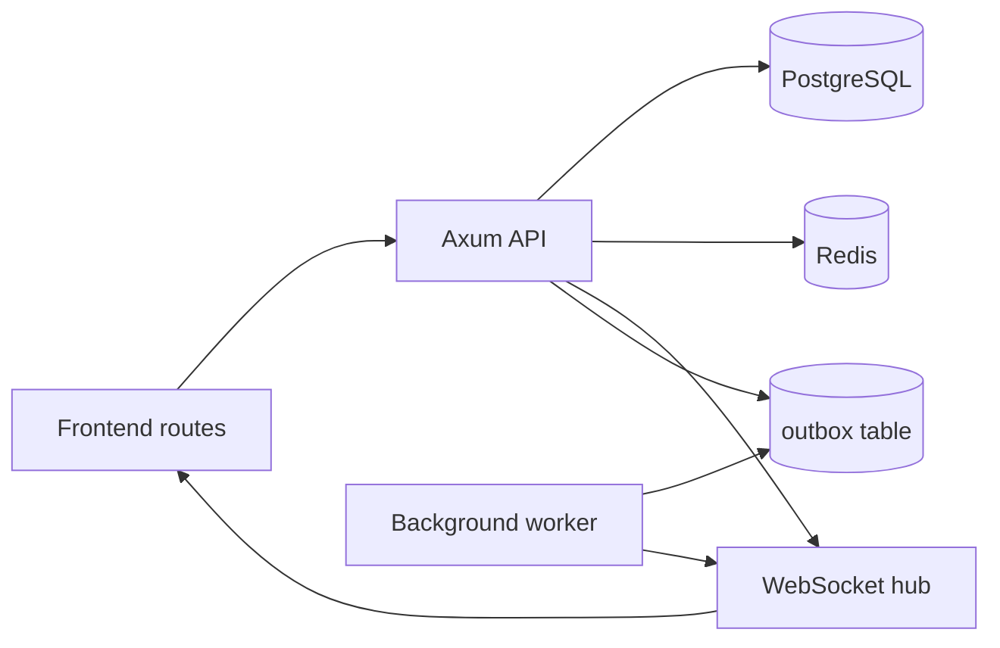

# Rust Backend Design Spec

Status: Draft

This spec defines a lean Rust backend for the current IELTS proctoring frontend. It keeps the domain model already present in the repo and replaces local persistence with a modular monolith built around PostgreSQL, Redis, and WebSockets.

## Scope

The backend covers the active frontend surfaces in [route-manifest.ts](/Users/rd-cream/Downloads/remix_-ielts-proctoring-system/src/app/router/route-manifest.ts):

- `/admin/*`
- `/builder/:examId`
- `/proctor`
- `/student/:scheduleId`

The backend must preserve the domain concepts already present in [src/types/domain.ts](/Users/rd-cream/Downloads/remix_-ielts-proctoring-system/src/types/domain.ts), [src/types/studentAttempt.ts](/Users/rd-cream/Downloads/remix_-ielts-proctoring-system/src/types/studentAttempt.ts), and [src/types/grading.ts](/Users/rd-cream/Downloads/remix_-ielts-proctoring-system/src/types/grading.ts).

## Goals

- Replace localStorage-backed repositories with backend APIs.
- Keep published exam versions immutable.
- Support 1000+ concurrent students and 10-50 proctors.
- Support real-time proctoring and student session updates over WebSockets.
- Keep builder, delivery, proctoring, grading, and scheduling logic in one deployable backend.
- Use transactional writes and optimistic concurrency for state changes.

## Non-Goals

- No microservices in v1.
- No Kafka or RabbitMQ in v1.
- No QUIC in v1.
- No gRPC in v1.
- No CRDT or operational transform system in v1.
- No read replicas in v1 unless load testing proves they are needed.

## Architecture



### Runtime Shape

- `axum` handles HTTP and WebSocket upgrade paths.
- `tower` and `tower-http` provide middleware, tracing, compression, CORS, and request IDs.
- `sqlx` is the only database client in the first version.
- `tokio` is the async runtime.
- `moka` is the per-instance hot cache for version snapshots and validation results.
- Redis is the shared cache and ephemeral state store for session presence, idempotency lookups, and fan-out coordination.
- A background worker drains the outbox table and publishes events to the WebSocket hub.

### Module Boundaries

The code should be split by business capability, not by transport:

- Builder module
  - Exam CRUD
  - Draft saves
  - Version creation
  - Publish, restore, clone, republish
  - Publish readiness validation
- Delivery module
  - Session bootstrap
  - Pre-check persistence
  - Attempt creation
  - Answer mutation sync
  - Heartbeats and reconnect tracking
  - Final submission
- Proctoring module
  - Proctor presence
  - Violation ingest
  - Alert fan-out
  - Session control events
- Grading module
  - Grading sessions
  - Review drafts
  - Review events
  - Student results
  - Release workflow
- Scheduling module
  - Schedule CRUD
  - Runtime snapshots
  - Start/pause/resume/end control
- Shared module
  - Auth and actor context
  - Idempotency
  - Outbox publishing
  - Caching
  - Common validation and error mapping

## API Conventions

- All mutable endpoints use JSON.
- All state-changing POST/PATCH requests accept `Idempotency-Key`.
- Time values are ISO-8601 in UTC.
- Mutations that depend on revision state must include the current revision.
- Version, schedule, and attempt reads are cacheable; mutations are not.
- Standard response shape:

```json
{
  "data": {},
  "meta": {
    "requestId": "req_123",
    "serverTime": "2026-04-17T10:00:00Z"
  }
}
```

- Standard error shape:

```json
{
  "error": {
    "code": "CONFLICT",
    "message": "Draft version has changed",
    "details": []
  }
}
```

### Auth Model

- The backend expects a bearer token or equivalent session credential.
- Middleware turns the authenticated identity into an actor context.
- Actor roles used by policy:
  - `admin`
  - `owner`
  - `reviewer`
  - `grader`
  - `proctor`
  - `student`
- The exact identity provider is out of scope for this spec.

## Routes

### Builder and Exam Lifecycle

| Method | Route | Purpose |
| --- | --- | --- |
| GET | `/api/v1/exams` | List exams with filters for status, owner, visibility, and search |
| POST | `/api/v1/exams` | Create a new exam shell |
| GET | `/api/v1/exams/:examId` | Fetch exam entity with current version pointers |
| PATCH | `/api/v1/exams/:examId` | Update mutable exam metadata |
| DELETE | `/api/v1/exams/:examId` | Delete a draft exam when allowed |
| GET | `/api/v1/exams/:examId/versions` | List all versions for an exam |
| GET | `/api/v1/exams/:examId/versions/:versionId` | Fetch a single version snapshot |
| POST | `/api/v1/exams/:examId/versions` | Create a new draft version from the current draft or source payload |
| GET | `/api/v1/exams/:examId/validation` | Return publish-readiness validation for the active draft or a named version |
| POST | `/api/v1/exams/:examId/publish` | Publish the current draft version |
| POST | `/api/v1/exams/:examId/clone` | Clone an exam into a new lineage |
| POST | `/api/v1/exams/:examId/versions/:versionId/restore` | Restore a prior version as a new draft |
| POST | `/api/v1/exams/:examId/versions/:versionId/republish` | Republish an existing version as a new published version |
| GET | `/api/v1/exams/:examId/events` | Read the exam event stream |
| POST | `/api/v1/exams/bulk-actions` | Execute bulk publish, archive, unpublish, duplicate, delete, export |
| GET | `/api/v1/exams/:examId/versions/compare?left=...&right=...` | Return structured diff between two versions |

### Scheduling and Admin

| Method | Route | Purpose |
| --- | --- | --- |
| GET | `/api/v1/schedules` | List schedules with exam, status, and time filters |
| POST | `/api/v1/schedules` | Create a schedule linked to a published exam version |
| GET | `/api/v1/schedules/:scheduleId` | Fetch schedule details |
| PATCH | `/api/v1/schedules/:scheduleId` | Update schedule metadata or timing |
| GET | `/api/v1/schedules/:scheduleId/runtime` | Fetch the current runtime snapshot |
| POST | `/api/v1/schedules/:scheduleId/start` | Start a scheduled cohort runtime |
| POST | `/api/v1/schedules/:scheduleId/pause` | Pause the cohort runtime |
| POST | `/api/v1/schedules/:scheduleId/resume` | Resume the cohort runtime |
| POST | `/api/v1/schedules/:scheduleId/end` | End the cohort runtime |
| GET | `/api/v1/schedules/:scheduleId/control-events` | Read cohort control history |
| GET | `/api/v1/schedules/:scheduleId/notes` | Read session notes |
| POST | `/api/v1/schedules/:scheduleId/notes` | Create a session note |

### Student Delivery

| Method | Route | Purpose |
| --- | --- | --- |
| GET | `/api/v1/student/sessions/:scheduleId` | Fetch the full student session context |
| POST | `/api/v1/student/sessions/:scheduleId/precheck` | Persist pre-check results and device fingerprint data |
| POST | `/api/v1/student/sessions/:scheduleId/bootstrap` | Create or hydrate the student attempt and return the exam snapshot |
| POST | `/api/v1/student/sessions/:scheduleId/mutations:batch` | Submit a batch of offline answer mutations |
| POST | `/api/v1/student/sessions/:scheduleId/heartbeat` | Record heartbeat, disconnect, reconnect, or lost events |
| POST | `/api/v1/student/sessions/:scheduleId/submit` | Finalize the attempt and create submission records |
| GET | `/api/v1/student/attempts/:attemptId` | Fetch a student attempt by id |
| GET | `/api/v1/student/attempts/:attemptId/mutations` | Read pending or applied mutation history |

### Proctoring

| Method | Route | Purpose |
| --- | --- | --- |
| GET | `/api/v1/proctor/sessions` | List live and scheduled proctoring sessions |
| GET | `/api/v1/proctor/sessions/:scheduleId` | Fetch the live session roster and runtime snapshot |
| POST | `/api/v1/proctor/sessions/:scheduleId/presence` | Join, refresh, or leave proctor presence |
| POST | `/api/v1/proctor/sessions/:scheduleId/violations` | Ingest a violation event |
| POST | `/api/v1/proctor/alerts/:alertId/ack` | Acknowledge a delivered alert |
| GET | `/api/v1/proctor/sessions/:scheduleId/audit` | Read proctor audit entries |

### Grading

| Method | Route | Purpose |
| --- | --- | --- |
| GET | `/api/v1/grading/sessions` | List grading sessions and queue summaries |
| GET | `/api/v1/grading/sessions/:sessionId` | Fetch session detail with student submissions |
| GET | `/api/v1/grading/submissions/:submissionId` | Fetch a submission and section snapshots |
| GET | `/api/v1/grading/submissions/:submissionId/review-draft` | Fetch the active review draft |
| PUT | `/api/v1/grading/submissions/:submissionId/review-draft` | Save the review draft |
| POST | `/api/v1/grading/submissions/:submissionId/review-events` | Append grading audit events |
| POST | `/api/v1/grading/results/:resultId/release` | Release or schedule release of student results |
| GET | `/api/v1/grading/results/:resultId/events` | Read release history |

### WebSockets

| Route | Purpose |
| --- | --- |
| `/api/v1/ws/proctor/:scheduleId` | Live runtime updates, violations, presence, and control events |
| `/api/v1/ws/student/:scheduleId` | Student sync acknowledgements, proctor state, and runtime phase changes |

## Data Model

### Core Invariants

- One `exam_entities` row represents one exam lifecycle entity.
- One exam can have many immutable `exam_versions`.
- The active draft and active published version are pointer fields on `exam_entities`.
- One schedule points at exactly one published version.
- One runtime snapshot belongs to one schedule.
- One student attempt belongs to one schedule and one student key.
- One review draft belongs to one submission.
- One result version belongs to one submission, with a revision chain for later corrections.

### Tables

#### `exam_entities`

| Column | Type | Notes |
| --- | --- | --- |
| id | uuid pk | Stable exam id |
| slug | text unique | Human-readable identifier |
| title | text | Exam title |
| exam_type | text | `Academic` or `General Training` |
| status | text | `draft`, `in_review`, `approved`, `rejected`, `scheduled`, `published`, `archived`, `unpublished` |
| visibility | text | `private`, `organization`, `public` |
| owner_id | text | Actor who owns the exam |
| created_at | timestamptz | Creation time |
| updated_at | timestamptz | Last mutation time |
| published_at | timestamptz nullable | Latest publish time |
| archived_at | timestamptz nullable | Archive time |
| current_draft_version_id | uuid nullable | Pointer to mutable draft version |
| current_published_version_id | uuid nullable | Pointer to immutable published version |
| can_edit | boolean | Policy summary |
| can_publish | boolean | Policy summary |
| can_delete | boolean | Policy summary |
| total_questions | int nullable | Denormalized count |
| total_reading_questions | int nullable | Denormalized count |
| total_listening_questions | int nullable | Denormalized count |
| schema_version | int | Must match the current domain schema version |
| revision | int | Optimistic concurrency token |

Indexes:

- unique on `slug`
- index on `(status, updated_at desc)`
- index on `(owner_id, updated_at desc)`

#### `exam_versions`

| Column | Type | Notes |
| --- | --- | --- |
| id | uuid pk | Version id |
| exam_id | uuid fk | Parent exam |
| version_number | int | Monotonic per exam |
| parent_version_id | uuid nullable fk | Immediate lineage parent |
| content_snapshot | jsonb | Serialized exam state |
| config_snapshot | jsonb | Serialized exam config |
| validation_snapshot | jsonb nullable | Latest validation summary |
| created_by | text | Actor id |
| created_at | timestamptz | Version creation time |
| publish_notes | text nullable | Optional publish notes |
| is_draft | boolean | True for active draft versions |
| is_published | boolean | True for published versions |
| revision | int | Optimistic concurrency token |

Constraints:

- unique on `(exam_id, version_number)`
- index on `(exam_id, created_at desc)`
- index on `(exam_id, is_draft)`
- index on `(exam_id, is_published)`

#### `exam_events`

| Column | Type | Notes |
| --- | --- | --- |
| id | uuid pk | Event id |
| exam_id | uuid fk | Parent exam |
| version_id | uuid nullable fk | Version context |
| actor_id | text | Actor who triggered the event |
| action | text | `created`, `draft_saved`, `submitted_for_review`, `approved`, `rejected`, `published`, `unpublished`, `scheduled`, `archived`, `restored`, `cloned`, `version_created`, `version_restored`, `permissions_updated` |
| from_state | text nullable | Previous exam status |
| to_state | text nullable | New exam status |
| payload | jsonb nullable | Extra audit data |
| created_at | timestamptz | Event time |

Indexes:

- index on `(exam_id, created_at desc)`
- index on `(exam_id, action, created_at desc)`

#### `exam_schedules`

| Column | Type | Notes |
| --- | --- | --- |
| id | uuid pk | Schedule id |
| exam_id | uuid fk | Parent exam |
| exam_title | text | Snapshot for display |
| published_version_id | uuid fk | Immutable version pinned by the schedule |
| cohort_name | text | Cohort label |
| institution | text nullable | Optional institution |
| start_time | timestamptz | Scheduled start |
| end_time | timestamptz | Scheduled end |
| planned_duration_minutes | int | Derived from section plan |
| delivery_mode | text | Must be `proctor_start` |
| recurrence_type | text | `none`, `daily`, `weekly`, `monthly` |
| recurrence_interval | int | Repetition interval |
| recurrence_end_date | date nullable | Optional recurrence limit |
| buffer_before_minutes | int nullable | Pre-window buffer |
| buffer_after_minutes | int nullable | Post-window buffer |
| auto_start | boolean | Auto-start runtime |
| auto_stop | boolean | Auto-stop runtime |
| status | text | `scheduled`, `live`, `completed`, `cancelled` |
| created_at | timestamptz | Creation time |
| created_by | text | Actor id |
| updated_at | timestamptz | Last mutation time |
| revision | int | Optimistic concurrency token |

Indexes:

- index on `(exam_id, start_time desc)`
- index on `(status, start_time asc)`
- index on `(published_version_id)`

#### `exam_session_runtimes`

| Column | Type | Notes |
| --- | --- | --- |
| id | uuid pk | Runtime id |
| schedule_id | uuid unique fk | One runtime per schedule |
| exam_id | uuid fk | Parent exam |
| status | text | `not_started`, `live`, `paused`, `completed`, `cancelled` |
| plan_snapshot | jsonb | Derived section plan |
| actual_start_at | timestamptz nullable | Actual runtime start |
| actual_end_at | timestamptz nullable | Actual runtime end |
| active_section_key | text nullable | Live section |
| current_section_key | text nullable | Cursor section |
| current_section_remaining_seconds | int | Remaining time in current section |
| waiting_for_next_section | boolean | Gap window state |
| is_overrun | boolean | True if runtime exceeds plan |
| total_paused_seconds | int | Accumulated pause time |
| created_at | timestamptz | Creation time |
| updated_at | timestamptz | Last mutation time |
| revision | int | Optimistic concurrency token |

#### `exam_session_runtime_sections`

| Column | Type | Notes |
| --- | --- | --- |
| id | uuid pk | Row id |
| runtime_id | uuid fk | Parent runtime |
| section_key | text | `listening`, `reading`, `writing`, `speaking` |
| label | text | Display label |
| section_order | int | Sort order |
| planned_duration_minutes | int | Planned time |
| gap_after_minutes | int | Gap after this section |
| status | text | `locked`, `live`, `paused`, `completed` |
| available_at | timestamptz nullable | When section becomes available |
| actual_start_at | timestamptz nullable | Actual start |
| actual_end_at | timestamptz nullable | Actual end |
| paused_at | timestamptz nullable | Pause timestamp |
| accumulated_paused_seconds | int | Total paused seconds |
| extension_minutes | int | Extra time granted |
| completion_reason | text nullable | `auto_timeout`, `proctor_end`, `proctor_complete`, `cancelled` |
| projected_start_at | timestamptz nullable | Scheduled start |
| projected_end_at | timestamptz nullable | Scheduled end |

Constraints:

- unique on `(runtime_id, section_key)`
- index on `(runtime_id, section_order)`

#### `cohort_control_events`

| Column | Type | Notes |
| --- | --- | --- |
| id | uuid pk | Event id |
| schedule_id | uuid fk | Parent schedule |
| runtime_id | uuid fk | Parent runtime |
| exam_id | uuid fk | Parent exam |
| actor_id | text | Proctor or admin id |
| action | text | `start_runtime`, `pause_runtime`, `resume_runtime`, `extend_section`, `end_section_now`, `complete_runtime`, `auto_timeout` |
| section_key | text nullable | Section target |
| minutes | int nullable | Extension amount |
| reason | text nullable | Human-readable reason |
| payload | jsonb nullable | Extra details |
| created_at | timestamptz | Event time |

#### `student_attempts`

| Column | Type | Notes |
| --- | --- | --- |
| id | uuid pk | Attempt id |
| schedule_id | uuid fk | Parent schedule |
| student_key | text | Stable student identity for a schedule |
| exam_id | uuid fk | Parent exam |
| exam_title | text | Snapshot for display |
| phase | text | `pre-check`, `lobby`, `exam`, `post-exam` |
| current_module | text | Active module |
| current_question_id | text nullable | Cursor question |
| answers | jsonb | Answer map |
| writing_answers | jsonb | Writing answer map |
| flags | jsonb | Question flags |
| violations_snapshot | jsonb | Compact view of current violations |
| integrity | jsonb | Pre-check and heartbeat integrity state |
| recovery | jsonb | Sync and recovery state |
| created_at | timestamptz | Creation time |
| updated_at | timestamptz | Last mutation time |
| revision | int | Optimistic concurrency token |

Constraints:

- unique on `(schedule_id, student_key)`
- index on `(schedule_id, phase)`
- index on `(exam_id, updated_at desc)`

#### `student_attempt_mutations`

| Column | Type | Notes |
| --- | --- | --- |
| id | uuid pk | Mutation id |
| attempt_id | uuid fk | Parent attempt |
| schedule_id | uuid fk | Parent schedule |
| batch_request_id | uuid fk | Idempotency record for the batch request |
| mutation_type | text | `answer`, `writing_answer`, `flag`, `violation`, `position`, `precheck`, `network`, `heartbeat`, `device_fingerprint`, `sync` |
| payload | jsonb | Client mutation body |
| client_timestamp | timestamptz | Client event time |
| server_received_at | timestamptz | Server receive time |
| applied_revision | int nullable | Attempt revision after application |
| applied_at | timestamptz nullable | Application time |

Indexes:

- index on `(attempt_id, server_received_at desc)`
- index on `(schedule_id, server_received_at desc)`
- index on `(batch_request_id)`

#### `student_heartbeat_events`

| Column | Type | Notes |
| --- | --- | --- |
| id | uuid pk | Event id |
| attempt_id | uuid fk | Parent attempt |
| schedule_id | uuid fk | Parent schedule |
| event_type | text | `heartbeat`, `disconnect`, `reconnect`, `lost` |
| payload | jsonb nullable | Extra metadata |
| client_timestamp | timestamptz | Client event time |
| server_received_at | timestamptz | Server receive time |

#### `student_violation_events`

| Column | Type | Notes |
| --- | --- | --- |
| id | uuid pk | Event id |
| attempt_id | uuid fk | Parent attempt |
| schedule_id | uuid fk | Parent schedule |
| student_id | text | Student identity for proctor views |
| proctor_id | text nullable | Reporting proctor |
| severity | text | `low`, `medium`, `high`, `critical` |
| violation_type | text | Canonical violation code |
| description | text | Human-readable description |
| source | text | `client`, `proctor`, `rule_engine`, `system` |
| detected_at | timestamptz | Violation time |
| payload | jsonb nullable | Full violation body |
| alert_state | text | `pending`, `delivered`, `acknowledged`, `suppressed` |
| created_at | timestamptz | Row creation time |

Indexes:

- index on `(schedule_id, severity, detected_at desc)`
- index on `(attempt_id, detected_at desc)`

#### `proctor_presence`

| Column | Type | Notes |
| --- | --- | --- |
| id | uuid pk | Row id |
| schedule_id | uuid fk | Parent schedule |
| proctor_id | text | Proctor identity |
| proctor_name | text | Display name |
| joined_at | timestamptz | First join time |
| last_heartbeat_at | timestamptz | Last refresh time |
| is_active | boolean | Presence state |
| updated_at | timestamptz | Last mutation time |

Constraints:

- unique on `(schedule_id, proctor_id)`

#### `session_audit_logs`

| Column | Type | Notes |
| --- | --- | --- |
| id | uuid pk | Audit id |
| schedule_id | uuid fk | Session scope |
| actor | text | Actor name or id |
| action_type | text | Mirrors the frontend audit action names |
| target_student_id | text nullable | Optional student target |
| payload | jsonb nullable | Extra audit metadata |
| timestamp | timestamptz | Event time |

#### `session_notes`

| Column | Type | Notes |
| --- | --- | --- |
| id | uuid pk | Note id |
| schedule_id | uuid fk | Session scope |
| author | text | Note author |
| category | text | `general`, `incident`, `handover` |
| content | text | Note body |
| is_resolved | boolean nullable | Resolution state |
| timestamp | timestamptz | Creation time |

#### `violation_rules`

| Column | Type | Notes |
| --- | --- | --- |
| id | uuid pk | Rule id |
| schedule_id | uuid fk | Rule scope |
| trigger_type | text | `violation_count`, `specific_violation_type`, `severity_threshold` |
| threshold | int | Trigger threshold |
| specific_violation_type | text nullable | Required for type-based rules |
| specific_severity | text nullable | Required for severity rules |
| action | text | `warn`, `pause`, `notify_proctor`, `terminate` |
| is_enabled | boolean | Rule toggle |
| created_at | timestamptz | Creation time |
| created_by | text | Actor id |

#### `grading_sessions`

| Column | Type | Notes |
| --- | --- | --- |
| id | uuid pk | Session id |
| schedule_id | uuid fk | Schedule scope |
| exam_id | uuid fk | Parent exam |
| exam_title | text | Snapshot for display |
| published_version_id | uuid fk | Immutable version pinned for grading |
| cohort_name | text | Cohort label |
| institution | text nullable | Optional institution |
| start_time | timestamptz | Schedule start |
| end_time | timestamptz | Schedule end |
| status | text | `scheduled`, `live`, `in_progress`, `completed`, `cancelled` |
| total_students | int | Denormalized count |
| submitted_count | int | Denormalized count |
| pending_manual_reviews | int | Denormalized count |
| in_progress_reviews | int | Denormalized count |
| finalized_reviews | int | Denormalized count |
| overdue_reviews | int | Denormalized count |
| assigned_teachers | jsonb | Teacher ids |
| created_at | timestamptz | Creation time |
| created_by | text | Actor id |
| updated_at | timestamptz | Last mutation time |

Constraints:

- unique on `(schedule_id)`

Indexes:

- index on `(status, updated_at desc)`
- index on `(exam_id, updated_at desc)`

#### `student_submissions`

| Column | Type | Notes |
| --- | --- | --- |
| id | uuid pk | Submission row id |
| submission_id | text unique | External-facing submission id |
| attempt_id | uuid fk | Source attempt |
| schedule_id | uuid fk | Schedule scope |
| exam_id | uuid fk | Parent exam |
| published_version_id | uuid fk | Immutable version used for grading |
| student_id | text | Student identity |
| student_name | text | Display name |
| student_email | text nullable | Optional contact |
| cohort_name | text | Cohort label |
| submitted_at | timestamptz | Final submission time |
| time_spent_seconds | int | Total duration |
| grading_status | text | `not_submitted`, `submitted`, `in_progress`, `grading_complete`, `ready_to_release`, `released`, `reopened` |
| assigned_teacher_id | text nullable | Assigned grader |
| assigned_teacher_name | text nullable | Grader display name |
| is_flagged | boolean | Flag state |
| flag_reason | text nullable | Flag reason |
| is_overdue | boolean | Overdue state |
| due_date | timestamptz nullable | Optional deadline |
| section_statuses | jsonb | Per-section grading status map |
| created_at | timestamptz | Creation time |
| updated_at | timestamptz | Last mutation time |

Constraints:

- unique on `(attempt_id)`
- unique on `(schedule_id, student_id)`

Indexes:

- index on `(schedule_id, updated_at desc)`
- index on `(exam_id, updated_at desc)`

#### `section_submissions`

| Column | Type | Notes |
| --- | --- | --- |
| id | uuid pk | Section row id |
| submission_id | uuid fk | Parent submission |
| section | text | `listening`, `reading`, `writing`, `speaking` |
| answers | jsonb | Immutable answer snapshot |
| auto_grading_results | jsonb nullable | Objective section grading |
| grading_status | text | Section grading status |
| reviewed_by | text nullable | Reviewer id |
| reviewed_at | timestamptz nullable | Review time |
| finalized_by | text nullable | Finalizer id |
| finalized_at | timestamptz nullable | Finalization time |
| submitted_at | timestamptz | Submission time |

Constraints:

- unique on `(submission_id, section)`

#### `writing_task_submissions`

| Column | Type | Notes |
| --- | --- | --- |
| id | uuid pk | Task row id |
| section_submission_id | uuid fk | Parent section submission |
| task_id | text | Task id from exam snapshot |
| task_label | text | Task label |
| prompt | text | Immutable prompt snapshot |
| student_text | text | Student response |
| word_count | int | Computed count |
| rubric_assessment | jsonb nullable | Rubric score payload |
| annotations | jsonb | Writing annotations |
| overall_feedback | text nullable | Feedback text |
| student_visible_notes | text nullable | Student-visible notes |
| grading_status | text | Section grading status |
| submitted_at | timestamptz | Submission time |
| graded_by | text nullable | Grader id |
| graded_at | timestamptz nullable | Grading time |
| finalized_by | text nullable | Finalizer id |
| finalized_at | timestamptz nullable | Finalization time |

Constraints:

- unique on `(section_submission_id, task_id)`

#### `review_drafts`

| Column | Type | Notes |
| --- | --- | --- |
| id | uuid pk | Draft id |
| submission_id | uuid unique fk | One draft per submission |
| student_id | text | Student identity |
| teacher_id | text | Grader identity |
| release_status | text | `draft`, `grading_complete`, `ready_to_release`, `released`, `reopened` |
| section_drafts | jsonb | Draft rubric assessments |
| annotations | jsonb | Draft annotations |
| drawings | jsonb | Draft drawings |
| overall_feedback | text nullable | Draft feedback |
| student_visible_notes | text nullable | Notes visible to student |
| internal_notes | text nullable | Private notes |
| teacher_summary | jsonb nullable | Summary bullets |
| checklist | jsonb | Completion flags |
| has_unsaved_changes | boolean | UI state |
| last_auto_save_at | timestamptz nullable | Auto-save time |
| revision | int | Optimistic concurrency token |
| created_at | timestamptz | Creation time |
| updated_at | timestamptz | Last mutation time |

Indexes:

- index on `(submission_id)`
- index on `(teacher_id, updated_at desc)`

#### `review_events`

| Column | Type | Notes |
| --- | --- | --- |
| id | uuid pk | Event id |
| submission_id | uuid fk | Submission scope |
| teacher_id | text | Grader id |
| teacher_name | text | Grader display name |
| action | text | `review_started`, `review_assigned`, `draft_saved`, `comment_added`, `comment_updated`, `rubric_updated`, `review_finalized`, `review_reopened`, `score_override`, `feedback_updated` |
| section | text nullable | Optional section context |
| task_id | text nullable | Optional task context |
| annotation_id | text nullable | Optional annotation context |
| question_id | text nullable | Optional question context |
| from_status | text nullable | Previous status |
| to_status | text nullable | New status |
| payload | jsonb nullable | Extra details |
| timestamp | timestamptz | Event time |

#### `student_results`

| Column | Type | Notes |
| --- | --- | --- |
| id | uuid pk | Result id |
| submission_id | uuid fk | Parent submission |
| student_id | text | Student identity |
| student_name | text | Display name |
| release_status | text | `draft`, `grading_complete`, `ready_to_release`, `released`, `reopened` |
| released_at | timestamptz nullable | Release time |
| released_by | text nullable | Releaser id |
| scheduled_release_date | timestamptz nullable | Deferred release time |
| overall_band | numeric(3,1) | Final band score |
| section_bands | jsonb | Per-section band map |
| listening_result | jsonb nullable | Listening breakdown |
| reading_result | jsonb nullable | Reading breakdown |
| writing_results | jsonb | Writing task breakdown |
| speaking_result | jsonb nullable | Speaking breakdown |
| teacher_summary | jsonb | Strengths and next steps |
| version | int | Result revision |
| previous_version_id | uuid nullable | Link to prior result version |
| revision_reason | text nullable | Reason for revision |
| created_at | timestamptz | Creation time |
| updated_at | timestamptz | Last mutation time |

Constraints:

- unique on `(submission_id, version)`

Indexes:

- index on `(submission_id, version desc)`

#### `release_events`

| Column | Type | Notes |
| --- | --- | --- |
| id | uuid pk | Event id |
| result_id | uuid fk | Parent result |
| action | text | `mark_grading_complete`, `mark_ready_to_release`, `release_now`, `schedule_release`, `reopen_result`, `revise_result` |
| actor | text | Actor id |
| actor_name | text | Actor display name |
| timestamp | timestamptz | Event time |
| from_status | text nullable | Previous release status |
| to_status | text nullable | New release status |
| payload | jsonb nullable | Extra details |

#### `idempotency_keys`

| Column | Type | Notes |
| --- | --- | --- |
| id | uuid pk | Row id |
| key | text unique | Client idempotency key |
| actor_id | text | Actor who sent the request |
| route | text | Route fingerprint |
| request_hash | text | Hash of request body |
| response_code | int nullable | Cached response code |
| response_body | jsonb nullable | Cached response payload |
| created_at | timestamptz | Creation time |
| expires_at | timestamptz | Expiry time |

#### `outbox_events`

| Column | Type | Notes |
| --- | --- | --- |
| id | uuid pk | Event id |
| aggregate_type | text | `exam`, `schedule`, `runtime`, `attempt`, `violation`, `submission`, `result` |
| aggregate_id | text | Aggregate id |
| event_type | text | Domain event name |
| channel | text | WebSocket or worker channel |
| payload | jsonb | Event body |
| not_before | timestamptz nullable | Delayed delivery |
| published_at | timestamptz nullable | When the worker delivered it |
| attempt_count | int | Delivery attempts |
| last_error | text nullable | Last publish error |
| created_at | timestamptz | Creation time |
| locked_at | timestamptz nullable | Worker lock timestamp |

## Event Flows

### 1. Publish Exam

1. Client sends `POST /api/v1/exams/:examId/publish` with `Idempotency-Key`.
2. Service loads the current exam row and draft version in one transaction.
3. Service runs publish-readiness validation.
4. If validation passes, service creates a new immutable published version.
5. Service updates `current_published_version_id`, `published_at`, `status`, and `revision`.
6. Service inserts an `exam_events` row with `action = published`.
7. Service writes an `outbox_events` row for cache invalidation and UI refresh.
8. Worker publishes the event to connected builder/admin clients and invalidates relevant caches.

Validation rules:

- Parallelize module validation for reading, listening, writing, and speaking.
- Cache validation results by `version_id` and `revision`.
- Fail on blocking errors.
- Return warnings without blocking publish.

### 2. Create or Restore a Draft Version

1. Client requests draft creation or restore.
2. Service loads the exam row and checks the current revision.
3. Service computes the next version number from the current max for the exam.
4. Service deep copies the source snapshot into `exam_versions`.
5. Service updates `current_draft_version_id` and increments the exam revision in the same transaction.
6. Service inserts a version event.
7. Service invalidates cached version snapshots.

### 3. Student Bootstrap and Pre-Check

1. Client opens `/student/:scheduleId`.
2. Client posts pre-check results to `/api/v1/student/sessions/:scheduleId/precheck`.
3. Service validates the schedule, the pinned published version, and the student identity.
4. Service stores pre-check results, device fingerprint, and integrity state.
5. Client calls `/api/v1/student/sessions/:scheduleId/bootstrap`.
6. Service returns:
   - schedule metadata
   - pinned exam version snapshot
   - runtime state if it exists
   - attempt state if it exists
   - current proctoring and connectivity flags
7. If the attempt does not exist, the service creates it in `phase = pre-check` or `phase = lobby` depending on schedule readiness.

### 4. Answer Submission Sync

1. Client accumulates mutations locally while offline or between heartbeats.
2. Client sends `POST /api/v1/student/sessions/:scheduleId/mutations:batch` with an idempotency key.
3. Service rejects the request if the schedule is closed or the attempt revision is stale beyond recovery.
4. Service resolves or creates the idempotency record for the batch request.
5. Service writes each mutation row to `student_attempt_mutations`, linked to the batch record.
6. Service applies the batch to `student_attempts` in one transaction.
7. Service advances the attempt revision and records the latest recovery state.
8. Service updates the idempotency record with the final response payload.
9. Service creates an outbox event for UI acknowledgement and proctor visibility if the mutation is relevant.
10. Service returns the new attempt revision and sync state.

Rules:

- The batch endpoint is the primary write path.
- Single mutation endpoints are optional compatibility shims.
- The server must preserve mutation order inside a batch.
- Duplicate batches with the same idempotency key must return the cached response.

### 5. Heartbeat and Connectivity

1. Client sends a heartbeat every 1-2 seconds during active exam time.
2. Service updates `student_attempts.integrity` and `recovery`.
3. Service appends a `student_heartbeat_events` row only when the heartbeat represents a meaningful state change.
4. If the connection is lost, the server marks the attempt as degraded and emits a UI update.
5. Proctor views consume the resulting event stream and update student status.

### 6. Violation Ingest and Alert Fan-Out

1. Client or proctor posts a violation to `/api/v1/proctor/sessions/:scheduleId/violations`.
2. Service validates the violation against the active schedule and rules.
3. Service inserts `student_violation_events`.
4. Service evaluates enabled `violation_rules`.
5. If a rule triggers, service inserts a control or alert outbox event.
6. Worker fans out the alert through the proctor WebSocket channel.
7. The service updates the attempt snapshot so the student and proctor views remain consistent.

### 7. Grading Draft Save

1. Grader opens a submission detail page.
2. Client fetches `/api/v1/grading/submissions/:submissionId/review-draft`.
3. Client saves changes through `PUT /api/v1/grading/submissions/:submissionId/review-draft`.
4. Service checks `review_drafts.revision`.
5. Service persists the draft and appends a `review_events` row with `draft_saved`.
6. Service updates derived counters on `grading_sessions`.
7. If the draft becomes ready to release, service updates `student_results.release_status`.

### 8. Schedule Start and Runtime Control

1. Admin calls `POST /api/v1/schedules/:scheduleId/start`.
2. Service locks the schedule and resolves the pinned published version.
3. Service generates `plan_snapshot` from the version config.
4. Service creates or updates `exam_session_runtimes` and `exam_session_runtime_sections`.
5. Service appends a `cohort_control_events` row with `start_runtime`.
6. Worker emits a WebSocket event to proctors and students.
7. Subsequent pause/resume/end actions mutate the runtime row and append control events.

## Consistency and Concurrency

- Use PostgreSQL transactions for every multi-table state change.
- Use optimistic concurrency on mutable aggregate rows: exams, schedules, runtimes, attempts, and review drafts.
- Use `SELECT ... FOR UPDATE` only when pointer updates must be serialized, such as publish, schedule start, and final submission.
- Keep version rows immutable after creation.
- Never update published version snapshots in place.
- Treat Redis as ephemeral state only.
- Treat the database as the source of truth for every durable state change.

## Caching

### L1 Cache

- `moka` holds:
  - exam version snapshots
  - validation results
  - schedule read models
  - grading queue summaries

### L2 Cache

- Redis holds:
  - active proctor presence
  - session connection metadata
  - idempotency metadata when appropriate
  - fan-out coordination across API nodes

### Invalidation Rules

- Publish and restore invalidate exam version caches.
- Schedule updates invalidate schedule and runtime caches.
- Attempt mutation invalidates student bootstrap caches.
- Draft save invalidates grading detail caches.
- Result release invalidates queue and result caches.

## Error Handling

### Status Codes

- `400` for malformed requests.
- `401` for unauthenticated requests.
- `403` for policy or role failures.
- `404` for missing aggregates.
- `409` for revision conflicts or duplicate submission state.
- `422` for domain validation failures.
- `413` for oversized payloads.
- `429` for rate-limited endpoints.
- `500` for unexpected failures.

### Domain Error Codes

- `VALIDATION_ERROR`
- `CONFLICT`
- `NOT_FOUND`
- `FORBIDDEN`
- `UNAUTHORIZED`
- `IDEMPOTENCY_REPLAY`
- `STALE_REVISION`
- `SESSION_CLOSED`
- `PAYLOAD_TOO_LARGE`

### Important Rules

- Answer submission must be idempotent.
- Publish must be atomic.
- Proctor alert delivery may be retried, but the violation event itself must not be lost.
- If Redis is unavailable, durable DB writes still succeed; live fan-out can degrade to polling or delayed delivery.

## Observability

- Use `tracing` for structured logs.
- Propagate `request_id`, `actor_id`, `schedule_id`, `exam_id`, and `submission_id` through logs.
- Expose Prometheus metrics for:
  - request latency
  - DB query latency
  - WebSocket connection counts
  - outbox backlog
  - publish validation time
  - answer submission latency
  - violation-to-alert latency
- Emit OpenTelemetry spans for the publish, bootstrap, submit, and alert flows.

## Testing

### Unit Tests

- Exam lifecycle transitions
- Publish validation
- Version lineage creation
- Runtime plan generation
- Attempt mutation merge logic
- Grading draft revision checks

### Integration Tests

- PostgreSQL transaction behavior
- Optimistic concurrency conflict handling
- Idempotency replay handling
- Outbox delivery
- WebSocket fan-out

### Contract Tests

- Route and response shape tests for the frontend repositories
- Student session bootstrap shape
- Builder version compare response
- Grading draft save response

### Load Tests

- 1000+ concurrent student heartbeats
- Burst answer submission traffic
- Live violation alert fan-out
- Schedule start and runtime update throughput

## Performance Targets

- Exam publish: p95 under 500 ms for normal-size exams.
- Draft save: p95 under 200 ms.
- Answer submission: p95 under 50 ms after durable commit for normal traffic.
- Violation-to-alert delivery: p95 under 100 ms.
- Schedule fetch: p95 under 50 ms.
- Grading draft save: p95 under 200 ms.
- WebSocket broadcast: p95 under 200 ms to connected clients on the same region.

## Rollout Plan

1. Add the Rust backend alongside the frontend.
2. Build API adapters that mirror the current repository methods.
3. Point the frontend repositories at the backend API instead of localStorage.
4. Preserve current JSON shapes where practical so the frontend rewrite is minimal.
5. Migrate one domain at a time:
   - builder first
   - then scheduling and delivery
   - then proctoring
   - then grading
6. Keep localStorage compatibility only as a temporary fallback for development and import/export.

## Notes on Existing Frontend Alignment

- The frontend already models the right entities; the backend should not invent a different lifecycle.
- The route surface already exists, so the backend API should follow those boundaries.
- The current local repositories are the migration seam, not the final storage layer.
