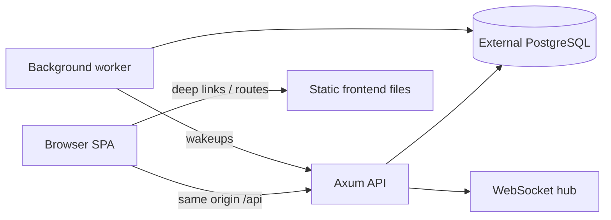

# Single-Service Railway Deployment Design

Status: Draft

This spec defines the deployment refactor needed to run the IELTS proctoring system as one Railway service. The target shape is a single container that serves the compiled frontend at `/`, serves the backend API and WebSocket endpoints on the same origin under `/api`, and runs the Rust worker in the same container as the API process. PostgreSQL stays external.

## Scope

This spec covers:

- backend container changes needed for one-service Railway hosting
- serving the built frontend from the backend container
- keeping API, WebSocket, and static frontend traffic on one origin
- running the worker in the same deployed service
- updating Railway documentation and config to match the one-service model
- keeping PostgreSQL outside the service container

This spec does not cover:

- changing the application domain model
- changing the frontend route structure
- splitting the backend into additional services
- replacing PostgreSQL with an embedded database
- adding a CDN or separate object-storage hosting layer

## Current Code Alignment

The current repository is already close to the desired runtime model, but not yet complete:

- The frontend is a Vite SPA built from the repo root by `npm run build` and currently served by a separate `Dockerfile.frontend`.
- The backend is a Rust workspace under `backend/` with separate API and worker binaries.
- The backend API already owns `/api/v1/*`, `/api/v1/ws/*`, `/healthz`, `/readyz`, and `/metrics`.
- The frontend API client already defaults to same-origin `/api`, which is the right shape for a single-origin deployment.
- The current Railway deployment docs assume separate frontend and backend services, which conflicts with the one-service goal.
- The backend Dockerfile already starts both the API and the worker in one container, so the missing piece is frontend serving, not process orchestration.

## Goals

- Deploy the whole product from one Railway service.
- Keep the browser app and backend on the same origin.
- Preserve the existing `/api/v1/*` backend contract.
- Keep WebSocket traffic on the same deployed origin as the frontend.
- Keep the worker running alongside the API in the same container.
- Keep PostgreSQL external and connect through normal environment variables.
- Avoid introducing a separate reverse proxy service.

## Non-Goals

- No second Railway service for the frontend.
- No separate worker service.
- No in-container database.
- No rewrite of the API contract to accommodate a CDN-only frontend.
- No migration to a monorepo-style multi-container platform beyond Railway’s single service.

## Proposed Runtime Shape

The deployed service will have one container with three responsibilities:

1. Serve the compiled frontend bundle at `/` and all non-API SPA routes.
2. Serve the Rust API and WebSocket endpoints under `/api`.
3. Run the background worker process that handles outbox and maintenance jobs.

The public URL will expose:

- `/` and SPA deep links such as `/admin/*`, `/builder/:examId`, `/proctor`, and `/student/:scheduleId`
- `/api/v1/*` for backend requests
- `/api/v1/ws/*` for WebSocket upgrades
- `/healthz`, `/readyz`, and `/metrics` for platform checks and observability

## Architecture

### Container Responsibilities

- The Docker build must compile the frontend assets into `dist/`.
- The final runtime image must contain the frontend build output and the Rust API/worker binaries.
- The API process must serve static files from the built frontend output.
- The worker process must start in the same container as the API process.

### Request Routing Rules

- Requests beginning with `/api/` must go to the backend router.
- Requests for `/healthz`, `/readyz`, and `/metrics` must continue to work as direct backend routes.
- Requests for static assets must resolve to actual built files when present.
- Non-API browser routes must fall back to `index.html` so client-side routing keeps working.
- Missing `/api/*` paths must not fall back to the SPA. They should return a backend-style 404 instead.

## Implementation Boundary

### Docker Build

The backend Dockerfile becomes the single Railway build target.

Required behavior:

- build the frontend from the repo root during image construction
- build the Rust backend binaries from `backend/`
- copy the built frontend assets into the runtime image
- launch the API and worker from the runtime image

This replaces the current split between `Dockerfile.frontend` and `backend/Dockerfile` for Railway deployment.

### API Static Serving

The API binary must serve the frontend build output from the same process that handles backend routes.

Required behavior:

- static assets come from the built frontend directory
- SPA routes fall back to `index.html`
- API routes keep their current JSON behavior
- WebSocket routes keep their current upgrade behavior

The serving layer must not interfere with `/api/v1/*` routing.

### Environment Variables

The one-service deployment keeps PostgreSQL external, so the service needs the normal backend database variables:

- `DATABASE_URL`
- `DATABASE_DIRECT_URL` when used for listener or maintenance paths
- `DATABASE_WORKER_URL` when the worker uses a separate connection URL
- existing backend config variables for ports, auth, object storage, and feature flags

The frontend no longer needs a separate public backend URL in production because the browser and API share the same origin.

### Railway Configuration

The Railway project must be configured as one service only.

Required behavior:

- one Railway web service pointing at the backend Dockerfile
- one external PostgreSQL service or external database connection
- no separate frontend service
- health check should target `/healthz` on the combined service

## Data Flow

1. The browser loads `/` or a deep link such as `/admin/exams`.
2. The container serves `index.html` and the frontend bundle.
3. The frontend makes same-origin requests to `/api/v1/*`.
4. The backend API handles the request and talks to PostgreSQL.
5. The worker drains outbox and maintenance jobs in the background.
6. WebSocket live updates stay on the same origin and continue to use the API process.

## Error Handling

- If static assets are missing, the frontend route should still fall back to `index.html` when appropriate.
- If an API route is missing, the backend must return a 404 and must not hand the request to the SPA.
- If PostgreSQL is unavailable, backend operations that require it should fail normally rather than pretending success.
- If the worker exits, the container may restart according to Railway policy, but the API must not silently stop serving frontend traffic.

## Verification

The refactor is complete only when all of these are true:

- `npm run build` succeeds and produces frontend assets.
- the backend image build succeeds from the Railway target Dockerfile.
- the combined runtime serves `/` correctly.
- direct browser reloads on SPA routes work.
- `/api/v1/*` still resolves to backend JSON endpoints.
- WebSocket routes still upgrade correctly on the same origin.
- the worker still runs in the same container.
- the service starts successfully with external PostgreSQL credentials.

Recommended checks:

- frontend smoke test against the built container
- backend route smoke tests for `/healthz` and `/api/v1/*`
- SPA deep-link reload test for at least one admin route and one student route
- WebSocket connectivity smoke test on `/api/v1/ws/*`

## Rollout

1. Update the backend image so it can build and ship the frontend bundle.
2. Update the API binary so it can serve static frontend assets and SPA fallbacks.
3. Update Railway docs and config to describe one service only.
4. Remove or deprecate the separate frontend deployment path from the Railway instructions.
5. Verify the service against the existing backend contract and route behavior.

## Risks

- Static-file fallback can accidentally mask API 404s if the router boundary is implemented too broadly.
- Serving the frontend from the same container can fail if the Docker build does not copy the correct `dist` output into the final image.
- The worker and API now share container lifecycle, so an unhandled worker crash can restart the entire service.
- External database connectivity must be stable because the single service depends on it for all durable state.

## Decisions

- Keep `Dockerfile.frontend` and `railway.frontend.json` in the repository for now as legacy artifacts, but stop using them for Railway deployment.
- Update `RAILWAY_DEPLOYMENT.md` to describe the one-service path as the canonical deployment guide.
