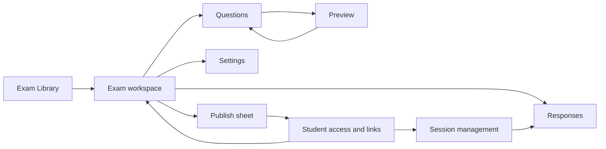

**Recommendation: turn SAT authoring into one persistent exam workspace with Google Forms-style question cards, Questions / Responses / Settings tabs, and Preview / Publish actions.**

I reviewed the current source and existing flow tests. This is a source-based assessment; I did not run a live UI walkthrough. No files were edited, and no skills or sub-agents were used.

**What currently makes the flow harder**

The current staff journey is:

`Exam Library → Create/name exam → Question navigator → Edit question → Release page → Publish confirmation → Student Access → Create link → Share`

The individual capabilities already exist. The main problem is how users move between them.

| Current behavior | UX implication | Proposed change |
|---|---|---|
| One question editor beside a substantial navigator | The exam feels like a collection of separate records | A scrollable module containing question cards |
| Overview, issues, and workbook import live in the overflow menu | Important tasks need discovery | Visible tabs, Import action, and an issue indicator |
| Required Domain and Skill live in question settings | A question can look finished while still failing validation | Show required classification inside the active card |
| Timing and adaptive settings live on Release | Publishing also becomes a configuration task | Move configuration into Settings |
| Publishing opens another page, then redirects to Student Access | Authors lose their editing context | Publish and manage access within the same workspace |
| Results live in the global Results area | Authors must find their exam again | An exam-scoped Responses tab |

These are visible in the [authoring header](/Users/rd-cream/Downloads/remix_-ielts-proctoring-system/src/features/exam-authoring/ui/spine/SpineHeader.tsx), [question inspector](/Users/rd-cream/Downloads/remix_-ielts-proctoring-system/src/features/exam-authoring/ui/spine/Inspector.tsx), and [release page](/Users/rd-cream/Downloads/remix_-ielts-proctoring-system/src/features/exam-authoring/ui/SatDeliveryReleasePage.tsx).

Google Forms provides a useful interaction reference: edit questions directly, keep type selection and answer keys with each question, and use a persistent Publish action with responder-access controls. [Question editing](https://support.google.com/docs/answer/2839737?hl=en), [quiz answer keys](https://support.google.com/docs/answer/7032287?hl=en-en), [publishing and access](https://support.google.com/docs/answer/2839588?hl=en).

**Proposed product spec**

The scope covers the internal journey: creation, question authoring, importing, settings, preview, publishing, student access, session handoff, and response review.

SAT rules remain part of the experience: fixed module structure, adaptive branches, supported answer types, required classification, and published versions.



**1. One consistent workspace**

The exam header stays present across Questions, Responses, Settings, and student-access management.

```text
← Exams    Practice Test 06       Saving… / Saved
                           Preview   Student access   Publish

             Questions | Responses | Settings

Reading & Writing / Math
Module 1 | Module 2 — Lower | Module 2 — Higher

                    Module question cards
```

Requirements:

- The title is editable in place.
- Questions is the default tab.
- Preview, Student access, and Publish stay easy to find.
- Exam lifecycle and saving status are separate indicators.
- Returning from preview or fixing a publish issue restores the module, question, scroll position, and focus.
- Tabs and actions follow existing permissions. The new navigation must not grant additional access.

Use explicit lifecycle copy:

| State | Display |
|---|---|
| Never published | Draft |
| Current content published | Published · Version 2 |
| Draft differs from published content | Unpublished changes · Version 2 remains available |
| Published without student access | Published · No student links |

**2. Create and reopen**

`Create SAT → Questions tab → start writing`

- Create with a default name such as “Untitled SAT”; allow immediate renaming.
- Build the standard SAT structure through the existing creation/draft commands.
- Show a clear Add question action in the initial module.
- If creation succeeds but opening the editor fails, recover that exam instead of creating another.
- An explicit editing action may open a working draft of a published exam.
- Refresh, preview, and read-only navigation must not create drafts.
- Replace technical “No editable draft” language with a useful action such as “Edit this exam.”

**3. Questions behave like Google Forms cards**

Show the selected module as a vertical sequence. Clicking a card expands it for editing; other cards show compact summaries.

The active card contains:

1. Question number and response-type selector.
2. Supporting material, when present.
3. Question text.
4. Answer choices or student-response definition.
5. An **Answer key** control within the card.
6. Required Domain and Skill; compact Difficulty control.
7. Optional Explanation and advanced settings.
8. Duplicate, Delete, and reorder controls.

Interaction requirements:

- Editing saves automatically.
- Moving between cards does not require a Save or Next workflow.
- Add question inserts after the active question; without an active question, it appends.
- Duplicate inserts beside the original.
- Reordering supports dragging and keyboard-accessible Move up / Move down.
- Correct answers follow stable option identities when options move.
- A populated response-type change asks before replacing answer data.
- Delete keeps a clear confirmation until reliable undo exists.
- Module capacity limits explain why Add is unavailable.
- New-question classification inheritance is an explicit preference and never overwrites existing questions.

SAT-specific limits remain clear:

- Reading & Writing supports multiple choice.
- Math supports multiple choice and student-produced responses.
- Multiple choice retains four options.
- There is no arbitrary “Required” toggle or custom points control.

The existing [question editor](/Users/rd-cream/Downloads/remix_-ielts-proctoring-system/src/features/exam-authoring/ui/spine/SpineQuestionView.tsx) and [question command owner](/Users/rd-cream/Downloads/remix_-ielts-proctoring-system/src/features/exam-authoring/ui/useAuthoringQuestionCommands.ts) should supply these behaviors.

**4. Navigation, importing, and validation**

Keep the section/module switcher visible. Make the question outline optional rather than the dominant editing surface.

- Remember position separately for each module.
- Show progress per module.
- Distinguish authored content across both branches from the questions one student receives.
- Provide one visible Import entry with the existing spreadsheet and workbook options.
- Import review identifies destination, accepted rows, excluded rows, capacity, and replacement effects.
- Workbook replacement requires an explicit confirmation.

Validation appears where users can resolve it:

- Field-level errors inside the active card.
- A textual status on incomplete cards.
- An exam-level issue indicator opening a grouped list.
- Clicking an issue opens the correct module, question, and field.
- Blank drafts can be saved; publishing enforces completeness.

Domain and Skill cannot disappear into advanced settings because the current [SAT validator](/Users/rd-cream/Downloads/remix_-ielts-proctoring-system/src/features/exam-authoring/providers/sat/satProvider.ts) requires them.

**5. Settings owns exam configuration**

Move timing, breaks, and adaptive-routing controls out of Release.

Organize Settings around:

- Module timing and breaks.
- Adaptive routing.
- Existing delivery/tool policies, showing read-only policies appropriately.

Student audience, availability, and entry requirements belong to each student link, since different links can serve different groups.

Settings should use the same saving vocabulary as questions. “Saved” must mean server-confirmed persistence, including delivery settings.

**6. Preview preserves context**

- Question preview opens from its card.
- Full preview continues using the actual student renderer.
- Identify preview as Draft or Published Version N.
- Let staff inspect either adaptive branch.
- Returning restores the authoring position.
- Pending changes are confirmed saved before generating the preview.

**7. Publish becomes one focused sheet**

Clicking Publish opens a sheet over the workspace.

The sheet contains:

- Scope: Full SAT, Reading & Writing, or Math.
- Automatic checks for that scope.
- Included sections and candidate duration.
- Blocking issues with direct Fix actions.
- Optional publish notes.
- One explicit publish confirmation.

Timing and routing are summarized here; editing them opens Settings.

After success, the sheet shows:

`Version 3 published → Create student link / Manage existing links`

The author stays in the same exam workspace.

Existing publish safeguards must remain: confirmed saves, checks against the current revision, server-side validation, and retry-safe publication. These already have an owner in the [release controller](/Users/rd-cream/Downloads/remix_-ielts-proctoring-system/src/features/exam-authoring/routes/SatDeliveryReleaseRoute.tsx).

**8. Student access is connected but explicit**

The first student-link flow asks for:

- Audience and entry requirement.
- Available sections within the published scope.
- Anytime or scheduled availability.
- Link name.

Then show Copy link and QR sharing.

Required behavior:

- Publishing content does not silently open access to everyone.
- Links display their published version.
- Publishing Version 3 does not redirect Version 2 links or active attempts.
- Offer “Create link for Version 3” using existing link settings.
- Pause and resume apply to the selected link.
- Explain the effect on new entry and existing attempts before consequential actions.
- If publishing succeeds but creating a link fails, show the partial result and retry only link creation.

The current link contract already pins links to a published version; retain that behavior.

**9. Responses and session handoff**

Responses opens results for the current exam without making staff search again.

Initial scope:

- Summary of existing attempt outcomes.
- Filters for access group, version, date, and status.
- Individual attempts and answer inspection.
- Existing export capability.
- An empty state linking to student-access setup.

Reuse the current results queries. Google Forms-style per-question analytics would require an additional, version-aware reporting capability and should be scoped separately.

From student-access details, offer the corresponding session action where supported. Keep live proctor controls in the session room, with a contextual return path to the exam.

**Solution plan**

| Order | Work | Reviewable result |
|---|---|---|
| 1 | Introduce the persistent exam shell, tabs, lifecycle copy, and navigation context | Questions, Settings, and Responses feel like one exam |
| 2 | Replace the main question canvas with module-scoped cards | Direct editing, visible required metadata, accessible card actions |
| 3 | Consolidate importing and issue navigation | Authors can import and fix problems without losing position |
| 4 | Move delivery configuration into Settings and unify save reporting | Publish contains review and confirmation |
| 5 | Embed publish and student-access surfaces | Publish → create/manage link → copy, within the workspace |
| 6 | Add exam-scoped response and session entry points | Staff can follow the complete internal lifecycle |
| 7 | Verify the full journey and responsive behavior | Evidence that the workflow and existing protections hold |

Implementation boundaries:

- Keep [AuthoringWorkspace](/Users/rd-cream/Downloads/remix_-ielts-proctoring-system/src/features/exam-authoring/ui/AuthoringWorkspace.tsx) responsible for editor orchestration.
- Mount one rich editor for the active card; use existing summaries for collapsed cards.
- Keep one collaboration boundary across exam surfaces.
- Reuse existing publish, access-link, preview, and results services.
- Preserve old release/access URLs and question-field deep links.
- Add insert-after behavior at the existing question-create boundary, with order protection and retry identity. Avoid creating a question and separately reordering it without concurrency protection.

**Acceptance criteria**

The redesign is ready when:

- An author can create, compose, preview, publish, and share without navigating through separate builder/release dashboards.
- Required fields are discoverable before publishing.
- Tab changes, preview exits, and issue fixes preserve editing context.
- Failed saves retain edits and prevent publishing stale content.
- Concurrent edits refresh checks before publication.
- Double-clicks and retries do not produce duplicate releases or questions.
- New releases preserve existing links, attempts, and results.
- Keyboard users can edit, reorder, fix issues, and publish.
- Narrow screens retain usable tabs and actions without overlapping the editor.

**The first implementation should prioritize the persistent shell and question cards.** Those establish the Google Forms-style experience; publishing and access can then join that same structure.

**The scope should cover every functional SAT staff page, including forms, dialogs, loading states, errors, and action feedback.** The redesign needs one consistent visual system, with layouts suited to authoring, operating sessions, and reviewing results.

This remains a read-only spec and solution plan. Findings below come from source inspection; rendered layouts still need browser verification.

**The main UI issues to address**

- Navigation changes shape between authoring, release, and student access.
- Several pages declare important metadata and labels at 10–11 px.
- Required question fields are separated from the main editing task.
- Results emphasize technical question and module IDs.
- Sharing presents several competing actions instead of one obvious next step.
- Some status mappings use broad “Completed” labels that conceal scoring or unknown states.

The relevant surfaces are in [SAT navigation](/Users/rd-cream/Downloads/remix_-ielts-proctoring-system/src/products/sat/SatRoot.tsx), [shared page components](/Users/rd-cream/Downloads/remix_-ielts-proctoring-system/src/products/sat/ui/SatPage.tsx), and [result details](/Users/rd-cream/Downloads/remix_-ielts-proctoring-system/src/products/sat/routes/SatResultDetailRoute.tsx).

**Shared UX/UI specification**

Every page should use the same rules:

| Element | Specification |
|---|---|
| Page header | Location/back link, clear title, relevant context, primary action |
| Typography | Body 14–16 px; labels and metadata at least 12 px; page titles 24–30 px |
| Surfaces | Quiet background, solid content surfaces, restrained borders and elevation |
| Spacing | Consistent 8 / 16 / 24 / 32 px rhythm |
| Controls | Consistent heights and focus treatment; at least 44 px interactive targets |
| Action hierarchy | One visually dominant next action per task area |
| Status | Text plus visual indicator; separate saving, publication, access, and attempt states |
| Forms | Persistent labels, required/optional indicators, errors beside their fields |
| Feedback | Confirmation beside the action; persistent messages for failures requiring recovery |
| Navigation | Preserve filters, selected records, scroll position, and return context |
| Responsive behavior | Adapt columns and panels; keep the current task and primary action visible |
| Accessibility | Full keyboard operation, visible focus, readable contrast, reduced-motion support |

Reuse the existing components and semantic colors, then reconcile their differences. The current application already has much of this foundation.

**Authoring pages should share the Google Forms-style exam workspace.**

| Page or surface | Proposed layout and behavior |
|---|---|
| **Exam Library** | Search and status filters above a scannable list. Each row shows title, lifecycle, question progress, published version, and updated date. Create SAT stays prominent. Preserve search when returning. |
| **Create SAT** | Enter the editor immediately with an editable default title. Show creation progress and recover the created exam if opening fails. |
| **Questions** | Scrollable cards within the selected module. Expand the active card; summarize inactive cards. Keep section/module navigation visible. Add, duplicate, reorder, and delete operate beside the relevant question. |
| **Question editing** | Supporting material, question text, response type, choices, answer key, and required classification belong together. Optional explanation expands on demand. Formatting controls appear near the focused field. |
| **Question settings** | Keep Domain and Skill in the card. Use a secondary panel for tags, accessibility details, and pretest configuration. Clearly identify the question being changed. |
| **Module import** | Show source input and a review pane with destination, capacity, accepted rows, and excluded rows. Use an explicit action label such as “Import 12 valid questions.” |
| **Workbook import** | Show a before/after summary by module. Identify replacement effects before confirmation. Show progress, completion, and available undo in the same surface. |
| **Issues** | Group problems by section/module, with readable question numbers and field names. Clicking an issue opens and focuses the exact field. Keep the remaining issue count available. |
| **Exam Settings** | Group timing, breaks, routing, and available policies into readable sections. Give each field a clear unit and consequence. Use consistent autosave feedback. |
| **Preview** | Use the student renderer with a compact staff toolbar: draft/version, section, module, branch, and Return to editing. Staff controls must not cover question content. |
| **Publish** | A focused sheet showing scope, checks, candidate duration, and confirmation. Fix actions return directly to the relevant field. Success offers student-access setup while retaining exam context. |

Question cards should expose familiar controls:

```text
Question 8                         Multiple choice ▾

Supporting material
Question text
A …   B …   C …   D …

Answer key: B
Domain ▾     Skill ▾     Difficulty ▾

Add explanation          Duplicate   Delete   Move
```

The card must distinguish **editing answer choices** from **selecting the correct answer**. It should also explain incomplete fields without preventing authors from saving unfinished work.

**Student access and session pages need clear operational layouts.**

| Page or surface | Proposed layout and behavior |
|---|---|
| **Student Access** | Retain the exam header. Show links with name, audience, availability, version, and participation. Selecting a link opens its details; preserve selection through updates. |
| **Create/Edit Student Link** | Group fields into Who can enter, Available content, and Availability. Show a concise access summary before confirmation. Label the timezone explicitly. |
| **Link details** | Put status, version, audience, and availability first. Make Copy link the main sharing action. Place activity and settings below or in secondary tabs. |
| **Share / QR presentation** | Show Copy link prominently, with QR, Download QR, and Present as supporting actions. Keep the link name, version, scope, and availability visible. Clipboard and QR failures need separate recovery. |
| **Sessions list** | Upcoming / Live / Finished filters, useful search, and scannable rows. Show session name, exam, start time, participation, and status. Live sessions should be easy to locate. |
| **New Session** | Show the selected published version and scope. Use clear start/end labels, timezone, and a schedule summary. Explain that scheduled time and proctor-controlled start have different meanings. |
| **Session room: before start** | Lead with readiness, joined students, student link, and Start session. Show the planned timeline as supporting context. |
| **Session room: live** | Keep current stage, correctly labeled clock, connection health, and session action visible. Make the roster easy to scan, with an attention filter and stable selection. |
| **Session room: finished** | Show the actual timeline, participation outcomes, and links to response review. Use a review layout with clear completion/cancellation state. |
| **Student inspector** | Lead with student identity, current stage, individual timing, and relevant alerts. Label actions with their scope so student actions cannot be confused with whole-session actions. |
| **Device-change review** | Show student identity, request expiry, last server save, and approval state together. Preserve the existing acknowledgement about unsaved answers. Clearly distinguish approval from completed transfer. |

The existing [session room](/Users/rd-cream/Downloads/remix_-ielts-proctoring-system/src/products/sat/routes/SatSessionRoomRoute.tsx) already supports readiness, live operation, review, and stale-data protection. Its redesign should strengthen the hierarchy around those existing behaviors.

**Results pages should prioritize understandable records and answers.**

| Page or surface | Proposed layout and behavior |
|---|---|
| **Results overview** | Searchable exam list with attempt outcomes and relevant dates. Separate participation counts from scoring information. |
| **Exam / access-group results** | Keep the exam title and breadcrumb visible. Show access groups, version context, and filters without requiring staff to rediscover their location. |
| **Attempts list** | Readable columns for student, access group, test time, attempt state, and available result. Preserve filters and pagination when opening a student. |
| **Completed result** | Lead with student identity, actual outcome, administered version, and raw performance where available. Present module names in ordinary language. |
| **Saved answers** | Show server-save freshness and attempt state first. Group answers by section and module. Use question number and recognizable content rather than IDs as the main label. |
| **Answer inspection** | Expand a row into the historical question, selected answer, and permitted answer-key information. Clearly distinguish unanswered, incorrect, pretest, and unscored. |
| **Export** | State which exam, access group, and filters the export covers. Show preparing, completion, and retry feedback beside Export. |

Historical question content must come from the administered version. If existing result data only supplies IDs, that projection needs a small extension.

The current [saved-answer page](/Users/rd-cream/Downloads/remix_-ielts-proctoring-system/src/products/sat/routes/SatAttemptAnswersRoute.tsx) already exposes server-save freshness; retain that useful distinction.

**Every function needs a complete interaction state.**

| State | Required experience |
|---|---|
| Initial loading | Layout-shaped skeleton with a clear loading label |
| Background refresh | Keep content and selection visible; indicate updating quietly |
| Empty | Explain why there is nothing to show and provide the relevant action |
| No search matches | Preserve the query and offer Clear filters |
| Saving/action pending | Show the operation beside its trigger; prevent duplicate submission |
| Success | Confirm what changed and provide the next useful action |
| Validation failure | Preserve input, identify affected fields, focus the first error |
| Offline/stale | Retain readable data, show freshness, and explain unavailable actions |
| Permission restriction | Respect current roles and show appropriate read-only context |
| Partial success | State what succeeded and retry only the failed step |
| Destructive confirmation | Name the affected record, scope, and consequence |
| Expired sign-in | Preserve recoverable work and provide a clear sign-in return path |

Role restrictions remain important: builders, proctors, and graders currently have different page access. Shared navigation must follow those permissions.

**Solution plan**

1. **Freeze the page inventory.** Include every page above and every action, dialog, and recovery state.
2. **Define the shared UI foundation.** Agree on typography, spacing, headers, controls, status vocabulary, lists, tables, forms, and panels.
3. **Produce wireframes for all page families.** Cover desktop and narrow screens, plus empty/error states—not only successful screens.
4. **Apply the shared shell and list layouts.** Start with Library, Student Access, Sessions, and Results.
5. **Complete the authoring workspace.** Question cards, visible required fields, Settings, imports, issues, preview, and publish.
6. **Refine operational and review pages.** Session modes, student inspection, device changes, historical answers, and exports.
7. **Verify every function in the browser.** Exercise normal, pending, failure, keyboard, and responsive behavior at 375, 768, 1280, and 1440 px, plus 200% zoom.

**Completion means every functional page follows the same UI language, every action has understandable feedback, and users retain their context throughout the task.** No implementation changes have been made.